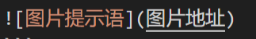

# 语法集合

<!-- @import "[TOC]" {cmd="toc" depthFrom=2 depthTo=4 orderedList=false} -->

<!-- code_chunk_output -->

- [一、语法习惯](#一-语法习惯)
- [二、基本符号](#二-基本符号)
  - [2.1 标题](#21-标题)
  - [2.2 分割线](#22-分割线)
  - [2.3 文本标识](#23-文本标识)
  - [2.4 引用](#24-引用)
  - [2.5 列表](#25-列表)
  - [2.6 代码](#26-代码)
  - [2.7 超链接和图片](#27-超链接和图片)
  - [2.8 表格](#28-表格)
  - [2.9 公式](#29-公式)
    - [2.9.1 上下标](#291-上下标)
    - [2.9.2 分式](#292-分式)
    - [2.9.3 根式](#293-根式)
    - [2.9.4 空格](#294-空格)
- [三、进阶——HTML语法](#三-进阶html语法)
  - [3.1 目录](#31-目录)
  - [3.2 插入空行](#32-插入空行)

<!-- /code_chunk_output -->


## 一、语法习惯

一般而言，两段之前需要空行
（似乎新版本的vscode格式不需要空行也可视为两段，但是在github上会被视作一段）

以下是空行与不空行的区别：

正文1（与前文有空行）
正文2（与前文无空行）

## 二、基本符号

### 2.1 标题

使用`#`以创建标题

``` markdown
# 一级标题

## 二级标题

### 三级标题

段落.
```

### 2.2 分割线

使用`---`三根或更多的横线来表示分割线

``` markdown
正文1

---

正文2
```

----

分割线与正文必须有空行，否则便会识别成标题格式 
以下格式是会变成标题的：

```markdown
正文1
---
```

### 2.3 文本标识

`**` **重点加粗**

`*` *斜体*

`~~` ~~删除线~~

`==` ==高亮==

**快捷键:**

使用 `Ctrl + B` 给选中文本**加粗**

同理 `Ctrl + I` 可以让选中文本变为*斜体*

### 2.4 引用

以 `>` 开头的字被认为是一段引用的文字

>注意「引用」这个东西会被怎么表示可是不一定的，不同的显示环境处理起来往往大相径庭。

### 2.5 列表

``` markdown
* 无序列表
  * 嵌套无序列表
  * 嵌套无序列表
* 无序列表
* 无序列表

1. 有序列表 1
   1. 嵌套有序列表 1
   2. 嵌套有序列表 2
2. 有序列表 2
3. 有序列表 3
```
效果如下：

* 无序列表
  * 嵌套无序列表
  * 嵌套无序列表
* 无序列表
* 无序列表

1. 有序列表 1
   1. 嵌套有序列表 1
   2. 嵌套有序列表 2
2. 有序列表 2
3. 有序列表 3

注意，在符号 `*` 和 `1.` 后一定要加上空格以被识别

### 2.6 代码

使用 `` 表示行内代码

代码块的使用：

``` markdown
''' python(对应语言的关键词可以高亮显示)
print("Hello, World!")
'''

注意要将 ' 替换成 `.
```

代码行数的显示：

``` markdown
''' javascript {.line-numbers}
function add(x, y) {
  return x + y
}
'''

注意要将 ' 替换成 `.
```

效果如下：

``` javascript {.line-numbers}
function add(x, y) {
  return x + y
}
```

### 2.7 超链接和图片

使用下列语法插入超链接：

``` markdown
[超链接名称](链接地址)


```
注意，上面那种的超链接名称是可见的，而下面那种图片提示语只是方便确认图片是什么，本身是不可见的

例子如下：

[**项目仓库**](https://github.com/Ag2S2O3/Note)



如果在图片地址后加入字符串，在鼠标停留后会显示，如下所示：

``` markdown

```
效果如下：


**经过配置，可以使用 `Ctrl + Shift + V` 可以从剪贴板插入图片，自动存在image文件夹下**

### 2.8 表格

一个表格的例子：

``` markdown
左对齐|居中|右对齐
:--|:--:|--:
2|3|5
10|100 1000
```

效果如下：

左对齐|居中|右对齐
:--|:--:|--:
2|3|5
10|100|1000

默认的表格内容应该是居中排列

### 2.9 公式

#### 2.9.1 上下标

$x^2 + y^{12} = 1$

$x_1 + y_{12} = 1$

``` markdown
上标 $x^2 + y^{12} = 1$

下标 $x_1 + y_{12} = 1$
```

#### 2.9.2 分式

较小的行内行分数 $\frac{1}{2}$

展示型的分式 $\displaystyle\frac{x+1}{x-1}$ （其中 `\displaystyle` 用于将行内展示转为块状展示）

``` markdown
较小的行内行分数 $\frac{1}{2}$

展示型的分式 $\displaystyle\frac{x+1}{x-1}$
```

#### 2.9.3 根式

开平方 $\sqrt{2}$

开 $n$ 次方 $\sqrt[n]{2}$

``` markdown
开平方 $\sqrt{2}$

开 $n$ 次方 $\sqrt[n]{2}$
```

#### 2.9.4 空格
数学公式中的 **空格和换行** 都会在编译时 被忽略，想要实现「空格」的效果，需要用特别的命令。

紧贴 $a\!b$

没有空格 $ab$

小空格 $a\,b$

中等空格 $a\;b$

大空格 $a\ b$

quad 空格 $a\quad b$

两个 quad 空格 $a\qquad b$

``` markdown
紧贴 $a\!b$

没有空格 $ab$

小空格 $a\,b$

中等空格 $a\;b$

大空格 $a\ b$

quad 空格 $a\quad b$

两个 quad 空格 $a\qquad b$
```

## 三、进阶——HTML语法

### 3.1 目录

使用以下代码自动生成目录

``` markdown
<!-- @import "[TOC]" {cmd="toc" depthFrom=2 depthTo=4 orderedList=false} -->
```

其中 `depthFrom=` 表示开始生成目录的标题层级数，而 `depthTo=` 则是结束目录生成的层级数

如本文章就是从2级标题到4级标题

### 3.2 插入空行

使用 `<br/>` 即可