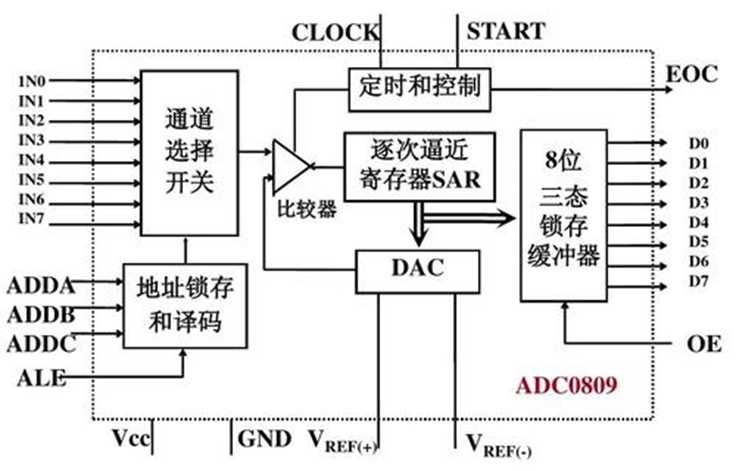
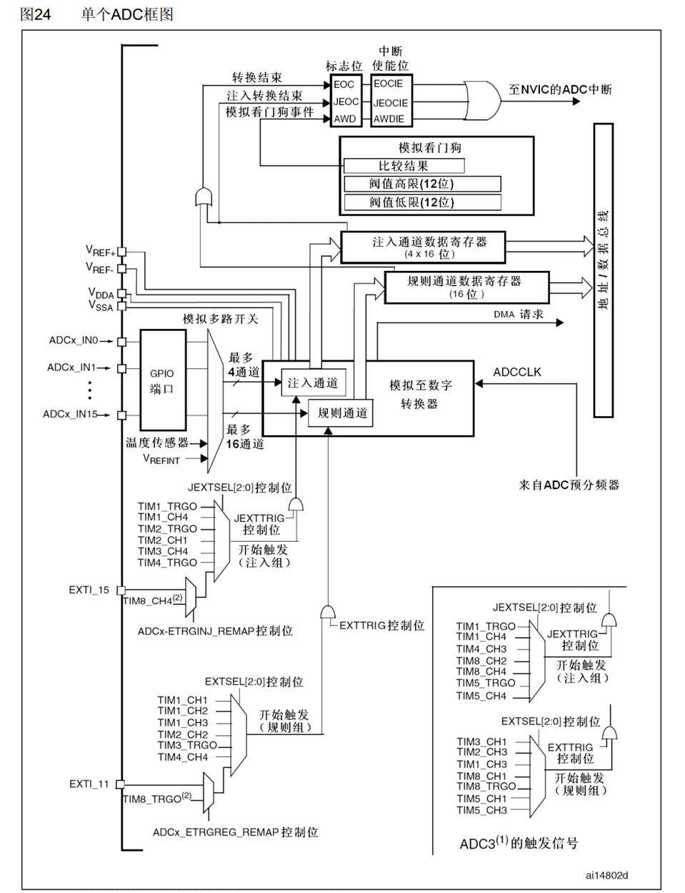
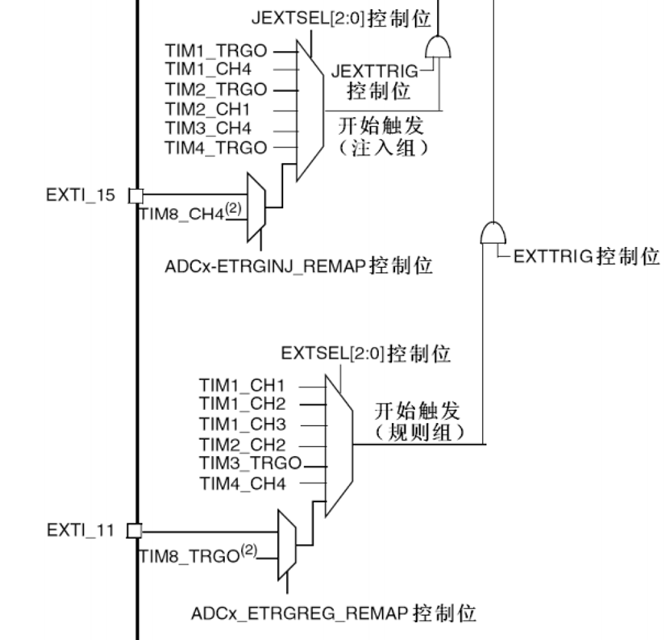
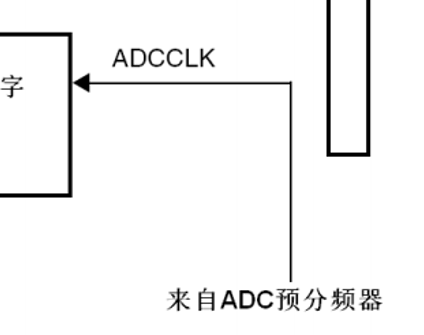
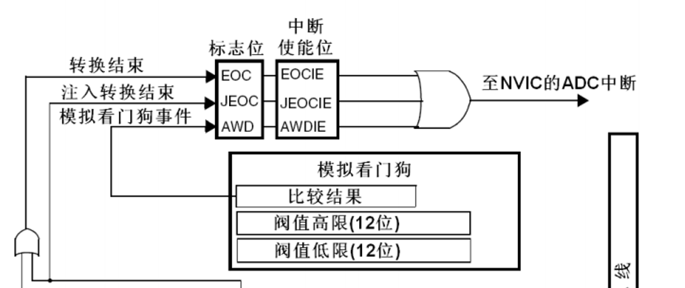
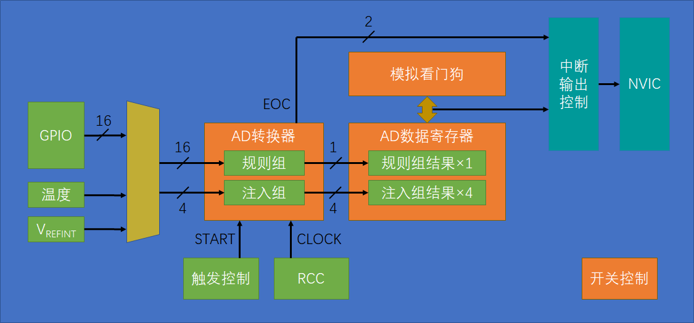
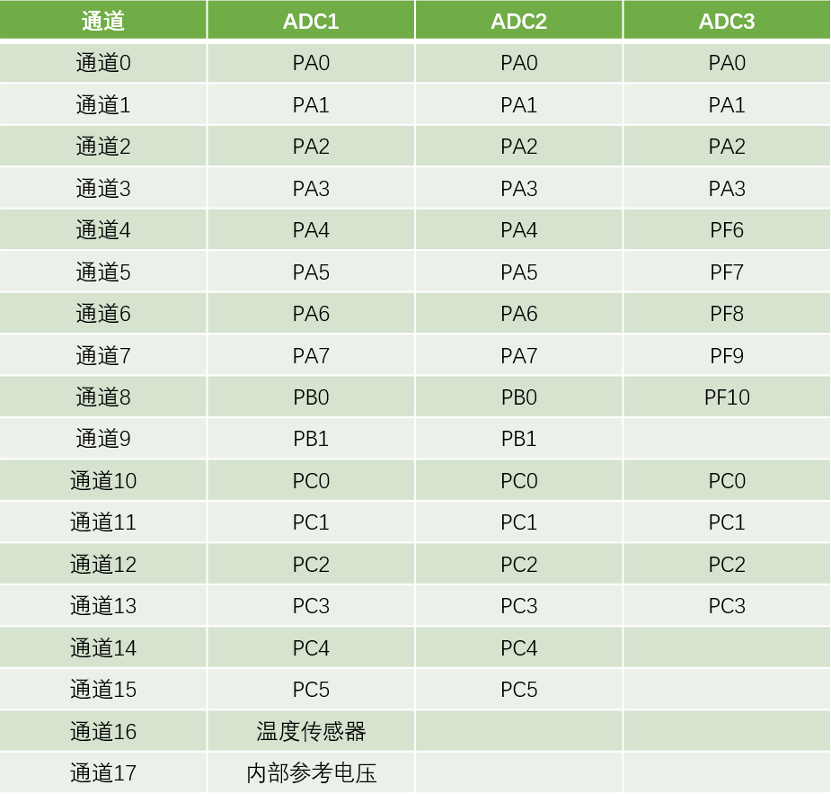
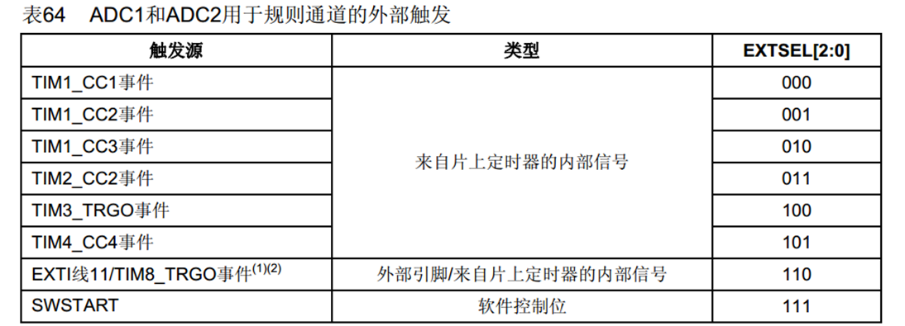
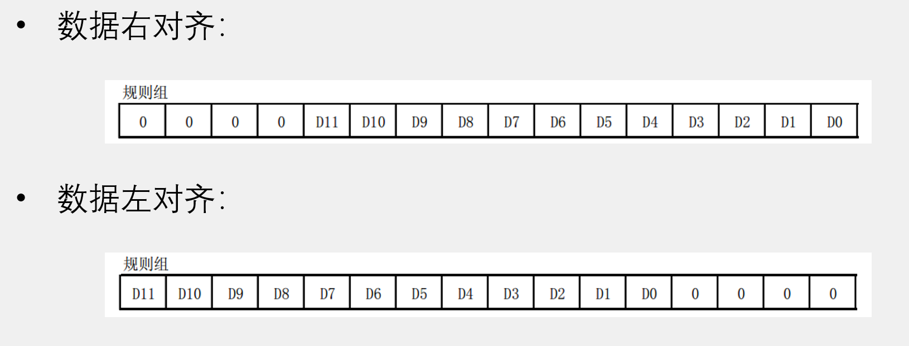
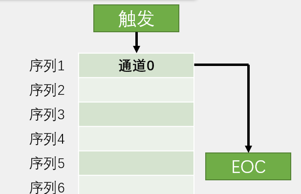

# ADC 模拟-数字转化器

<!-- @import "[TOC]" {cmd="toc" depthFrom=2 depthTo=4 orderedList=false} -->

<!-- code_chunk_output -->

- [一、ADC简介](#一-adc简介)
  - [1.1 逐次逼近型ADC](#11-逐次逼近型adc)
  - [1.2 ADC框图](#12-adc框图)
  - [1.3 ADC基本结构](#13-adc基本结构)
    - [1.3.1 输入通道](#131-输入通道)
    - [1.3.2 转换模式](#132-转换模式)
    - [1.3.3 触发控制](#133-触发控制)
    - [1.3.4 数据对齐](#134-数据对齐)
    - [1.3.5 校准](#135-校准)
- [二、初始化ADC](#二-初始化adc)
  - [2.1 开启时钟](#21-开启时钟)
  - [2.2 配置GPIO](#22-配置gpio)
  - [2.3 配置多路开关，选择规则组的输入通道](#23-配置多路开关选择规则组的输入通道)
  - [2.4 配置ADC](#24-配置adc)
  - [2.5 开启ADC，并校准](#25-开启adc并校准)
- [三、使用ADC转换](#三-使用adc转换)
  - [3.1 启动ADC，获取转换结果](#31-启动adc获取转换结果)
  - [3.2 连续、扫描模式](#32-连续-扫描模式)

<!-- /code_chunk_output -->


## 一、ADC简介

* 关键参数：
  * 12位逐次逼近型ADC —— 表示0~2^12-1(量化结果范围：0~4095)
  * 1us转换时间 —— 从开始转换到产生结果需要花1us，频率为1MHz
* 输入电压范围：0~3.3V，转换结果范围：0~4095
* 18个输入通道，可测量16个外部（即GPIO口，直接在引脚上接模拟信号即可）和2个内部信号源（内部温度传感器和内部参考电压）
* 规则组和注入组两个转换单元（可以一次启动多个组进行转换，即多通道并行）
* 模拟看门狗自动监测输入电压范围（执行如光线强度、温度高于某个值或低于某个值的判断，当发生时模拟看门狗会申请中断，避免手动if读值）

（stm32f103c8t6有ADC1、ADC2，10个外部输入通道）

### 1.1 逐次逼近型ADC

以下为ADC0809芯片的结构，stm32的ADC与之类似



首先IN0~IN8通过选择器输入一个信号，具体对应的通道由下方地址锁存和译码器控制；然后把这个信号与DAC输出的电压已知的一个信号放入比较器中比较，逐次修正，最终得到使DAC输出的电压与外部信号基本相等，这样DAC的输入数据就是外部电压的编码数据

### 1.2 ADC框图

接着再来看stm32的ADC



与一般的相比，它可以支持最多16通道的规则通道与最多4通道的注入通道

* 规则通道：可以一次性最多转换16组数据，但是由于上面的寄存器只有一个16位（只能接收一组），多余的15组会被挤掉，所以要配合DMA实现转换一个组就把该组数据搬运到其他地方，防止数据丢失
* 注入通道：由于有4个寄存器对应4组通道，所以就不需要担心被覆盖的问题了

一般使用规则组+DMA转运即可



ADC主模块的下方还有它的触发方式，分为软件触发（调用一条代码启动转换）和硬件触发（图示接线，触发源主要来自定时器或者TRGO（TRGO来触发ADC转换不需要进入中断，防止了CPU被大量中断请求卡住的情况），当然也可以选择外部触发）



右侧是用于驱动内部逐次比较的时钟，来自ADC预分频器，**最大14MHz**（由于APB2最大72Mhz，通过预分频器进行分频要满足这个条件，故只能选择**6分频12MHz和8分频9MHz**）



上方则是其转换结束或者触发看门狗后会将标志位置1，或者去到中断，提醒我们相应的情况

### 1.3 ADC基本结构



#### 1.3.1 输入通道



ADC1和ADC2共用一个通道，使用时选择一个ADC即可（双ADC模式暂可不用掌握）

#### 1.3.2 转换模式

* **单次转换** —— 触发后只转换一次，想要再转换就要再触发
* **连续转换** —— 在一次转换后立即开始新一轮的转换

</br>

* **非扫描模式** ——一次只转换一个通道的数据，转换完后EOC置1
* **扫描模式** —— 一次转换设置的通道数目的序列，全部转换完成后再将EOC置1（因为有之前提及的“覆盖”问题，所以要用DMA及时将数据搬走）
  
#### 1.3.3 触发控制

写程序的时候参考



#### 1.3.4 数据对齐

由于ADC是12位的而寄存器是16位的，所以要选择数据的对齐方式



一般选择右对齐（左对齐读出来的数会比较大）

#### 1.3.5 校准

>· ADC有一个内置自校准模式。校准可大幅减小因内部电容器组的变化而造成的准精度误差。校准期间，在每个电容器上都会计算出一个误差修正码(数字值)，这个码用于消除在随后的转换中每个电容器上产生的误差
· 建议在每次上电后执行一次校准
· 启动校准前， ADC必须处于关电状态超过至少两个ADC时钟周期

其实不需要管校准原理，只需要知道在ADC初始化的最后加几行校准代码即可


## 二、初始化ADC

依旧是打通1.3中的结构图

**1. 开启RCC时钟，包含ADC和GPIO时钟**（记得还要配置ADCCLK的分频器）

**2. 配置GPIO为模拟输入**

**3. 配置多路开关，连接通道与规则组**

**4. 配置ADC转换器**

**5. 开关控制，启动ADC，校准ADC**

（如果要中断或者看门狗，需要在4~5之间加入相应的配置）

### 2.1 开启时钟

开启ADC和GPIOA时钟（均挂载APB2总线上）

```c
RCC_APB2PeriphClockCmd(RCC_APB2Periph_ADC1, ENABLE);
RCC_APB2PeriphClockCmd(RCC_APB2Periph_GPIOA, ENABLE);
	
RCC_ADCCLKConfig(RCC_PCLK2_Div6);
```

最后别忘了还要**配置ADCCLK对PCLK2进行分频**，这里6分频后是12MHz

### 2.2 配置GPIO

`GPIO_Mode_AIN` 是ADC的专属输入模式，这个模式下GPIO的输入输出对模拟信号不会有影响，所以GPIO_Mode应该配置成这个模式

```c
GPIO_InitTypeDef GPIO_Initstructure;
GPIO_Initstructure.GPIO_Mode=GPIO_Mode_AIN;
GPIO_Initstructure.GPIO_Pin=GPIO_Pin_0;
GPIO_Initstructure.GPIO_Speed=GPIO_Speed_50MHz;
GPIO_Init(GPIOA,&GPIO_Initstructure);
```

GPIOA模拟输入

### 2.3 配置多路开关，选择规则组的输入通道

使用 `ADC_RegularChannelConfig` 来对每个输入进行配置：

第一参数选择ADC1/2，然后是指定通道（0~17），接着指定规则组序列器里的次序（1~16），最后是采样时间（需要转到定义选择固定的几个数，对采样周期没要求就随便选）

```c
ADC_RegularChannelConfig(ADC1, ADC_Channel_0, 1, ADC_SampleTime_55Cycles5);
```

这里配置的是：在规则组菜单列表的第一个位置写入通道0，采样周期是55.5个机器周期

如下图所示：



### 2.4 配置ADC

使用结构体进行配置，老样子先创建结构体，然后设置参数，最后初始化

```c
ADC_InitTypeDef ADC_InitStructure;
	
ADC_InitStructure.ADC_Mode= ADC_Mode_Independent;		//独立模式
ADC_InitStructure.ADC_DataAlign= ADC_DataAlign_Right;	//右对齐
ADC_InitStructure.ADC_ExternalTrigConv= ADC_ExternalTrigConv_None;	//无外部触发（内部触发）
ADC_InitStructure.ADC_ContinuousConvMode= DISABLE;		//不用连续模式
ADC_InitStructure.ADC_ScanConvMode= DISABLE;			//不用扫描模式
ADC_InitStructure.ADC_NbrOfChannel = 1;					//一个通道
	
ADC_Init(ADC1, &ADC_InitStructure);
```

* 第一个是ADC的工作模式，配置其为独立模式/双ADC模式，这里选独立模式
* 第二个是数据对齐，这里选右对齐（参见1.3.4）
* 第三个是外部触发转换选择，就是触发控制的触发源，其参数对应1.3.3；这里我们使用软件控制，所以参数选择NONE

<br/>

* 第四个是连续转换模式，对应连续和非连续
* 第五个是扫描转换模式，对应扫描和非扫描
* 第六个是通道数目，当指定在扫描模式下，输入会用到的通道个数<br/>（这三个详见1.3.2）

>这个配置完毕后，如果还需要中断和看门狗，可以在这之后继续配置，此处就不配置了

### 2.5 开启ADC，并校准

启动ADC电源

```c
ADC_Cmd(ADC1, ENABLE);
```

开启ADC后，根据手册的建议，还需要对ADC进行校准，这个比较程式化

```c
ADC_ResetCalibration(ADC1);		//复位
while(ADC_GetResetCalibrationStatus(ADC1) == SET);	//等待复位完成
ADC_StartCalibration(ADC1);		//校准
while(ADC_GetCalibrationStatus(ADC1) == SET);	//等待校准完成
```

这样子就ADC就准备就绪了

## 三、使用ADC转换

### 3.1 启动ADC，获取转换结果

可以用写一个函数来获取ADC的结果

```c
u16 AD_GetValue(void)
{
	
}
```

按照以下顺序即可：触发转换 $\rightarrow$ 等待转换完成（EOC置1） $\rightarrow$ 读取ADC寄存器 

```c
ADC_SoftwareStartConvCmd(ADC1, ENABLE); //软件触发
while(ADC_GetFlagStatus(ADC1, ADC_FLAG_EOC) == RESET);	//等待转换完成（没完成时EOC=0（RESET））
return ADC_GetConversionValue(ADC1);	//取得转换结果
```

读取到转换值后会自动清除EOC标志位

其实整个流程就如2.2.3中图所示

### 3.2 连续、扫描模式

参见[DMA章节](./DMA.md)