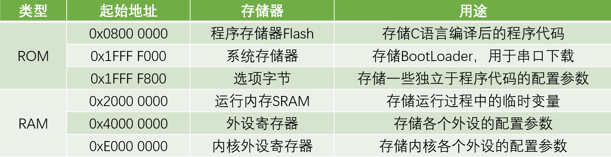
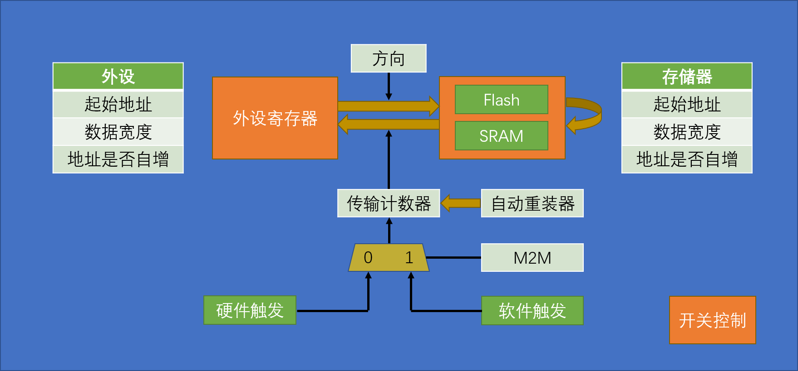
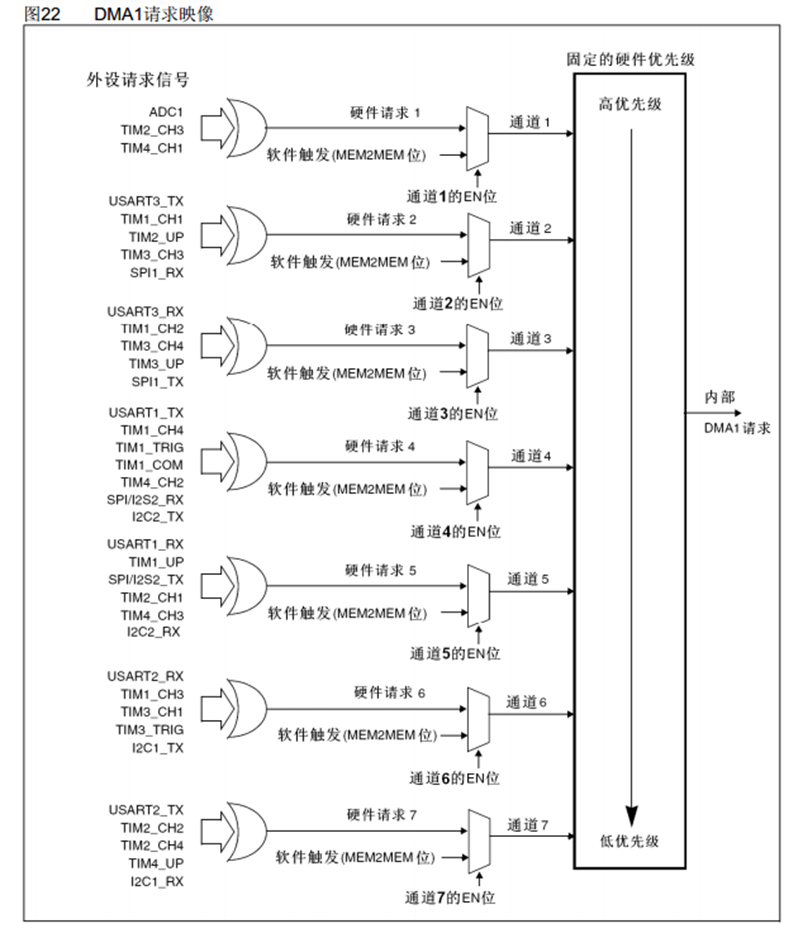
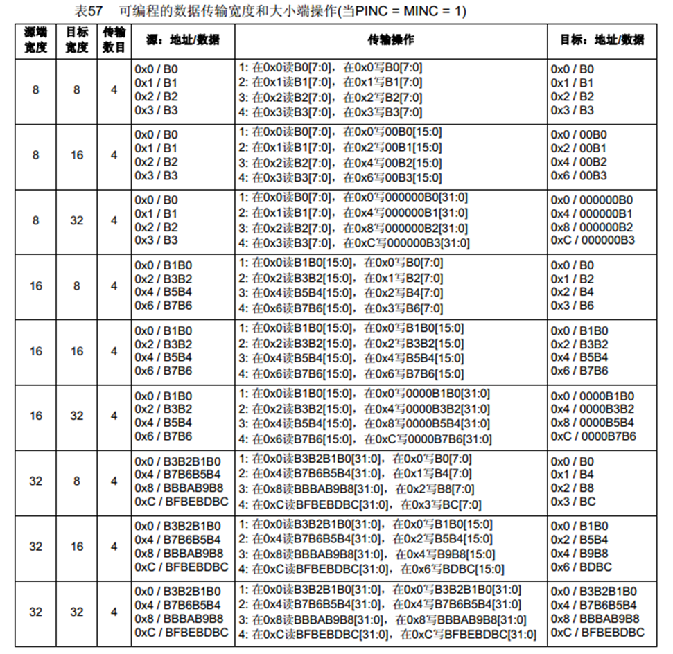

# DMA 直接存储器存取

<!-- @import "[TOC]" {cmd="toc" depthFrom=2 depthTo=4 orderedList=false} -->

<!-- code_chunk_output -->

- [一、DMA简介](#一-dma简介)
  - [1.1 存储器映像](#11-存储器映像)
  - [1.2 DMA基本结构](#12-dma基本结构)
  - [1.3 DMA转运条件](#13-dma转运条件)
  - [1.4 DMA请求映像](#14-dma请求映像)
  - [1.5 数据宽度与对齐](#15-数据宽度与对齐)
- [二、配置DMA（以数组转运为例）](#二-配置dma以数组转运为例)
  - [2.1 开启RCC时钟](#21-开启rcc时钟)
  - [2.2 初始化DMA](#22-初始化dma)
  - [2.3 使能DMA](#23-使能dma)
  - [2.4 DMA连续转运](#24-dma连续转运)
- [三、DMA与多路ADC转运](#三-dma与多路adc转运)

<!-- /code_chunk_output -->


## 一、DMA简介

* DMA是一个**数据转运小助手**，用于协助CPU完成数据转运工作

* 它可以直接访问stm32的内部储存器，提供外设（比如ADC的数据寄存器DR，串口的数据寄存器等）和存储器（运行内存SRAM和程序储存器Flash）或者存储器和存储器之间的高速数据传输，无须CPU干预，节省了CPU的资源
* 有12个独立可配置的通道： DMA1（7个通道）， DMA2（5个通道）；每个通道都支持软件触发（一般用于存储器到存储器）和特定的硬件触发（用于外设到存储器，需要使用该外设连接到的那个通道）

（stm32F103c8t6只有DMA1（7个通道））

### 1.1 存储器映像



### 1.2 DMA基本结构

如果要编写代码控制DMA的话，这个图必不可少！



* 数据在橙色的两个区域间转运，可以从外设到储存器，也可以从储存器到外设（也可以是两个储存器间的转运），具体方向（从左到右还是从右到左）有一个方向的参数进行控制
* 具体转运的操作由表格中的三个参数控制：
  * 起始地址决定了数据从哪里来到哪里去
  * 数据宽度指一次转运的数据量，可以有 Byte（字节）[8位] 、HalfWord（半字）[16位] 和 Word（字）[32位]（对于ARM32位机来说）
  * 地址是否自增值指的是数据转运完成后下一次转运是否把地址++（转运到的储存器一边需要自增，每转运一次就往后挪一个坑【不自增的话数据就会被覆盖了】）
  >存储器之间的转运则是把一个存储器的地址放到外设这边来，那么DMA就会到相应的地方找数据
* 传输计数器用来指定需要转运几次，是一个自减计数器（减到0后停止转运，地址也恢复到起始位置）；旁边的自动重装载则是减到0后将其恢复成初始值（不重装就是单次模式，重装就是循环模式）
* 最下面是DMA的触发模式，由M2M寄存器决定，分为硬件触发（置0）和软件触发（置1）；
  * 软件触发是以最快的速度连续触发DMA直到计数器的值减为0（不是调用一次触发一次啊，所以**不能和循环模式同时使用**）
  * 硬件触发需要一些时机，如ADC转换完成、串口接收到数据、定时时间到，在硬件到达这些时机时传信号过来触发DMA
* 右下角是开关控制，使能DMA

### 1.3 DMA转运条件

1. 开关控制 `DMA_Cmd` 使能
2. 传输计数器大于0
3. 有触发信号
   
当转运结束（计数器到0）后，需要将`DMA_Cmd` DISABLE， 再为计数器写一个大于0的数，再开启 `DMA_Cmd` 

即**写传输计数器时必须先关闭DMA**！

### 1.4 DMA请求映像

在使用硬件触发DMA时，需要查找硬件触发源对应的通道



### 1.5 数据宽度与对齐

目标数据宽度大于源端数据宽度，则在每个数据前面补0

目标数据宽度小于源端数据宽度，则舍去每个数据的高位



## 二、配置DMA（以数组转运为例）

还是按照1.2的图来看

**1. RCC开启DMA时钟**

**2. 调用 `DMA_Init()` 初始化各个参数**

**3. 开关控制使能DMA**

（如果使用硬件触发，不要忘了在**对应外设调用 `XXX_DMACmd` 开启触发信号的输出**）

（如果需要DMA中断则调用 `DMA_ITConfig` ，然后在NVIC里配置相应中断通道，编写中断函数即可）

### 2.1 开启RCC时钟

DMA是**AHB总线**的设备，注意开启对应的时钟

```c
RCC_AHBPeriphClockCmd(RCC_AHBPeriph_DMA1, ENABLE);
```

### 2.2 初始化DMA

使用 `DMA_Init()` 初始化各个参数，同样，先定义初始化结构体

```c
DMA_InitTypeDef DMA_InitStructure;
	
DMA_InitStructure.DMA_PeripheralBaseAddr= AddrA;
DMA_InitStructure.DMA_PeripheralDataSize= DMA_PeripheralDataSize_Byte ;
DMA_InitStructure.DMA_PeripheralInc= DMA_PeripheralInc_Enable;

DMA_InitStructure.DMA_MemoryBaseAddr= AddrB;
DMA_InitStructure.DMA_MemoryDataSize= DMA_PeripheralDataSize_Byte;
DMA_InitStructure.DMA_MemoryInc= DMA_PeripheralInc_Enable;
DMA_InitStructure.DMA_DIR= DMA_DIR_PeripheralSRC;
DMA_InitStructure.DMA_BufferSize= Size;
DMA_InitStructure.DMA_Mode= DMA_Mode_Normal  ;
DMA_InitStructure.DMA_M2M= DMA_M2M_Enable;
DMA_InitStructure.DMA_Priority= DMA_Priority_Medium;
```

前三个是外设站点的起始地址、数据宽度、是否自增；后三个是存储器的起始地址、数据宽度、是否自增；后面分别是传输方向、传输计数器、传输模式、选择触发方式、优先级

* 第一个是外设站点的基地址，需要一个32位的地址，一般通过数组名来获取地址（比如这里我们通过配置DMA的函数传入一个u32 AddrA参数（`void MyDMA(u32 AddrA, u32 AddrB, u16 Size)`），用它就即可）
* 第二个是数据宽度，转到定义看到有三种选项，我们这里使用字节的方式
* 第三个地址是否自增，我们是数组转运，不同的数字存放在数组的位置不同，所以需要，选Enable那个参数
  >后三项是存储器的配置，同理
* 第七个传输方向通过设置外设站点作为源头（source）还是目的地（destination）来配置，这里设置从外设站点到存储器站点，所以应作为源头（SRC）
* 第八个就是设置传输计数器的值（0~65535 [u16]），可以设置为由参数传入
* 第九个为计数器是否重装，我们这里不循环，选正常模式 
* 第十个选择触发方式（通过配置M2M），Enable那个项就指软件触发，Disable那个项就指硬件触发
* 最后一个设置通道优先级，有多个通道时可以设置，这里只用一个通道就随便了   

最后把结构体喂到初始化函数里

```c
DMA_Init(DMA1_Channel1,&DMA_InitStructure);
```

* 这里的第一个参数为 DMA`y`_Channel`x` 
  >y（1 ~ 2）选择DMA1/2；x（1 ~ 7）选择对应的通道
* 第二个就是我们的结构体

这样DMA的那些寄存器就算是配置好了

### 2.3 使能DMA

```c
DMA_Cmd(DMA1_Channel1, ENABLE);
```

如果写在初始化里面，则初始化完DMA就开始工作了

### 2.4 DMA连续转运

正常来说，DMA转运一次就停止了，如果要连续转运，就得给传输计数器重新赋值

比如为此写一个函数

```c
void MYDMA_Transder(void)
{

}
```

如果要赋值，首先要让DMA失能，然后使用 `DMA_SetCurrDataCounter` 函数：第一个参数是DMA通道，第二个参数是要重新赋的值，这个可以在初始化的时候获取

因此在文件的最开始定义一个变量

```c
static u16 MYDMA_Size;
```

然后在初始化的时候为其赋值

```c
void MyDMA(u32 AddrA, u32 AddrB, u16 Size;)
{
	MYDMA_Size= Size;
  ……
```

这样就完成了重新赋值里面值的确定

最后别忘了再次开启DMA

```c
void MYDMA_Transder(void)
{
	DMA_Cmd(DMA1_Channel1, DISABLE);
	DMA_SetCurrDataCounter(DMA1_Channel1,MYDMA_Size);
	DMA_Cmd(DMA1_Channel1, ENABLE);
```

最后再加上判断转运是否完成，转换完后标志位置1，然后需要清除标志位

```c
while(DMA_GetFlagStatus(DMA1_FLAG_TC1) == RESET);   //DMA1的1通道
DMA_ClearFlag(DMA1_FLAG_TC1);
}
```

这样就行了，同时，如果不想DMA一初始化完就开始转运，记得把初始化中的ENABLE改为DISABLE！

## 三、DMA与多路ADC转运

见视频8-2