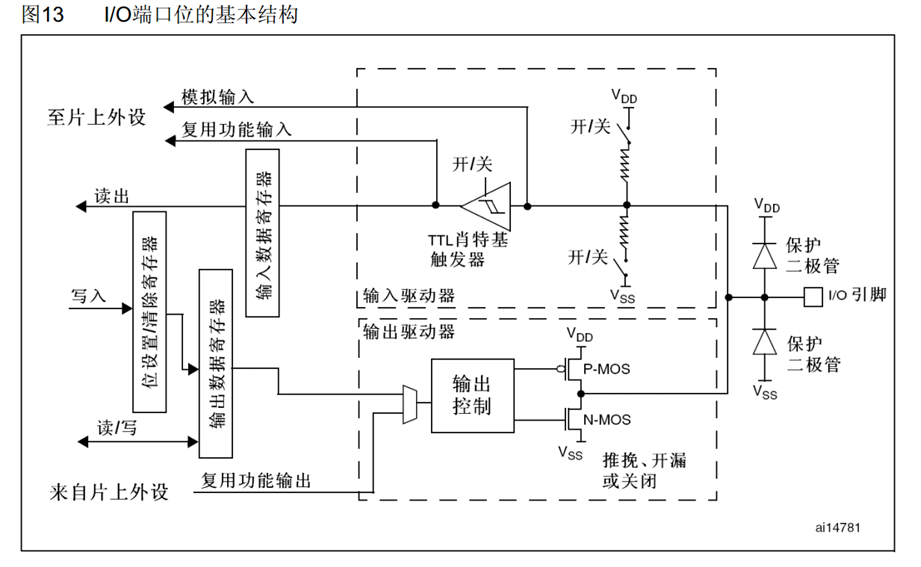
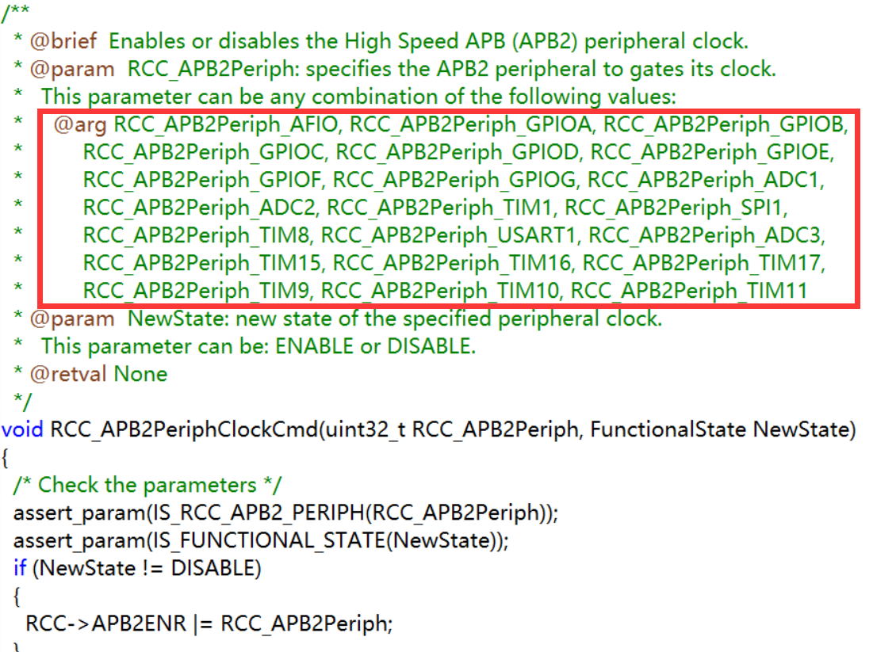

# GPIO通用输入输出口

## 一、GPIO简介

<div style="text-align: center;">
                                  

</div>

通过配置GPIO的端口配置寄存器，端口可以配置成以下8种模式：

模式名称|代号|特征
--|--|--
浮空输入|GPIO_MODE_IN_FLOATING|可读取引脚电平，**若引脚悬空，则电平不确定**
上拉输入|GPIO_MODE_IPU|可读取引脚电平，内部连接上拉电阻，**悬空时默认高电平**
下拉输入|GPIO_MODE_IPD|可读取引脚电平，内部连接下拉电阻，**悬空时默认低电平**
模拟输入|GPIO_MODE_AIN|GPIO无效，引脚直接接入内部ADC
开漏输出|GPIO-MODE_OUT_OD|可输出引脚电平，高电平为高阻态，低电平接VSS <br/> (高电平没有驱动能力，一般用于通信协议的驱动模式)
推挽输出|GPIO_MODE_OUT_PP|可输出引脚电平，高电平接VDD，低电平接VSS <br/>（低、高电平均有驱动能力）
复用开漏输出|GPIO_MODE_AF_OD|由片上外设控制，高电平为高阻态，低电平接VSS
复用推挽输出|GOIO_MODE_AF_PP|由片上外设控制，高电平接VDD，低电平接VSS

通过手册可以查询片上外设的GPIO配置，在使用时可以进行查阅（中文版8.1.11）

GPIO输出速度可以限制引脚电平反转的最大速度，用于追求低功耗、稳定性情况，一般要求不高设置成50MHZ即可

## 二、GPIO输出

操作stm32的GPIO总共需要**三个**步骤

**1. 使用RCC开启GPIO时钟**
**2. 使用GPIO_Init初始化GPIO**
**3. 使用输出/输入函数控制GPIO**

### 2.1 RCC库函数

RCC库函数基本只用到下面三个函数

``` c
void RCC_AHBPeriphClockCmd(uint32_t RCC_AHBPeriph, FunctionalState NewState);       //使能AHB总线
void RCC_APB2PeriphClockCmd(uint32_t RCC_APB2Periph, FunctionalState NewState);     //使能APB2总线
void RCC_APB1PeriphClockCmd(uint32_t RCC_APB1Periph, FunctionalState NewState);     //使能APB1总线
```

第一个参数选择外设，每个总线负责的外设可以GO TO至该函数的定义中查看；第二个参数选择Enable或Disable

如APB2负责以下外设



### 2.2 GPIO函数

#### 2.2.1 复位函数：

``` c
void GPIO_DeInit(GPIO_TypeDef* GPIOx);  //复位GPIO
void GPIO_AFIODeInit(void);         //复位AFIO
```

#### 2.2.2 初始化函数：

```c
void GPIO_Init(GPIO_TypeDef* GPIOx, GPIO_InitTypeDef* GPIO_InitStruct);
```

用结构体里的参数初始化GPIO

具体操作为：先定义结构体变量，再给结构体赋值，最后调用这个函数

#### 2.2.3 读写函数

```c
//读
uint8_t GPIO_ReadInputDataBit(GPIO_TypeDef* GPIOx, uint16_t GPIO_Pin);  //读输入寄存器某个端口的电平（返回端口的高低电平）
uint16_t GPIO_ReadInputData(GPIO_TypeDef* GPIOx);   //读整个输入寄存器（返回值每一位代表一个端口值）
uint8_t GPIO_ReadOutputDataBit(GPIO_TypeDef* GPIOx, uint16_t GPIO_Pin); //读输出期存器的某一位（一般用于输出模式下查看输出内容）
uint16_t GPIO_ReadOutputData(GPIO_TypeDef* GPIOx);  //读整个输出寄存器
//写
void GPIO_SetBits(GPIO_TypeDef* GPIOx, uint16_t GPIO_Pin);      //将端口指向高电平
void GPIO_ResetBits(GPIO_TypeDef* GPIOx, uint16_t GPIO_Pin);    //将端口指向低电平
void GPIO_WriteBit(GPIO_TypeDef* GPIOx, uint16_t GPIO_Pin, BitAction BitVal);   //将端口的值设置为BitVal（GO TO函数定义查看可以设置的值）
void GPIO_Write(GPIO_TypeDef* GPIOx, uint16_t PortVal);         //可以同时对16个端口进行写入操作，由PortVal的值控制
```

## 三、举例

### 3.1 LED的亮灭

首先使用RCC开启GPIO时钟

```c
RCC_APB2PeriphClockCmd(RCC_APB2Periph_GPIOC, ENABLE);
```

然后定义结构体变量(这句话固定，名字官方建议就这么取方便)

```c
GPIO_InitTypeDef GPIO_Initstructure;
```

给结构体赋值(可以GO TO每一项查看都有何种参数设置)

```c
GPIO_Initstructure.GPIO_Mode=GPIO_Mode_Out_PP;  //推挽输出（一般都用推挽）
GPIO_Initstructure.GPIO_Pin=GPIO_Pin_13;        //使用端口为PC13
GPIO_Initstructure.GPIO_Speed=GPIO_Speed_50MHz; //速度50MHZ（不需考虑低功耗）
```

初始化该GPIO

```c
GPIO_Init(GPIOC,&GPIO_Initstructure);
```

操作GPIO

```c
GPIO_ResetBits(GPIOC,GPIO_Pin_13);  //置低电平LED亮
GPIO_SetBits(GPIOC,GPIO_Pin_13);    //置高电平LED灭
```

### 3.2 流水灯（同时使用多个GPIO）

前面部分一样

```c
RCC_APB2PeriphClockCmd(RCC_APB2Periph_GPIOC, ENABLE);

GPIO_InitTypeDef GPIO_Initstructure;
GPIO_Initstructure.GPIO_Mode=GPIO_Mode_Out_PP;
GPIO_Initstructure.GPIO_Speed=GPIO_Speed_50MHz;
```

可以同时开启多个GPIO口，只要在结构体里或上他们就行（本质上就是位运算寄存器）

```c
GPIO_Initstructure.GPIO_Pin=GPIO_Pin_13 | GPIO_Pin_12 | GPIO_Pin_11; //开启多个
```

或者

```c
GPIO_Initstructure.GPIO_Pin=GPIO_Pin_All    //16个全开
```

初始化

```c
GPIO_Init(GPIOC,&GPIO_Initstructure);
```

同时操作16个寄存器

```c
GPIO_Write(GPIOC, 0x1000);  //0001 0000 0000 0000 PC13
```

### 3.3 按键控制LED

主要例举GPIO的读取（按键部分）

还是先初始GPIO

```c
RCC_APB2PeriphClockCmd(RCC_APB2Periph_GPIOA, ENABLE);

GPIO_InitTypeDef GPIO_Initstructure;
GPIO_Initstructure.GPIO_Mode=GPIO_Mode_Out_IPU; //上拉输入
GPIO_Initstructure.GPIO_Pin=GPIO_Pin_1
GPIO_Initstructure.GPIO_Speed=GPIO_Speed_50MHz;
```

设置一个函数反应按键是否被按下

```c
uint8_t Key_GetNum(void)
{
    uint8_t KeyNum = 0; //默认没有按下
    if(GPIO_ReadInputDataBit(GPIOA,GPIO_Pin_1) == 0);  //读取端口值(0表示按下)
    {
        Delay_ms(20);   //按下消抖
        while(GPIO_ReadInputDataBit(GPIOA,GPIO_Pin_1) == 0);    //如果一直按着键就卡死在这里
        Delay_ms(20);   //松手消抖
        KeyNum=1;
    }

    return KeyNum;
}