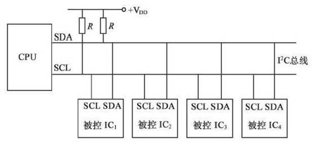
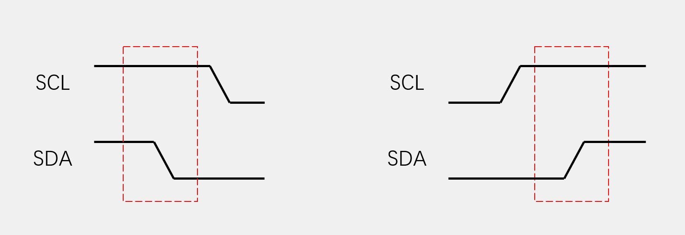
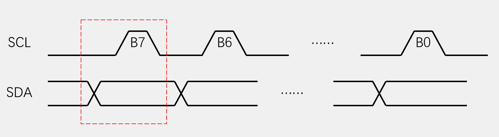
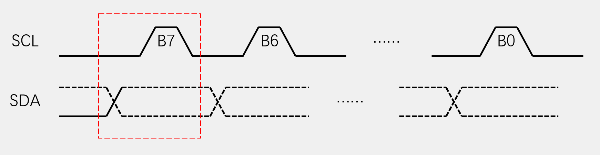
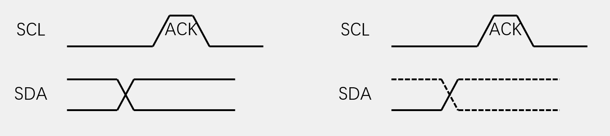
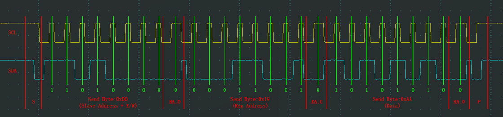
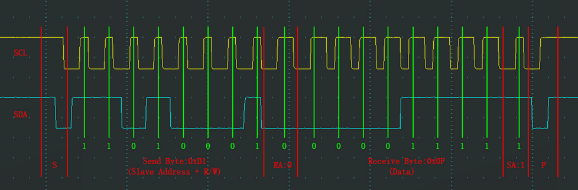
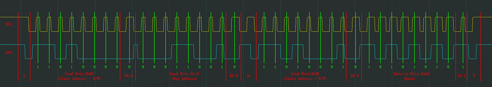

# I2C 通信

## 一、I2C通信介绍

* 两根通信线：SCL（Serial Clock）、SDA（Serial Data）（对比USART的RX与TX）
* 同步，半双工
* 带数据应答
* 支持总线挂载多设备（一主多从、多主多从）

### 1.1 硬件电路

* 所有I2C设备的SCL连在一起，SDA连在一起
* 设备的SCL和SDA均要配置成开漏输出模式（单片机/设备只能主动将电平拉低，“松手后”会自动回弹置默认的高电平【Vdd经过R上拉高电平】）
* SCL和SDA各添加一个上拉电阻，阻值一般为4.7KΩ左右



主机对SCL（时钟）线有着绝对的控制权，从机只能读取；同时，从机不允许主动发起对SDA（数据线）的控制，只有主机发送命令从机应答后才有短暂的控制权

### 1.2 I2C时序基本单元

* **起始条件**：SCL高电平期间，SDA从高电平切换到低电平
* **终止条件**：SCL高电平期间，SDA从低电平切换到高电平



---

* **(主机)发送一个字节**：SCL低电平期间，主机将数据位依次放到SDA线上（**高位先行**），然后释放SCL，从机将在SCL高电平期间读取数据位，所以SCL高电平期间SDA不允许有数据变化，依次循环上述过程8次，即可发送一个字节



即主机先在SCL为低时将SDA按照想要发送的数据置0或1，然后松开SCL使之变为高电平；在高电平期间从机读取SDA数据（因为SCL是主机控制，从机需要迅速把握这个时机，所以一般是上升沿时就已读取），然后主机将电平再次拉低，放入SDA数据，准备发送下一位

---

* **(主机)接收一个字节**：SCL低电平期间，从机将数据位依次放到SDA线上（高位先行），然后释放SCL，主机将在SCL高电平期间读取数据位，所以SCL高电平期间SDA不允许有数据变化，依次循环上述过程8次，即可接收一个字节（主机在接收之前，需要释放SDA）



释放SDA可以理解成切换为输入模式，只有当设备想要发送数据时才会去主动拉低SDA

接受数据就是发送数据反过来：低电平从机放数据（一般是下降沿时从机就放上去了），高电平主机读数据

---

* **(主机)发送应答**：主机在接收完一个字节之后，在下一个时钟发送一位数据，数据0表示应答，数据1表示非应答
* **(主机)接收应答**：主机在发送完一个字节之后，在下一个时钟接收一位数据，判断从机是否应答，数据0表示应答，数据1表示非应答（主机在接收之前，需要释放SDA）



即：**发一字节收一位，收一字节发一位**

### 1.3 I2C时序

#### 1.3.1 指定地址写

对于指定设备（Slave Address），在指定地址（Reg Address）下，写入指定数据（Data）



* S：**起始条件**
* 第一个字节：**从机地址+读/写位** [ 从机地址为1101000,接下来的操作是0（写入）]
* RA：**主机接收应答** [ 从机发回0（应答）]
* 第二个字节：**发送的数据，可以送到指定设备内部；从机设备可以自己定义第二个字节和后续字节的用途**（一般第二个字节是指定 从机寄存器的地址 或者 指令控制字 ）[ 这里是从机的寄存器地址0x19 ]
* RA： **主机接收应答** [ 从机发回0（应答）]
* 第三个字节：**发送的数据** [ 这里就是主机想要写入到0x19地址下的数据0xAA ] 
* RA： **主机接收应答** [ 从机发回0（应答）]
* P： **停止条件**

注：如果是写入多个数据，那么再第一个数据写完后，地址会向后移动，即第二个数据就写在了 **0x1A** 地址下 ...

---

#### 1.3.2 当前地址读

对于指定设备（Slave Address），在当前地址指针指示的地址下，读取从机数据（Data）



* S：**起始条件**
* 第一个字节：**从机地址+读/写位** [ 从机地址为1101000,接下来的操作是1（读出）]
* RA：**主机接收应答** [ 从机发回0（应答）]
* 第二个字节：**主机把SDA控制交给从机，进行接收操作；从机依次在SDA中写入数据交由主机读** [ 主机读到数据0x0F ]
* SA: **主机发送从机非应答，从而让从机停止发送数据（否则从机就会一直占着SDA）** [ 主机向从机发送1（非应答） ]

（但是这个时序操作不能读取指定位置寄存器的数据，所以不常用）

#### 1.3.3 指定地址读

对于指定设备（Slave Address），在指定地址（Reg Address）下，读取从机数据（Data）



其实就是把**指定地址写**加到了**当前地址读**的前面

中间的 **Sr** 即为重复起始条件，重新开启了一个时序；在指定完地址后还没进行写入数据，就又重新变为读取当前地址的数据 （当然，在SR前加一个P也可以，这样就变成了两个完整的时序）

即：**先起始，再重复起始，再停止**

注：如果主机要读多个数据的话，前面所有的字节都要给应答，最后的字节要给非应答，从而使从机交出SDA的控制权

## 二、软件I2C

就是在软件中手动翻转SDA与SCL的电平，实现上述时序模块的功能

这里直接把现有的代码搬过来就行(PB10为SCL，PB11位SDA)

```c
/*引脚配置层*/

/**
  * 函    数：I2C写SCL引脚电平
  * 参    数：BitValue 协议层传入的当前需要写入SCL的电平，范围0~1
  * 返 回 值：无
  * 注意事项：此函数需要用户实现内容，当BitValue为0时，需要置SCL为低电平，当BitValue为1时，需要置SCL为高电平
  */
void MyI2C_W_SCL(uint8_t BitValue)
{
	GPIO_WriteBit(GPIOB, GPIO_Pin_10, (BitAction)BitValue);		//根据BitValue，设置SCL引脚的电平
	Delay_us(10);												//延时10us，防止时序频率超过要求
}

/**
  * 函    数：I2C写SDA引脚电平
  * 参    数：BitValue 协议层传入的当前需要写入SDA的电平，范围0~0xFF
  * 返 回 值：无
  * 注意事项：此函数需要用户实现内容，当BitValue为0时，需要置SDA为低电平，当BitValue非0时，需要置SDA为高电平
  */
void MyI2C_W_SDA(uint8_t BitValue)
{
	GPIO_WriteBit(GPIOB, GPIO_Pin_11, (BitAction)BitValue);		//根据BitValue，设置SDA引脚的电平，BitValue要实现非0即1的特性
	Delay_us(10);												//延时10us，防止时序频率超过要求
}

/**
  * 函    数：I2C读SDA引脚电平
  * 参    数：无
  * 返 回 值：协议层需要得到的当前SDA的电平，范围0~1
  * 注意事项：此函数需要用户实现内容，当前SDA为低电平时，返回0，当前SDA为高电平时，返回1
  */
uint8_t MyI2C_R_SDA(void)
{
	uint8_t BitValue;
	BitValue = GPIO_ReadInputDataBit(GPIOB, GPIO_Pin_11);		//读取SDA电平
	Delay_us(10);												//延时10us，防止时序频率超过要求
	return BitValue;											//返回SDA电平
}

/**
  * 函    数：I2C初始化
  * 参    数：无
  * 返 回 值：无
  * 注意事项：此函数需要用户实现内容，实现SCL和SDA引脚的初始化
  */
void MyI2C_Init(void)
{
	/*开启时钟*/
	RCC_APB2PeriphClockCmd(RCC_APB2Periph_GPIOB, ENABLE);	//开启GPIOB的时钟
	
	/*GPIO初始化*/
	GPIO_InitTypeDef GPIO_InitStructure;
	GPIO_InitStructure.GPIO_Mode = GPIO_Mode_Out_OD;
	GPIO_InitStructure.GPIO_Pin = GPIO_Pin_10 | GPIO_Pin_11;
	GPIO_InitStructure.GPIO_Speed = GPIO_Speed_50MHz;
	GPIO_Init(GPIOB, &GPIO_InitStructure);					//将PB10和PB11引脚初始化为开漏输出
	
	/*设置默认电平*/
	GPIO_SetBits(GPIOB, GPIO_Pin_10 | GPIO_Pin_11);			//设置PB10和PB11引脚初始化后默认为高电平（释放总线状态）
}

/*协议层*/

/**
  * 函    数：I2C起始
  * 参    数：无
  * 返 回 值：无
  */
void MyI2C_Start(void)
{
	MyI2C_W_SDA(1);							//释放SDA，确保SDA为高电平
	MyI2C_W_SCL(1);							//释放SCL，确保SCL为高电平
	MyI2C_W_SDA(0);							//在SCL高电平期间，拉低SDA，产生起始信号
	MyI2C_W_SCL(0);							//起始后把SCL也拉低，即为了占用总线，也为了方便总线时序的拼接
}

/**
  * 函    数：I2C终止
  * 参    数：无
  * 返 回 值：无
  */
void MyI2C_Stop(void)
{
	MyI2C_W_SDA(0);							//拉低SDA，确保SDA为低电平
	MyI2C_W_SCL(1);							//释放SCL，使SCL呈现高电平
	MyI2C_W_SDA(1);							//在SCL高电平期间，释放SDA，产生终止信号
}

/**
  * 函    数：I2C发送一个字节
  * 参    数：Byte 要发送的一个字节数据，范围：0x00~0xFF
  * 返 回 值：无
  */
void MyI2C_SendByte(uint8_t Byte)
{
	uint8_t i;
	for (i = 0; i < 8; i ++)				//循环8次，主机依次发送数据的每一位
	{
		MyI2C_W_SDA(Byte & (0x80 >> i));	//使用掩码的方式取出Byte的指定一位数据并写入到SDA线
		MyI2C_W_SCL(1);						//释放SCL，从机在SCL高电平期间读取SDA
		MyI2C_W_SCL(0);						//拉低SCL，主机开始发送下一位数据
	}
}

/**
  * 函    数：I2C接收一个字节
  * 参    数：无
  * 返 回 值：接收到的一个字节数据，范围：0x00~0xFF
  */
uint8_t MyI2C_ReceiveByte(void)
{
	uint8_t i, Byte = 0x00;					//定义接收的数据，并赋初值0x00，此处必须赋初值0x00，后面会用到
	MyI2C_W_SDA(1);							//接收前，主机先确保释放SDA，避免干扰从机的数据发送
	for (i = 0; i < 8; i ++)				//循环8次，主机依次接收数据的每一位
	{
		MyI2C_W_SCL(1);						//释放SCL，主机机在SCL高电平期间读取SDA
		if (MyI2C_R_SDA() == 1){Byte |= (0x80 >> i);}	//读取SDA数据，并存储到Byte变量
														//当SDA为1时，置变量指定位为1，当SDA为0时，不做处理，指定位为默认的初值0
		MyI2C_W_SCL(0);						//拉低SCL，从机在SCL低电平期间写入SDA
	}
	return Byte;							//返回接收到的一个字节数据
}

/**
  * 函    数：I2C发送应答位
  * 参    数：Byte 要发送的应答位，范围：0~1，0表示应答，1表示非应答
  * 返 回 值：无
  */
void MyI2C_SendAck(uint8_t AckBit)
{
	MyI2C_W_SDA(AckBit);					//主机把应答位数据放到SDA线
	MyI2C_W_SCL(1);							//释放SCL，从机在SCL高电平期间，读取应答位
	MyI2C_W_SCL(0);							//拉低SCL，开始下一个时序模块
}

/**
  * 函    数：I2C接收应答位
  * 参    数：无
  * 返 回 值：接收到的应答位，范围：0~1，0表示应答，1表示非应答
  */
uint8_t MyI2C_ReceiveAck(void)
{
	uint8_t AckBit;							//定义应答位变量
	MyI2C_W_SDA(1);							//接收前，主机先确保释放SDA，避免干扰从机的数据发送
	MyI2C_W_SCL(1);							//释放SCL，主机机在SCL高电平期间读取SDA
	AckBit = MyI2C_R_SDA();					//将应答位存储到变量里
	MyI2C_W_SCL(0);							//拉低SCL，开始下一个时序模块
	return AckBit;							//返回定义应答位变量
}
```

同样的，对于相应的从机配置，就要组合上述基本模块，让其成为1.3中所示的几种时序，实现主机对从机的通信

具体可以参考视频10-3的后半部分