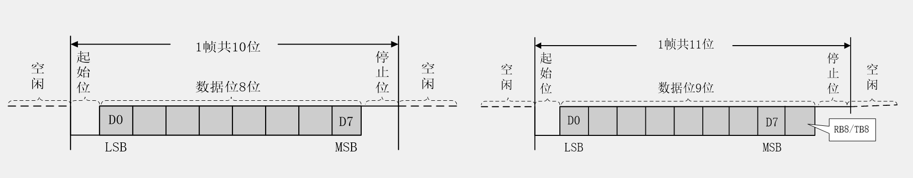
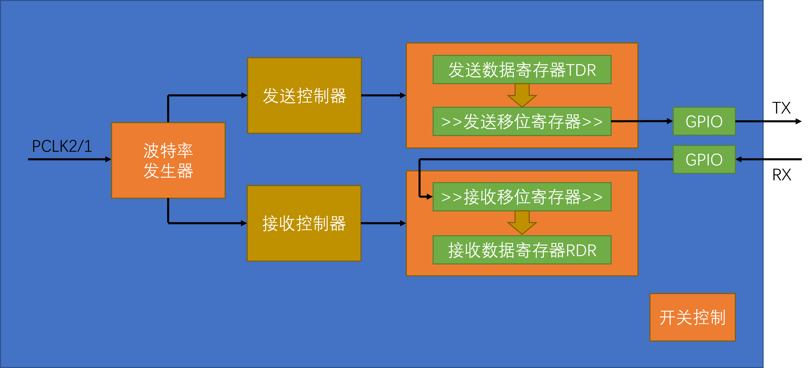
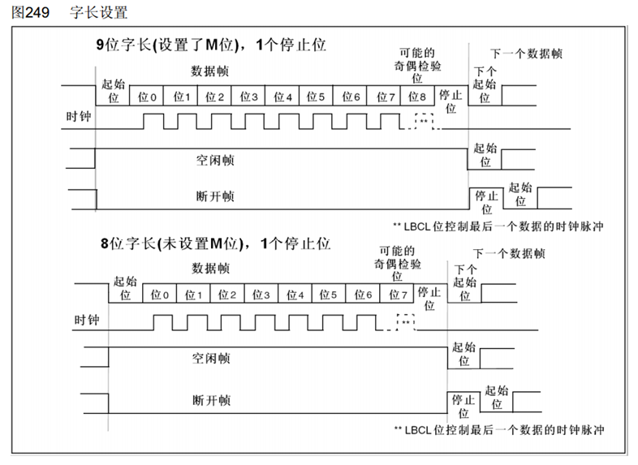
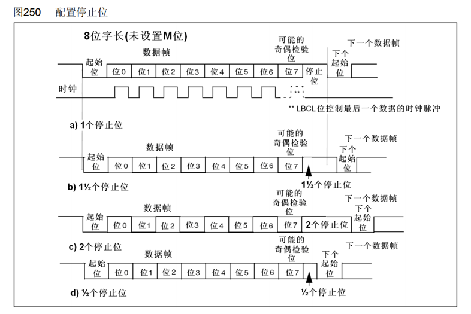
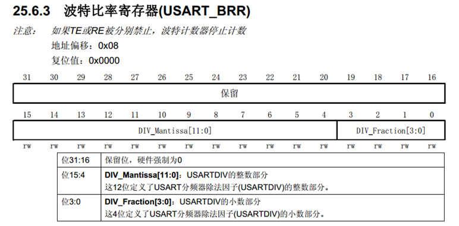
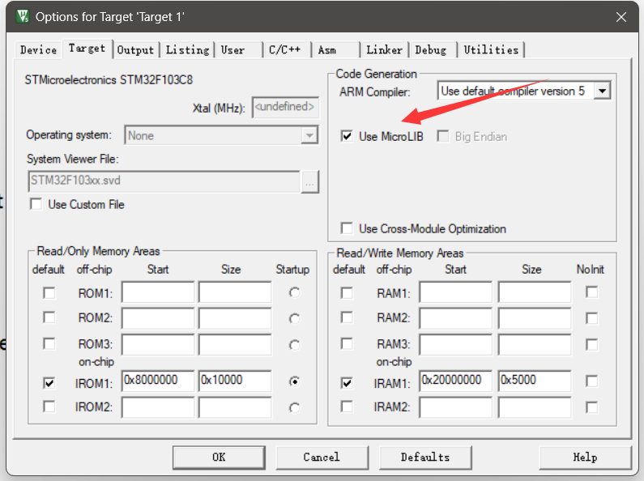
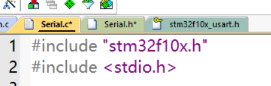
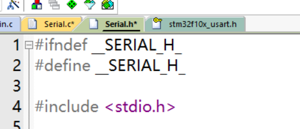

# UART 串口通信

<!-- @import "[TOC]" {cmd="toc" depthFrom=2 depthTo=4 orderedList=false} -->

<!-- code_chunk_output -->

- [一、通信](#一-通信)
- [二、串口通信](#二-串口通信)
  - [2.1 硬件电路](#21-硬件电路)
  - [2.2 电平标准](#22-电平标准)
  - [2.3 串口参数及时序](#23-串口参数及时序)
- [三、USART简介](#三-usart简介)
  - [3.1 USART基本结构](#31-usart基本结构)
  - [3.2 数据帧](#32-数据帧)
  - [3.3 波特率发生器](#33-波特率发生器)
- [四、与单片机进行串口通信](#四-与单片机进行串口通信)
  - [4.1 初始化串口](#41-初始化串口)
    - [4.1.1 开启时钟](#411-开启时钟)
    - [4.1.2 初始化GPIO引脚](#412-初始化gpio引脚)
    - [4.1.3 初始化USART](#413-初始化usart)
    - [4.1.4 配置接收中断](#414-配置接收中断)
  - [4.1.5 开启串口](#415-开启串口)
  - [4.2 发送数据](#42-发送数据)

<!-- /code_chunk_output -->


## 一、通信

通信协议：制定通信的规则，通信双方按照协议规则进行数据收发

stm32的通信协议：

名称|引脚|双工|时钟|电平|设备
:--:|:--:|:--:|:--:|:--:|:--:
USART|TX、RX|全双工|异步|单端|点对点
I2C|SCL、SDA|半双工|同步|单端|多设备
SPI|SCLK、MOSI、MISO、CS|全双工|同步|单端|多设备
CAN|CAN_H、CAN_L|半双工|异步|差分|多设备
USB|DP、DM|半双工|异步|差分|点对点

## 二、串口通信

* 串口是一种应用十分广泛的通讯接口，串口成本低、容易使用、通信线路简单，可实现两个设备的互相通信

* 单片机的串口可以使单片机与单片机、单片机与电脑、单片机与各式各样的模块互相通信，极大地扩展了单片机的应用范围，增强了单片机系统的硬件实力

### 2.1 硬件电路

* 简单双向串口通信有两根通信线（发送端TX和接收端RX）

* TX与RX要交叉连接
  
* 当只需单向的数据传输时，可以只接一根通信线
  
* 当电平标准不一致时，需要加电平转换芯片
  


### 2.2 电平标准

电平标准是数据1和数据0的表达方式，是传输线缆中人为规定的电压与数据的对应关系，串口常用的电平标准有如下三种：

* TTL电平：+3.3V或+5V表示1，0V表示0
* RS232电平：-3~-15V表示1，+3~+15V表示0
* RS485电平：两线压差+2~+6V表示1，-2~-6V表示0（差分信号）

### 2.3 串口参数及时序

* 波特率：串口通信的速率
* 起始位：标志一个数据帧的开始，固定为低电平
* 数据位：数据帧的有效载荷，1为高电平，0为低电平，低位先行
* 校验位：用于数据验证，根据数据位计算得来
* 停止位：用于数据帧间隔，固定为高电平



## 三、USART简介

S指同步，A指异步（因为同步不常用，所以一般也简称UART）

* USART是STM32内部集成的硬件外设，可根据数据寄存器的一个字节数据自动生成数据帧时序，从TX引脚发送出去，也可自动接收RX引脚的数据帧时序，拼接为一个字节数据，存放在数据寄存器里
* 自带波特率发生器，最高达4.5Mbits/s（常用波特率：9600、115200）
* 可配置数据位长度（8/9）、停止位长度（0.5/1/1.5/2）
* 可选校验位（无校验/奇校验/偶校验）
* 支持同步模式、硬件流控制、DMA、智能卡、IrDA、LIN
（STM32F103C8T6 USART资源： USART1（APB2）、 USART2（APB1）、 USART3（APB1））

通过查看引脚定义表可以看到引脚被定义在了哪个串口上

>USART1的TX在PA9，RX在PA10
USATR2的TX在PA2，RX在PA3
USATR3的TX在PB10，RX在PB11

### 3.1 USART基本结构



波特率发生器产生约定的通信速率，通往发送控制器和接收控制器，从而控制发送/接受移位；接着，橙色中的两个寄存器相互配合，将数据一位一位移出去，通过GPIO的复用输出，输出到TX引脚（当数据由TDR转移到发送移位寄存器时，会置一个TXE的标志位）；接收数据也是类似的过程，只不过是接收完后统一转运到RDR（完成后也会置一个RXNE标志位，不过这个标志位还可以申请中断）

### 3.2 数据帧



一般都是**9位字长——1个奇偶校验位；8位字长——无奇偶校验位**

这样保证发出去的数据都是一个字节



### 3.3 波特率发生器

* 发送器和接收器的波特率由波特率寄存器BRR里的DIV确定
* 计算公式：波特率 = fPCLK2/1 / (16 * DIV) 由此解出DIV即为该寄存器需要配置的值



## 四、与单片机进行串口通信

使用USART1 使单片机的PA9（UART1_TX）接RXD，PA10（UART1_RX）接TXD，GND接GND

### 4.1 初始化串口

同样是打通3.1中图

**1. 开启USART和GPIO时钟**

**2. GPIO初始化（TX复用输出，RX复用输入）**

**3. 配置USART**

**4. 配置接收中断**

**5. 开启串口**

#### 4.1.1 开启时钟

```c
void Serial_Init(void)
{
	RCC_APB2PeriphClockCmd(RCC_APB2Periph_GPIOA, ENABLE);
	RCC_APB2PeriphClockCmd(RCC_APB2Periph_USART1, ENABLE);
```

不多讲了

#### 4.1.2 初始化GPIO引脚

```c
GPIO_InitTypeDef GPIO_Initstructure;
GPIO_Initstructure.GPIO_Mode=GPIO_Mode_AF_PP;  //复用推挽输出
GPIO_Initstructure.GPIO_Pin=GPIO_Pin_9;        //使用端口为PA9
GPIO_Initstructure.GPIO_Speed=GPIO_Speed_50MHz; //速度50MHZ（不需考虑低功耗）
GPIO_Init(GPIOA,&GPIO_Initstructure);
	
GPIO_Initstructure.GPIO_Mode=GPIO_Mode_IPU;  //上拉输入
GPIO_Initstructure.GPIO_Pin=GPIO_Pin_10;        //使用端口为PA10
GPIO_Initstructure.GPIO_Speed=GPIO_Speed_50MHz; //速度50MHZ（不需考虑低功耗）
GPIO_Init(GPIOA,&GPIO_Initstructure);
```

也不多讲，初始化两次，中间就不用再 GPIO_InitTypeDef 了

#### 4.1.3 初始化USART

```c
USART_InitTypeDef USART_InitStructure;
USART_InitStructure.USART_BaudRate= 9600;
USART_InitStructure.USART_HardwareFlowControl= USART_HardwareFlowControl_None;
USART_InitStructure.USART_Mode= USART_Mode_Rx | USART_Mode_Tx ;
USART_InitStructure.USART_Parity= USART_Parity_No;
USART_InitStructure.USART_StopBits= USART_StopBits_1  ;
USART_InitStructure.USART_WordLength = USART_WordLength_8b ;
	
USART_Init(USART1,&USART_InitStructure);
```

* 第一个参数**波特率**，需要什么波特率直接写就行，系统会自动算好
* 第二个参数是**硬件流控制**，我们这里不使用硬件流控制
* 第三个参数**串口模式**，如果既要发送又要接收那就需要把两个参数或（ `|` ）起来
* 第四个参数**校验位**，Odd为奇，Even为偶
* 第五个参数**停止位**，选1
* 第六个参数**字长**，一般是8位对应无校验，9位对应一位校验

#### 4.1.4 配置接收中断

接收中断是 `USART_IT_RXNE`

```c
USART_ITConfig(USART1, USART_IT_RXNE, ENABLE);
```

开启中断后配置NVIC

```c
NVIC_PriorityGroupConfig(NVIC_PriorityGroup_2);
NVIC_InitTypeDef NVIC_InitStructure;	//定义结构体变量
NVIC_InitStructure.NVIC_IRQChannel = USART1_IRQn;	//选择配置NVIC的USART1
NVIC_InitStructure.NVIC_IRQChannelCmd = ENABLE;		//指定NVIC线路使能
NVIC_InitStructure.NVIC_IRQChannelPreemptionPriority = 1;	//指定NVIC线路的抢占优先级为1
NVIC_InitStructure.NVIC_IRQChannelSubPriority = 1;	//指定NVIC线路的响应优先级为1
NVIC_Init(&NVIC_InitStructure);	
```

然后我们寻找到中断函数名字为 `USART1_IRQHandler` 即可编写中断函数

以下采用封装函数的方式获取接收到的数据以及标志位

```c
u8 Serial_GetRxFlag(void)	//获取串口接收标志位
{
	if (Serial_RxFlag == 1)
	{
		Serial_RxFlag = 0;
		return 1;
	}
	else
		return 0;
}

u8 Serial_GetRxData(void)	//获取串口接收的数据
{
	return Serial_RxData;
}

//中断函数
void USART1_IRQHandler(void)
{
	if(USART_GetITStatus(USART1, USART_IT_RXNE) == SET) //判断中断标志位确实被置1
	{
		Serial_RxData = USART_ReceiveData(USART1);	//读取数据寄存器会自动清除RXNE标志位
		Serial_RxFlag = 1;
	}
}
```

### 4.1.5 开启串口

```c
    USART_Cmd(USART1,ENABLE);
}
```

到此串口就配置好了

### 4.2 发送数据

写一个发送数据函数

```c
void Serial_SendByte(u8 Byte)
{
	USART_SendData(USART1, Byte);
```

为了防止数据还没发送完成下一个数据过来就把它覆盖了，所以我们需要等待一下标志位

```c
    while(USART_GetFlagStatus(USART1, USART_FLAG_TXE) == RESET);
}
```

通过参数 `USART_FLAG_TXE` 来查看发送标志位，等待它置1

当我们下一次sendbyte时，它会自动清零，所以不需要手动清啦

---

有了这个函数，我们就可以封装一些具有更多功能的函数，比如发送数组、发送字符串等等

```c
void Serial_SendArr(u8 *arr, u16 size)  //发送数组
{
	u16 i;
	for(i=0; i<size; i++)
	{
		Serial_SendByte(arr[i]);
	}
}
```

```c
void Serial_SendStr(char *str)  //发送字符串（使用‘\n’换行）
{
	u8 i;
	for(i=0; str[i] != '\0'; i++)
	{
		Serial_SendByte(str[i]);
	}
}
```

```c
//发送字符形式数字
uint32_t Serial_Pow(uint32_t X, uint32_t Y)	//取出每一位数字
{
	uint32_t Result = 1;
	while (Y --)
	{
		Result *= X;
	}
	return Result;
}

void Serial_SendNumber(uint32_t Number, uint8_t Length)	//发送每一位数字
{
	uint8_t i;
	for (i = 0; i < Length; i ++)
	{
		Serial_SendByte(Number / Serial_Pow(10, Length - i - 1) % 10 + '0');
	}
}
```

还可以移植 `printf` 函数，不过需要先勾选 **Use MicroLIB**



然后在头文件引用处加上（注意.c和.h里面都要加）

```c
#include <stdio.h>
```





最后使用以下函数指定printf对应的串口

```c
/**
  * 函    数：使用printf需要重定向的底层函数
  * 参    数：保持原始格式即可，无需变动
  * 返 回 值：保持原始格式即可，无需变动
  */
int fputc(int ch, FILE *f)
{
	Serial_SendByte(ch);			//将printf的底层重定向到自己的发送字节函数
	return ch;
}
```


对于大量数据的传输，一般推荐采用数据包的方式（参考视频9-5）
