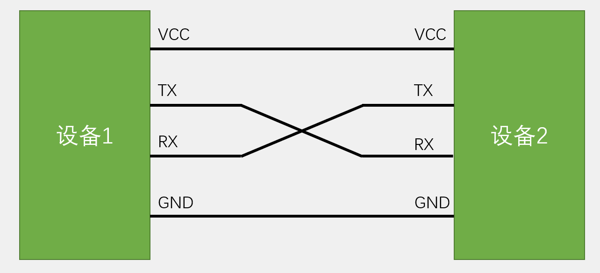

# UART 串口通信

## 一、通信

通信协议：制定通信的规则，通信双方按照协议规则进行数据收发

stm32的通信协议：

名称|引脚|双工|时钟|电平|设备
:--:|:--:|:--:|:--:|:--:|:--:
USART|TX、RX|全双工|异步|单端|点对点
I2C|SCL、SDA|半双工|同步|单端|多设备
SPI|SCLK、MOSI、MISO、CS|全双工|同步|单端|多设备
CAN|CAN_H、CAN_L|半双工|异步|差分|多设备
USB|DP、DM|半双工|异步|差分|点对点

## 二、串口通信

* 串口是一种应用十分广泛的通讯接口，串口成本低、容易使用、通信线路简单，可实现两个设备的互相通信

* 单片机的串口可以使单片机与单片机、单片机与电脑、单片机与各式各样的模块互相通信，极大地扩展了单片机的应用范围，增强了单片机系统的硬件实力

### 2.1 硬件电路

* 简单双向串口通信有两根通信线（发送端TX和接收端RX）

* TX与RX要交叉连接
  
* 当只需单向的数据传输时，可以只接一根通信线
  
* 当电平标准不一致时，需要加电平转换芯片
  

### 2.2 电平标准

电平标准是数据1和数据0的表达方式，是传输线缆中人为规定的电压与数据的对应关系，串口常用的电平标准有如下三种：

* TTL电平：+3.3V或+5V表示1，0V表示0
* RS232电平：-3~-15V表示1，+3~+15V表示0
* RS485电平：两线压差+2~+6V表示1，-2~-6V表示0（差分信号）

### 2.3 串口参数及时序

* 波特率：串口通信的速率
* 起始位：标志一个数据帧的开始，固定为低电平
* 数据位：数据帧的有效载荷，1为高电平，0为低电平，低位先行
* 校验位：用于数据验证，根据数据位计算得来
* 停止位：用于数据帧间隔，固定为高电平

## 三、USART简介

S指同步，A指异步（因为同步不常用，所以一般也简称UART）

* USART是STM32内部集成的硬件外设，可根据数据寄存器的一个字节数据自动生成数据帧时序，从TX引脚发送出去，也可自动接收RX引脚的数据帧时序，拼接为一个字节数据，存放在数据寄存器里
* 自带波特率发生器，最高达4.5Mbits/s（常用波特率：9600、115200）
* 可配置数据位长度（8/9）、停止位长度（0.5/1/1.5/2）
* 可选校验位（无校验/奇校验/偶校验）
* 支持同步模式、硬件流控制、DMA、智能卡、IrDA、LIN
（STM32F103C8T6 USART资源： USART1（APB2）、 USART2（APB1）、 USART3（APB1））

通过查看引脚定义表可以看到引脚被定义在了哪个串口上

>USART1的TX在PA9，RX在PA10
USATR2的TX在PA2，RX在PA3
USATR2的TX在PB10，RX在PB11

### 3.1 USART基本结构

波特率发生器产生约定的通信速率，通往发送控制器和接收控制器，从而控制发送/接受移位；接着，橙色中的两个寄存器相互配合，将数据一位一位移出去，通过GPIO的复用输出，输出到TX引脚（当数据由TDR转移到发送移位寄存器时，会置一个TXE的标志位）；接收数据也是类似的过程，只不过是接收完后统一转运到RDR（完成后也会置一个RXNE标志位，不过这个标志位还可以申请中断）

### 3.2 数据帧

一般都是**9位字长——1个奇偶校验位；8位字长——无奇偶校验位**

这样保证发出去的数据都是一个字节

### 3.3 波特率发生器

* 发送器和接收器的波特率由波特率寄存器BRR里的DIV确定
* 计算公式：波特率 = fPCLK2/1 / (16 * DIV) 由此解出DIV即为该寄存器需要配置的值

## 四、与单片机进行串口通信

使用USART1 使单片机的PA9接RXD，PA10接TXD

