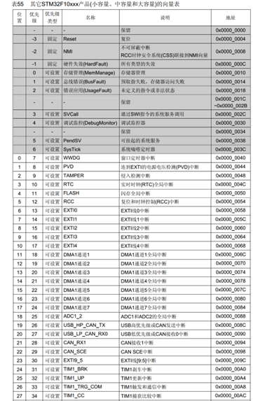
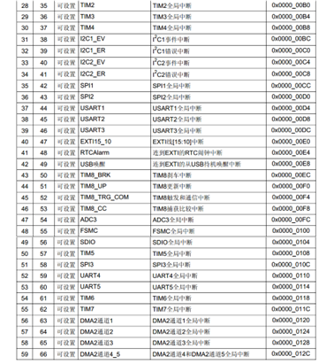
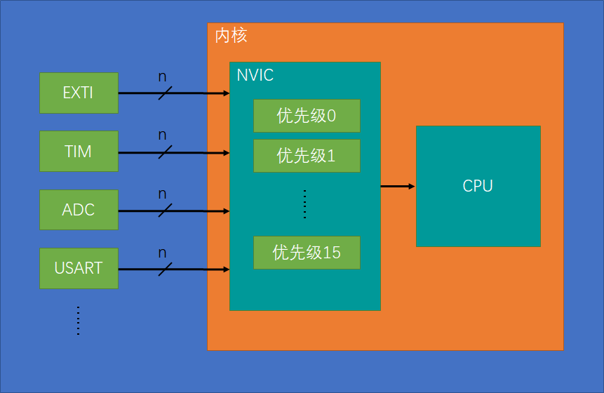
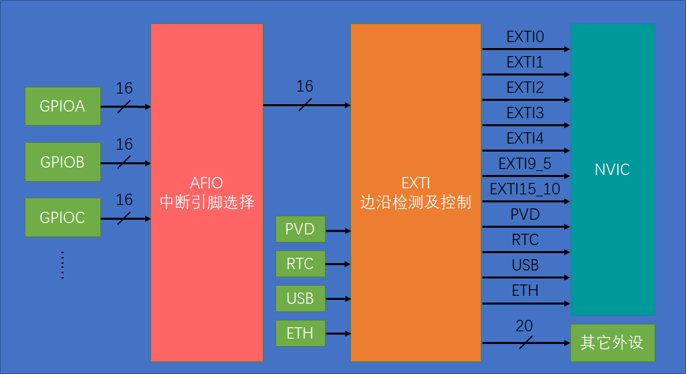
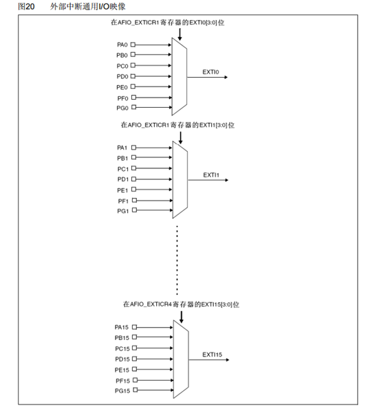
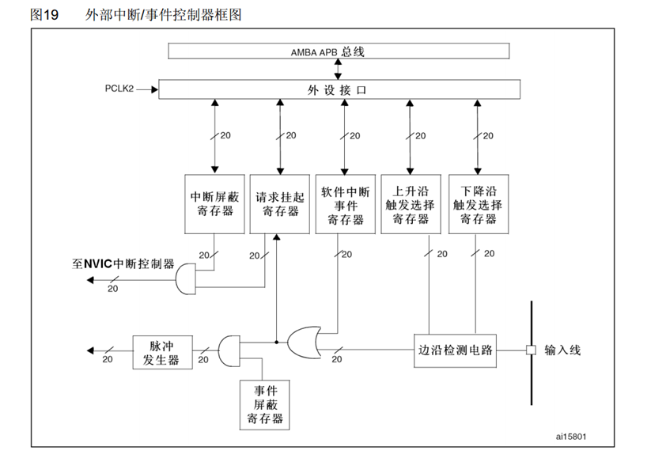

# 中断

<!-- @import "[TOC]" {cmd="toc" depthFrom=2 depthTo=4 orderedList=false} -->

<!-- code_chunk_output -->

- [中断](#中断)
  - [一、stm32中断](#一stm32中断)
    - [1.1 NVIC基本结构](#11-nvic基本结构)
    - [1.2 NVIC优先级分组](#12-nvic优先级分组)
  - [二、EXTI外部中断](#二exti外部中断)
    - [2.1 介绍](#21-介绍)
    - [2.2 EXTI结构](#22-exti结构)
      - [2.2.1 AFIO](#221-afio)
      - [2.2.2 EXTI](#222-exti)
    - [2.3 AFIO、EXTI与NVIC函数](#23-afioexti与nvic函数)
      - [2.3.1 AFIO函数](#231-afio函数)
      - [2.3.2 EXTI函数](#232-exti函数)
        - [2.3.2.1 配置函数](#2321-配置函数)
        - [2.3.2.2 软件触发外部中断](#2322-软件触发外部中断)
        - [2.3.2.3 状态标志位函数](#2323-状态标志位函数)
      - [2.3.3 NVIC函数](#233-nvic函数)
    - [2.4 配置EXTI中断](#24-配置exti中断)
      - [1. 配置RCC，打开需要配置外设的时钟](#1-配置rcc打开需要配置外设的时钟)
      - [2. 配置GPIO，选择端口为输入模式](#2-配置gpio选择端口为输入模式)
      - [3. 配置AFIO，选择所使用的GPIO连接至后方的EXTI](#3-配置afio选择所使用的gpio连接至后方的exti)
      - [4. 配置EXTI，选择边沿触发方式与响应方式](#4-配置exti选择边沿触发方式与响应方式)
      - [5. 配置NVIC，选择一个合适的优先级](#5-配置nvic选择一个合适的优先级)
    - [2.5 EXTI中断函数](#25-exti中断函数)

<!-- /code_chunk_output -->


## 一、stm32中断

stm32F10xx共有68个可屏蔽中断通道





>*中断向量表*————记录中断的地址
由于硬件的限制，中断的跳转只能跳转的固定的地址执行程序，而我们编写的中断函数地址是不固定的；
所以需要在内存中定义一个固定地址的列表，当中断发生时跳转到该固定位置，然后再由编译器加上跳转中断函数代码，实现能够跳转到任意位置执行中断函数的功能

使用**NVIC**统一管理中断，每个中断通道都拥有16个可编程的优先等级，可对优先级进行分组，进一步设置抢占优先级和响应优先级

一般使用的都是图中白色的中断，灰色的了解即可

### 1.1 NVIC基本结构



### 1.2 NVIC优先级分组

**响应优先级**：排队顺序的先后（响应优先级高，则可以插到队伍前面）

**抢占优先级**：决定是否可以中断嵌套（是否可以直接打断CPU当前的工作进入该中断）

**取值越小优先级越高**

分组方式|抢占优先级|响应优先级
--|--|--
分组0|0位，取值为0|4位，取值为0~15
分组1|1位，取值为0-1|4位，取值为0~7
分组2|2位，取值为0-3|3位，取值为0~3
分组3|3位，取值为0-7|2位，取值为0~1
分组4|4位，取值为0-15|1位，取值为0

## 二、EXTI外部中断

### 2.1 介绍

EXTI可以监测指定GPIO口的电平信号，当其指定的GPIO口产生电平变化时，EXTI将立即向NVIC发出中断申请，经过NVIC裁决后即可中断CPU主程序，使CPU执行EXTI对应的中断程序

简单来说就是：**引脚电平变化，申请中断**

* 支持的触发方式：上升沿/下降沿/双边沿（上+下）/软件触发（程序执行一段代码触发中断）
* 支持的GPIO口：所有GPIO口，但相同的Pin不能同时触发中断（如：`PA^0` 与 `PB^0` 不可以同时触发，但是 `PA^0` 与 `PB^1` 可以）
* 通道数：16个GPIO_Pin，外加PVD输出、RTC闹钟、USB唤醒、以太网唤醒（外加部分主要用于低功耗模式的唤醒）
* 触发响应方式：中断响应/事件响应（中断信号通往其他外设，触发其他外设的操作）

### 2.2 EXTI结构



注意，EXTI9-5 与 EXTI15-10 被放在了一根线上，意味着它们会触发同一个中断函数；因此在编程时需要根据标志位区分到底是哪个中断进入的

#### 2.2.1 AFIO

AFIO主要用于引脚复用功能的选择和重定义



也就是数据选择器的作用（根据上方箭头寄存器中的值选择哪根通道的数据作为输出）

在STM32中，AFIO主要完成两个任务：**复用功能引脚重映射**、**中断引脚选择**

#### 2.2.2 EXTI



### 2.3 AFIO、EXTI与NVIC函数

#### 2.3.1 AFIO函数

关于AFIO有两个重要函数：

```c
void GPIO_PinRemapConfig(uint32_t GPIO_Remap, FunctionalState NewState);    //进行引脚重映射
void GPIO_EXTILineConfig(uint8_t GPIO_PortSource, uint8_t GPIO_PinSource);  //配置中断
```
#### 2.3.2 EXTI函数

##### 2.3.2.1 配置函数

```c
void EXTI_DeInit(void); //复位
void EXTI_Init(EXTI_InitTypeDef* EXTI_InitStruct);  //初始化
```

根据结构体内的参数初始化EXTI，具体与GPIO差不多

##### 2.3.2.2 软件触发外部中断

```c
void EXTI_GenerateSWInterrupt(uint32_t EXTI_Line);
```

使用软件触发时才会用到，具体为：

调用这个函数，参数给一个指定的中断线，就能软件触发一次这个外部中断

##### 2.3.2.3 状态标志位函数

```c
FlagStatus EXTI_GetFlagStatus(uint32_t EXTI_Line);  
ITStatus EXTI_GetITStatus(uint32_t EXTI_Line);  //在中断函数中使用
```

获取指定标志位是否被置1

```c
void EXTI_ClearFlag(uint32_t EXTI_Line);
void EXTI_ClearITPendingBit(uint32_t EXTI_Line);    //在中断函数中使用
```

清除标志位，将其置0

**说明：**

带IT的函数只能读写与中断有关的标志位，而Flag则是都可以一般的读取。因此一般约定，**主程序用带Flag的函数，中断里用带IT的函数**

#### 2.3.3 NVIC函数

```c
void NVIC_PriorityGroupConfig(uint32_t NVIC_PriorityGroup);
```
使用该函数指定中断的分组

```c
void NVIC_Init(NVIC_InitTypeDef* NVIC_InitStruct);
```

然后使用该函数初始化NVIC即可

### 2.4 配置EXTI中断

配置EXTI中断只需要将2.2结构图中从GPIO到NVIC这一路中出现的外设模块都配置好即可


步骤如下：

**1. 配置RCC，打开需要配置外设的时钟**

**2. 配置GPIO，选择端口为输入模式**

**3. 配置AFIO，选择所使用的GPIO连接至后方的EXTI**

**4. 配置EXTI，选择边沿触发方式与响应方式**

**5. 配置NVIC，选择一个合适的优先级**

具体操作如下所示：

#### 1. 配置RCC，打开需要配置外设的时钟

首先开启GPIO时钟

``` c
RCC_APB2PeriphClockCmd(RCC_APB2Periph_GPIOB, ENABLE);
```

然后开启AFIO时钟

``` c
RCC_APB2PeriphClockCmd(RCC_APB2Periph_AFIO, ENABLE);
```

EXTI与NVIC时钟默认开启，所以不需要再进行什么操作

#### 2. 配置GPIO，选择端口为输入模式

详见GPIO章节

``` c
GPIO_InitTypeDef GPIO_Initstructure;
GPIO_Initstructure.GPIO_Mode=GPIO_Mode_IPU; //手册推荐使用上拉输入
GPIO_Initstructure.GPIO_Pin=GPIO_Pin_14;
GPIO_Initstructure.GPIO_Speed=GPIO_Speed_50MHz;

GPIO_Init(GPIOB,&GPIO_Initstructure);
```

#### 3. 配置AFIO，选择所使用的GPIO连接至后方的EXTI

AFIO的相关配置还是放在GPIO头文件中，虽然写着GPIO，实际上是调用的AFIO的寄存器

```c
GPIO_EXTILineConfig(GPIO_PortSourceGPIOB, GPIO_PinSource14) 
```

函数的第一歌参数 `GPIO_PortSourceGPIOx` 选择GPIO外设，第二个参数 `GPIO_PinSourcex` 选择配置的外部中断线（在此出设置的对应PB14）

#### 4. 配置EXTI，选择边沿触发方式与响应方式

```c
EXTI_InitTypeDef EXTI_InitStructure;	//定义结构体变量
EXTI_InitStructure.EXTI_Line = EXTI_Line14;		//选择配置外部中断的14号线
EXTI_InitStructure.EXTI_LineCmd = ENABLE;	//指定外部中断线使能
EXTI_InitStructure.EXTI_Mode = EXTI_Mode_Interrupt;		//指定外部中断线为中断模式
EXTI_InitStructure.EXTI_Trigger = EXTI_Trigger_Falling;	//指定外部中断线为下降沿触发
EXTI_Init(&EXTI_InitStructure);		//将结构体变量交给EXTI_Init，配置EXTI外设
```

#### 5. 配置NVIC，选择一个合适的优先级

```c
NVIC_PriorityGroupConfig(NVIC_PriorityGroup_2);	    //配置NVIC为分组2
//即抢占优先级范围：0~3，响应优先级范围：0~3
```

注意：这个分组方式整个芯片**只能用一种**，如果放在模块里进行分组，一定要确保**所有模块的分组都是选的同一个！**

然后进行初始化即可

```c
NVIC_InitTypeDef NVIC_InitStructure;	//定义结构体变量

NVIC_InitStructure.NVIC_IRQChannel = EXTI15_10_IRQn;	//选择配置NVIC的EXTI15_10线
NVIC_InitStructure.NVIC_IRQChannelCmd = ENABLE;		//指定NVIC线路使能
NVIC_InitStructure.NVIC_IRQChannelPreemptionPriority = 1;	//指定NVIC线路的抢占优先级为1
NVIC_InitStructure.NVIC_IRQChannelSubPriority = 1;	//指定NVIC线路的响应优先级为1

NVIC_Init(&NVIC_InitStructure);		//将结构体变量交给NVIC_Init，配置NVIC外设
```

在选择 `NVIC_IRQChannel` 时,需要寻找当前芯片对应的IRQn_Type列表，在里面选择所对应的值即可（这里用的EXTI14，所以选EXTI15_10）

至此，整个外部中断就配置好了

### 2.5 EXTI中断函数

在stm32中，中断函数的名字是固定的，每一个中断通道对应一个中断函数

在启动文件中也可以找到中断向量表，里面就有中断函数的名字，中断函数不需要声明

如本例中应使用的函数如下：

```c
void EXTI_15_10_IRQHandler(void)
{

}
```

写错了就进不了中断了，所以最好是从启动文件里复制过来

函数内部首先一般是先进行中断标志位的判断

```c
if (EXTI_GetFlagStatus(EXTI_Line14) == SET ) //判断中断标志位是不是1（SET）
{
  EXTI_ClearITPendingBit(EXTI_Line14);   //清除中断标志位
}
```
在函数的末尾需要清除中断标志位，否则程序会一直响应中断

然后就可以在if里面加入中断后想要实现的功能了