# TIM 定时器

<!-- @import "[TOC]" {cmd="toc" depthFrom=2 depthTo=4 orderedList=false} -->

<!-- code_chunk_output -->

- [一、定时器](#一-定时器)
  - [1.1 基本定时器](#11-基本定时器)
  - [1.2 通用定时器](#12-通用定时器)
    - [1.2.1 时钟源选择](#121-时钟源选择)
    - [1.2.2 输入、输出比较电路](#122-输入-输出比较电路)
  - [1.2.3 RCC时钟树](#123-rcc时钟树)
- [二、定时器中断](#二-定时器中断)
  - [2.1 定时中断基本结构](#21-定时中断基本结构)
  - [2.2 基本公式](#22-基本公式)
  - [2.3 配置定时器](#23-配置定时器)
    - [2.3.1 开启RCC时钟](#231-开启rcc时钟)
    - [2.3.2 选择时基单元的时钟源](#232-选择时基单元的时钟源)
    - [2.3.3 配置时基单元](#233-配置时基单元)
    - [2.3.4 使能更新中断](#234-使能更新中断)
    - [2.3.5 配置NVIC](#235-配置nvic)
    - [2.3.6 运行控制，使能计数器](#236-运行控制使能计数器)
  - [2.4 定时器中断函数](#24-定时器中断函数)
  - [*2.5 使用外部时钟](#25-使用外部时钟)
- [三、TIM输出比较](#三-tim输出比较)
  - [3.1 OC（Output Compare）输出比较](#31-ocoutput-compare输出比较)
  - [3.2 输出比较模式](#32-输出比较模式)
  - [3.3 PWM（Pulse Width Modulation）脉冲宽度调制](#33-pwmpulse-width-modulation脉冲宽度调制)
    - [3.3.1 PWM基本结构](#331-pwm基本结构)
    - [3.3.2 参数计算](#332-参数计算)
  - [3.4 初始化PWM](#34-初始化pwm)
    - [3.4.1-2 开启RCC与配置时基单元](#341-2-开启rcc与配置时基单元)
    - [3.4.3 初始化输出比较单元](#343-初始化输出比较单元)
    - [3.4.4 初始化GPIO](#344-初始化gpio)
  - [3.5 占空比调节](#35-占空比调节)
- [四、TIM输入捕获](#四-tim输入捕获)
- [五、TIM编码器](#五-tim编码器)

<!-- /code_chunk_output -->


## 一、定时器

类型|编号|总线|功能
--|--|--|--
高级定时器|TIM1、TIM8|APB2|拥有通用定时器全部功能，并额外具有重复计数器、死区生成、互补输出、刹车输入等功能
通用定时器|TIM2、TIM3、TIM4、TIM5|APB1|拥有基本定时器全部功能，并额外具有内外时钟源选择、输入捕获、输出比较、编码器接口、主从触发模式等功能
基本定时器|TIM6、TIM7|APB1|拥有定时中断、主模式触发DAC的功能

STM32F103C8T6定时器资源：**TIM1、TIM2、TIM3、TIM4**

### 1.1 基本定时器

<div style="text-align: center;">
                                
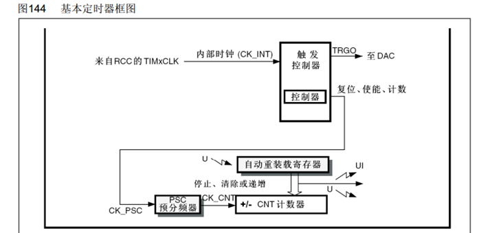
</div>

基本定时器只能选择内部时钟，所以可以认为是CK_INT与CK_PSC直接相连；而内部时钟的来源是RCC_TIMxCLK，一般都是系统主频**72MHZ**

预分频器（16位）对72M进行分频，写0即为1分频，写1即为2分频，**实际分频系数=预分频的值+1**；最大值可以写65535，即为65536分频

对于每一个上升沿，计数器（16位）的值+1，可以从0加到65535；

自动重装载（16位）寄存器储存目标值，当计数器的值加到目标后触发中断并清零重新计数

>这种 计数值等于重新装载值 产生的中断被一般称为 “更新中断”，通往NVIC

>主模式触发DAC的功能则是相当于计数器到了重装载值，产生了一个更新事件，然后内部硬件映射到TRGO，通过TRGO来自动触发DAC转换，不再需要再到定时器中断里再去执行读取DAC数值了。

### 1.2 通用定时器

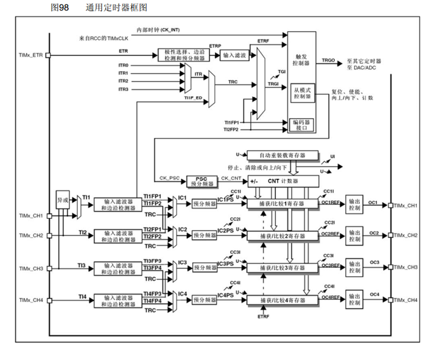

基本定时器只支持向上计数，而通用定时器可以支持**向上计数、向下计数、中央对齐**三种模式（用的最多的还是向上计数）

---

以下为内外时钟源选择和主从触发模式的结构

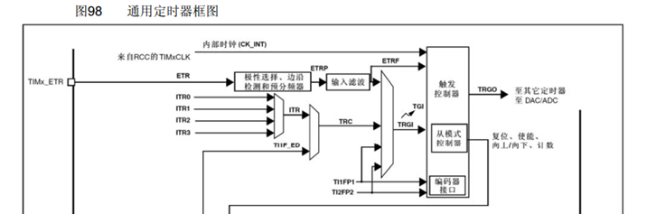

#### 1.2.1 时钟源选择 

除了内部时钟源外，通用定时器还可以选择外部时钟，按照信号可以分为：

* ETR：根据引脚定义表，可以在复用功能有TIMx_ETR的引脚上（如PA0为TIM2的ETR引脚）接一个外部方波时钟，然后配置内部的极性选择，边沿检测和预分频电路还有输入滤波电路（对输入进行整形）。将得到的信号一路经TRGI作为触发输入使用（触发定时器的从模式）
* ITR：时钟信号来自其他定时器的TRGO输出，根据手册14.4.3 表78 了解其连接方式；用于实现定时器的级联功能
* TI1F_ED：从CH1引脚获得时钟（ED表示边沿），上升沿下降沿均有效
* TI1FP1、TI1FP2:即为CH1或者CH2引脚的时钟

以上为**外部时钟模式1**的输入，即为ETR引脚、其他定时器、CH1引脚边沿、CH1或者CH2引脚（**一般用ETR引脚**）

而ETR输入的信号还有一路由ETRF进入触发控制器，紧跟着也可以作为时基单元的时钟，该方式为**外部时钟模式1**（一般都选用这种）

#### 1.2.2 输入、输出比较电路

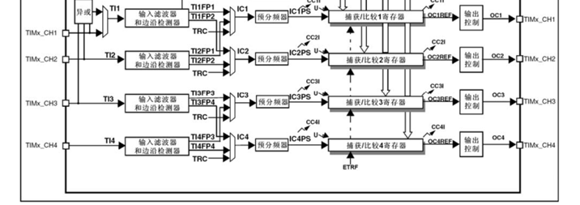

左边为输入捕获电路，用于测方波的频率

右边为输出捕获电路，主要用于输出PWM波驱动电机

### 1.2.3 RCC时钟树

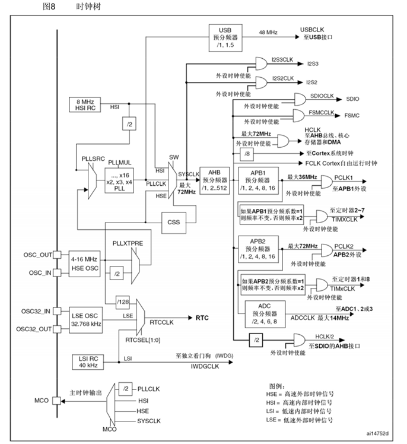

## 二、定时器中断

### 2.1 定时中断基本结构

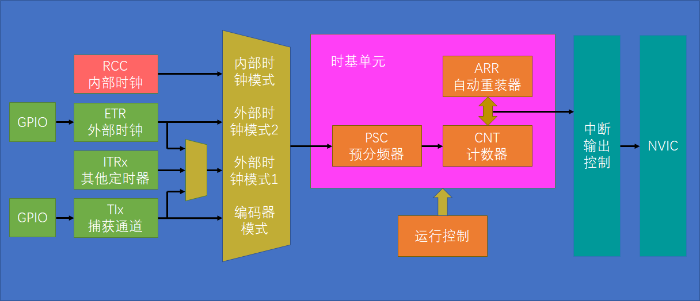

>影子寄存器：
程序员可以写入或读出的寄存器，是预装载寄存器；另一个是程序员看不见的、但在操作中真正起作用的寄存器，称为影子寄存器
影子寄存器有一道防备功能，防止计数在中途程序员突然预分频值或者预装载值（目标值）使时序对不上（如：当计数值为F1时将目标值从FF改成36，那么程计数不会立即重置，而是自增到FF溢出后变回0再加到36产生更新），因此会等每个计数周期结束后才会应用改变


### 2.2 基本公式

计数器计数频率：CK_CNT = CK_CNT / (PSC + 1)

> CK_CNT 定时器时钟；CK_CNT 定时器时钟源；PSC 预分频值

计数器溢出频率：CK_CNT_OV = CK_CNT / (ARR + 1)

>CK_CNT_OV 计数器溢出频率；ARR 自动重装载寄存器的值 

因此可以得到一般定时器在工作时的溢出频率

**CK_CNT_OV = CK_PSC / (PSC + 1) / (ARR + 1)**

定时时间取倒数即可

### 2.3 配置定时器

同理，只需要将2.1中的结构图打通即可，大体步骤为：

**1. RCC开启时钟**

**2. 选择时基单元的时钟源**

**3. 配置时基单元**

**4. 配置输出中断控制**

**5. 配置NVIC**

**6. 运行控制，使能计数器**

具体函数在配置的时候再详细讲解

举例：初始化TIM2通用定时器

#### 2.3.1 开启RCC时钟

```c
RCC_APB1PeriphClockCmd(RCC_APB1Periph_TIM2, ENABLE);
```

注意，**TIM2是APB1总线的外设**，所以应该是用APB1相关设置

#### 2.3.2 选择时基单元的时钟源

使用内部时钟选择以下函数

```c
TIM_InternalClockConfig(TIM2);
```

这样TIM2的时基单元就由内部时钟驱动了

>stm32上电后默认使用的是内部时钟，所以不写这一行也行

#### 2.3.3 配置时基单元

时基单元是通过结构体进行初始化，所以应该先定义一个结构体单元，使用以下代码进行定义：

```c
TIM_TimeBaseInitTypeDef TIM_TimeBaseInitStruct;
```

结构体成员有

```c
TIM_TimeBaseInitTypeDef TIM_TimeBaseInitStructure;
TIM_TimeBaseInitStructure.TIM_ClockDivision= TIM_CKD_DIV1;
TIM_TimeBaseInitStructure.TIM_CounterMode= TIM_CounterMode_Up;
TIM_TimeBaseInitStructure.TIM_Period= 10000 - 1;    //ARR
TIM_TimeBaseInitStructure.TIM_Prescaler= 7200 - 1;  //PSC
TIM_TimeBaseInitStructure.TIM_RepetitionCounter= 0;
```

* 第一个为时钟分频，与内部时基单元关系不大，故可以随便配置；可选1、2、4分频，这里选择1分频
* 第二个选择计数器模式，有向上计数、向下计数和中央对齐，这里选向上对其
* 后面三个就是跟计数有关了的，其中最后一个重复计数是高级定时器才有的，所以这里直接给0；而前面两个的值就可以根据2.2中的公式进行确定，这里最终算出来的定时是1s，也就是1HZ（注意公式中会有1的偏差，以及**PSC和ARR的值范围在0~65535之间**！）

最后用函数初始化时基单元即可

```c
TIM_TimeBaseInit(TIM2 , &TIM_TimeBaseInitStructure);

TIM_ClearFlag(TIM2, TIM_FLAG_Update);   //清除中断标志位
```

>此处在最后还加了一个清除中断标志位，原因是预分频完后系统会自动更新事件产生中断，为了防止一上电/复位就产生一次中断，我们需要清除这个中断标志位

#### 2.3.4 使能更新中断

使用以下函数

```c
TIM_ITConfig(TIM2, TIM_IT_Update, ENABLE);
```

第一个参数选择定时器，第二个是选择中断：这里选择更新中断，第三个使能即可；这样就开启了中断至NVIC的通路

#### 2.3.5 配置NVIC

原理同中断一讲，这里不再赘述

```c
NVIC_PriorityGroupConfig(NVIC_PriorityGroup_2);	    //配置NVIC为分组2

NVIC_InitTypeDef NVIC_InitStructure;	//定义结构体变量

NVIC_InitStructure.NVIC_IRQChannel = TIM2_IRQn;	//选择配置NVIC的定时器2
NVIC_InitStructure.NVIC_IRQChannelCmd = ENABLE;		//指定NVIC线路使能
NVIC_InitStructure.NVIC_IRQChannelPreemptionPriority = 2;	//指定NVIC线路的抢占优先级为1
NVIC_InitStructure.NVIC_IRQChannelSubPriority = 1;	//指定NVIC线路的响应优先级为1

NVIC_Init(&NVIC_InitStructure);		//将结构体变量交给NVIC_Init，配置NVIC外设
```

注意第一个参数要选择相应的外设中断通道，这里是TIM2_IRQn（定时器2）

#### 2.3.6 运行控制，使能计数器

```c
TIM_Cmd(TIM2, ENABLE);
```

### 2.4 定时器中断函数

定时器2在产生中断后进入以下函数

```c
void TIM2_IRQHandler(void)
{
	
}
```

首先还是检查中断标志位以及清除标志位

```c
if (TIM_GetITStatus(TIM2, TIM_IT_Update) == SET ) //判断中断标志位是不是1（SET）
{

     TIM_ClearITPendingBit(TIM2, TIM_IT_Update);   //清除中断标志位
}
```

然后就可以在if里面加入中断后想要实现的功能了

### *2.5 使用外部时钟

若使用外部时钟作为时基信号，只需要对“时基单元的时钟源”（2.3.2）进行更改

具体为将这一行：

```c
TIM_InternalClockConfig(TIM2);
```

删去，因为不需要内部时钟了，然后更改为：

```c
TIM_ETRClockMode2Config(TIM2,TIM_ExtTRGPSC_OFF,TIM_ExtTRGPolarity_NonInverted,0x0F);
```

选择外部时钟模式2

* 第一个参数：选择TIM2的时基单元
* 第二个参数：外部触发预分频器
* 第三个参数：外部触发的极性（反向：低电平/下降沿有效，不反向：高电平/上升沿有效）
* 第四个参数：外部触发滤波器，一般要大于0x03（取值为0x00~0x0f）

然后记得开启初始化输入时钟信号的GPIO口！（如本例使用TIM2的ETR对应的就是**PA0**引脚）

## 三、TIM输出比较

### 3.1 OC（Output Compare）输出比较

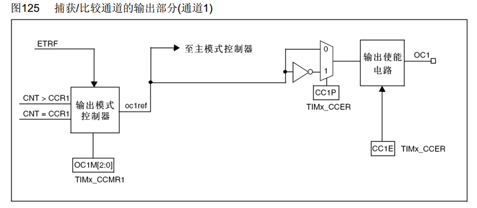

输出比较可以通过比较CNT与CCR寄存器值的关系，来对输出电平进行置1、置0或翻转的操作，用于**输出一定频率和占空比的PWM波形**

### 3.2 输出比较模式

模式|描述
:--:|--
冻结|CNT=CCR时，REF保持为原状态（适用于暂停比较，输出也定格在当前状态）
匹配时置有效电平|CNT=CCR时，REF置有效电平
匹配时置无效电平|CNT=CCR时，REF置无效电平
匹配时电平翻转|CNT=CCR时，REF电平翻转 (可以稳定输出占空比50%)
强制为无效电平|CNT与CCR无效，REF强制为无效电平
强制为有效电平|CNT与CCR无效，REF强制为有效电平
PWM模式1|向上计数：CNT<CCR时，REF置有效电平，CNT≥CCR时，REF置无效电平 <br/> 向下计数：CNT>CCR时，REF置无效电平，CNT≤CCR时，REF置有效电平
PWM模式2|向上计数：CNT<CCR时，REF置无效电平，CNT≥CCR时，REF置有效电平 <br/> 向下计数：CNT>CCR时，REF置有效电平，CNT≤CCR时，REF置无效电平

>注：有效电平即“高电平”，无效电平即“低电平”

### 3.3 PWM（Pulse Width Modulation）脉冲宽度调制

在具有**惯性**的系统中，可以通过对一系列脉冲的宽度进行调制，来等效地获得所需要的模拟参量，如：LED亮度调节、电机控速

像这样等效：

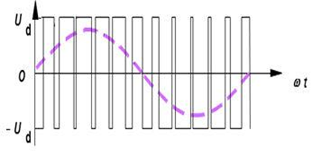

**PWM参数**

$频率 = 1 / T_S \quad 占空比 = T_{ON} / T_S \quad 分辨率 = 占空比变化步距$

(分辨率：若为1%，占空比就只能取1%，2%……；若为0.1%，则可以取1.1%，1.2%……)

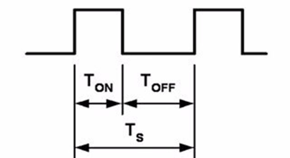

#### 3.3.1 PWM基本结构

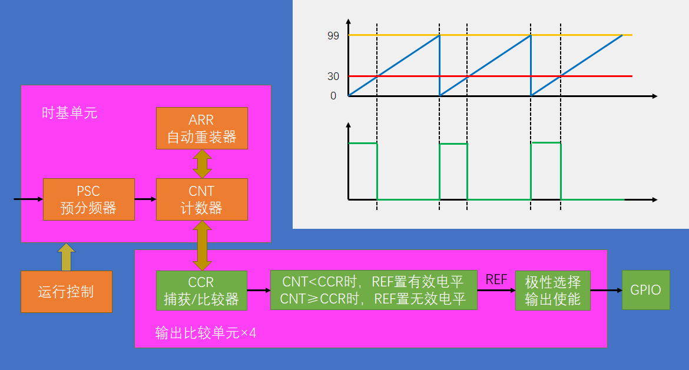

前半部分与定时中断一样，不过这里不需要往中断连接了，而是在CNT不断自增的过程中与CCR进行比较来控制高低电平的输出；具体见右上角的图例

#### 3.3.2 参数计算

PWM频率：	Freq = CK_PSC / (PSC + 1) / (ARR + 1)

>CK_PSC：时钟频率

PWM占空比：	Duty = CCR / (ARR + 1)

PWM分辨率：	Reso = 1 / (ARR + 1)

### 3.4 初始化PWM

同样，只需要将3.3.1中的路线打通即可，具体分为一下几步

**1. RCC开启时钟**

**2. 配置时基单元**

**3. 配置输出比较单元**

**4. 配置GPIO**

**5. 运行控制**

#### 3.4.1-2 开启RCC与配置时基单元

前两步之前的代码已经写过（2.3），这里直接拿过来用就行(初始化中断的就不需要了)

```c
//3.4.1
RCC_APB1PeriphClockCmd(RCC_APB1Periph_TIM2,ENABLE);

//3.4.2
TIM_InternalClockConfig(TIM2);
	
TIM_TimeBaseInitTypeDef TIM_TimeBaseInitStructure;
TIM_TimeBaseInitStructure.TIM_ClockDivision= TIM_CKD_DIV1;
TIM_TimeBaseInitStructure.TIM_CounterMode= TIM_CounterMode_Up;
TIM_TimeBaseInitStructure.TIM_Period= 10000 - 1;
TIM_TimeBaseInitStructure.TIM_Prescaler= 7200 - 1;
TIM_TimeBaseInitStructure.TIM_RepetitionCounter= 0;
	
TIM_TimeBaseInit(TIM2 , &TIM_TimeBaseInitStructure);
	
TIM_Cmd(TIM2, ENABLE);   //启动定时器（这个应该放在最后，后面写的程序得在他之前写！）
```

#### 3.4.3 初始化输出比较单元

注意，不同的GPIO口对应的输出比较通道不同，具体参照[引脚定义表](./程序开发.md)

这里使用**PA0**,对应是**OC1** (TIM2_CH1复用在PA0上，CH1对应OC1；当然也可以使用PA15的重定义，也是对应的TIM2_CH1)

同样还是需要一个结构体来配置初始化参数

```c
TIM_OCInitTypeDef TIM_OCInitStructure;
TIM_OCStructInit(&TIM_OCInitStructure); //赋初始值
	
TIM_OCInitStructure.TIM_OCMode = TIM_OCMode_PWM1;
TIM_OCInitStructure.TIM_OCPolarity = TIM_OCPolarity_High;
TIM_OCInitStructure.TIM_OutputState = TIM_OutputState_Enable;
TIM_OCInitStructure.TIM_Pulse = 50;
	
TIM_OC1Init(TIM2,&TIM_OCInitStructure);
``` 

* 第一个是输出比较模式，就是3.2表格中的那几种模式，这里选择PWM模式1
* 第二个是输出比较极性，高极性就是不翻转，低极性就是翻转，这里选的是高极性
* 第三个是输出状态，即输出使能，选使能就行
* 第四个Pulse指输出脉冲，这里就是指CRR的值（0000~FFFF），它会和PSC、ARR共同决定我们的波形，详见3.3.2参数计算 

>产生1KHZ，50%占空比（分辨率1%）的信号，代入公式
72M / (PSC+1) / (ARR+1) = 1000
CRR / (ARR+1) = 50%
1 / (ARR+1) = 1%
解得 ARR + 1 = 100，CRR = 50，PSC + 1 = 720
（一般分辨率都取1%，故ARR值基本固定为 100 - 1 ）
（修改频率通过修改PSC即可，频率一般超过20KHZ就不会听到电机的蜂鸣声干扰了）

注意，由于这里并没有用到这个结构体里面的所有成员，那些没有被赋值的成员状态是不确定的，会导致一系列的问题。因此，为了避免这种“不确定性”，我们需要在声明完结构体后**给它赋一个初始值**( `TIM_OCStructInit(&TIM_OCInitStructure);` )，然后再修改部分我们需要用到的结构体成员，以避免出现问题

#### 3.4.4 初始化GPIO

不作赘述，只是一般是喜欢把GPIO写在TIM初始化的前面

```c
RCC_APB2PeriphClockCmd(RCC_APB2Periph_GPIOA, ENABLE);
	
GPIO_InitTypeDef GPIO_Initstructure;
GPIO_Initstructure.GPIO_Mode=GPIO_Mode_Out_PP;
GPIO_Initstructure.GPIO_Pin=GPIO_Pin_0;
GPIO_Initstructure.GPIO_Speed=GPIO_Speed_50MHz;
GPIO_Init(GPIOA,&GPIO_Initstructure);
```

注意GPIO是在APB2总线上的，跟TIM不一样

同时输出模式需要选择**复用推挽输出**，因为这里的GPIO输出应该由**片上外设**控制，如下图：

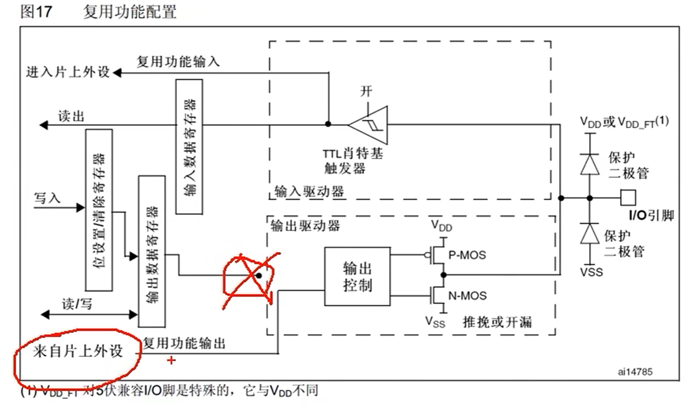

### 3.5 占空比调节

这里以呼吸灯为例，通过不断更改CCR改变占空比调节其亮度

同样，用一个函数封装其功能

```c
void PWM_SetCompare1(u16 CRR)
{
     TIM_SetCompare1(TIM2,CRR);
}
```

使用 ` TIM_SetCompare1` 修改OC1中CRR的值

最后在主程序中不断更改CRR的值（0~100，这个最大值是由公式计算出来的！）即可实现占空比的调节

比如：

```c
while(1)
{
	for(i = 0; i <= 100; i++)
	{
		PWM_SetCompare1(i);
		Delay_ms(10);
	}
	for(i = 0; i <= 100; i++)
	{
		PWM_SetCompare1(100-i);
		Delay_ms(10);
	}
}
```

## 四、TIM输入捕获

待更新

## 五、TIM编码器