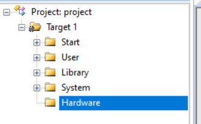
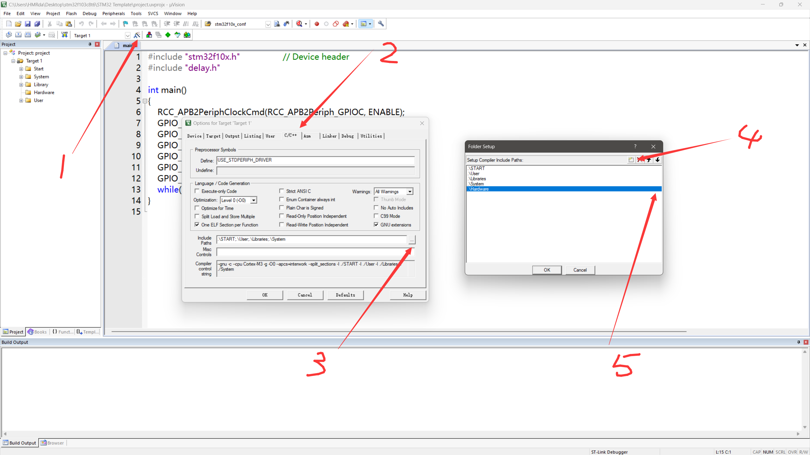
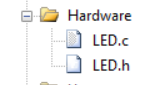
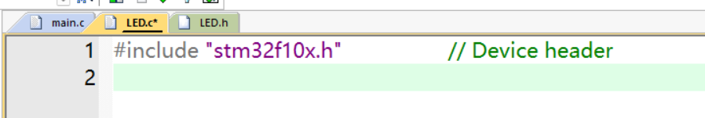
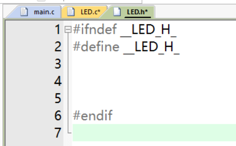
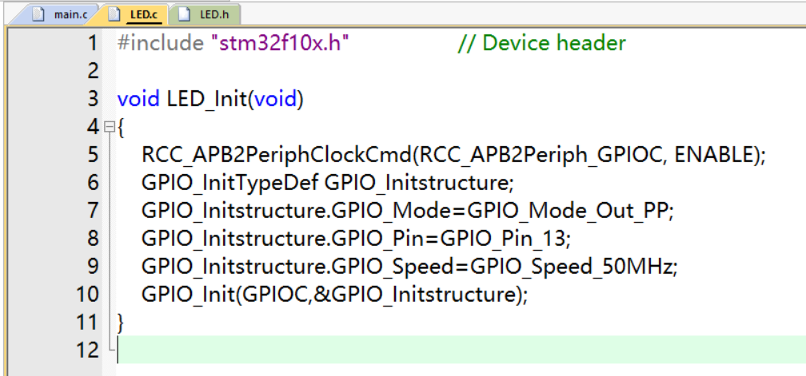
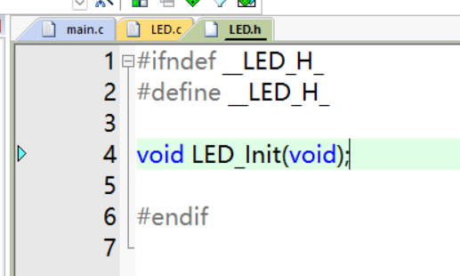
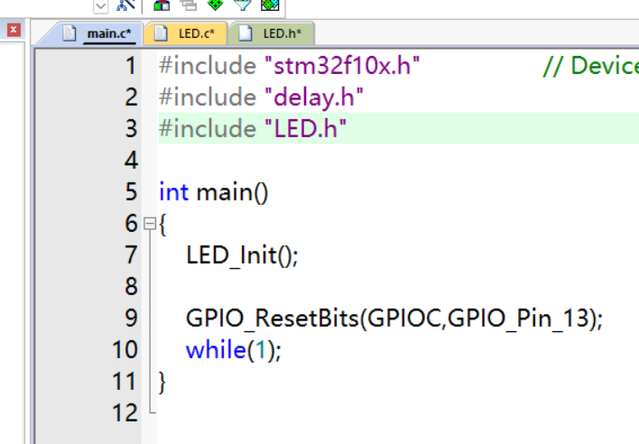
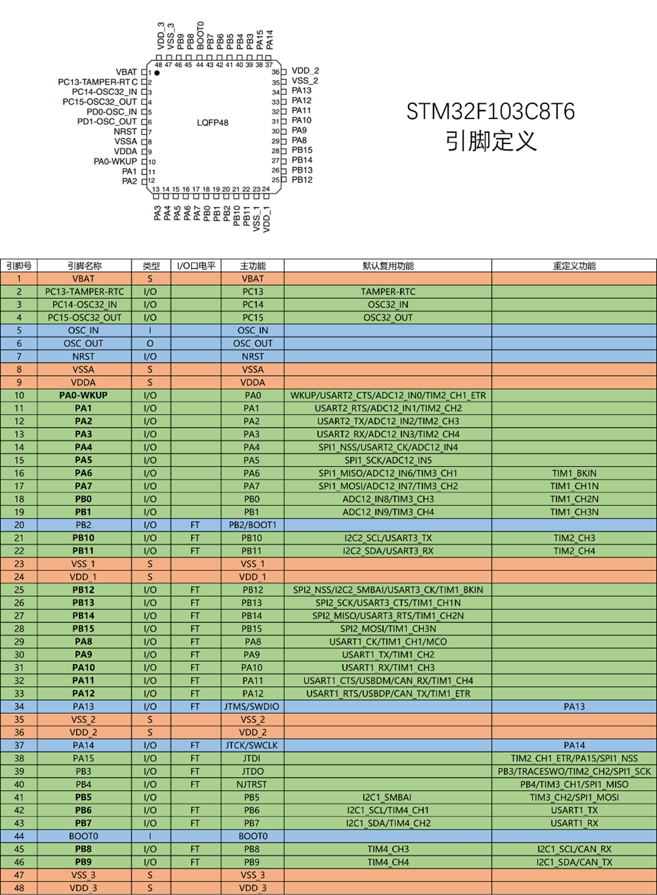

# stm32程序开发

<!-- @import "[TOC]" {cmd="toc" depthFrom=2 depthTo=4 orderedList=false} -->

<!-- code_chunk_output -->

- [stm32程序开发](#stm32程序开发)
  - [一、模块化编程](#一模块化编程)
    - [1.1 什么是模块化编程？](#11-什么是模块化编程)
    - [1.2 注意事项](#12-注意事项)
    - [1.3 模块化实例](#13-模块化实例)
      - [1.3.1 建立模块](#131-建立模块)
      - [1.3.2 封装函数](#132-封装函数)
  - [二、引脚定义](#二引脚定义)

<!-- /code_chunk_output -->

## 一、模块化编程

### 1.1 什么是模块化编程？

把各个模块的代码放在不同的.c文件里，在.h文件里提供外部可调用函数的声明，其它.c文件想使用其中的代码时，只需要 `#include "XXX.h"` 文件即可。使用模块化编程可极大的**提高代码的可阅读性、可维护性、可移植性**等

### 1.2 注意事项

* .c文件：函数、变量的定义
* .h文件：可被外部调用的函数、变量的声明

 

* 任何自定义的变量、函数在调用前必须有定义或声明(同一个.c)
* 使用到的自定义函数的.c文件必须添加到工程参与编译
* 使用到的.h文件必须要放在编译器可寻找到的地方(工程文件夹根目录、安装目录、自定义)

### 1.3 模块化实例

以LED代码模块化为例

#### 1.3.1 建立模块

首先创立一个新组取名“hardware”

将电脑中的该文件夹添加到头文件路径列表

在hardware文件下中添加.c和.h（注意存放位置也应在电脑里的hardware下）

添加固定代码，.c中为右键添加头文件

.h中添加防止头文件重复包含的代码（ `#ifndef` 后的名字可以随便起，但是一般起为该头文件的名字+下划线；另外**结尾一定要空行**）

#### 1.3.2 封装函数

将函数定义写在.c中（此处是LED初始化函数）

把函数声明放在 `#ifndef` 里面

最后再main.c中直接调用即可

 

如果还有其他与LED有关的函数，重复上述操作即可

## 二、引脚定义

