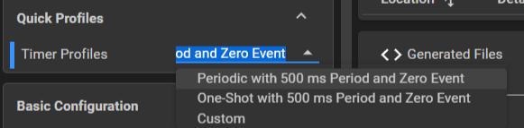

# Timer 定时器

<!-- @import "[TOC]" {cmd="toc" depthFrom=2 depthTo=4 orderedList=false} -->

<!-- code_chunk_output -->

- [一、例程 timx_timer_mode_periodic_sleep](#一-例程-timx_timer_mode_periodic_sleep)
  - [1.1 Preview Readme 总览](#11-preview-readme-总览)
    - [1.1.1 Example Summary 功能](#111-example-summary-功能)
    - [1.1.2 Example Usage](#112-example-usage)
  - [1.2 程序分析](#12-程序分析)
  - [1.3 sysconfig 系统配置](#13-sysconfig-系统配置)
    - [1.3.1 GPIO](#131-gpio)
    - [1.3.2 Timer](#132-timer)
- [二、例程 timx_timer_mode_pwm_edge_sleep](#二-例程-timx_timer_mode_pwm_edge_sleep)
  - [2.1 Preview Readme 总览](#21-preview-readme-总览)
    - [2.1.1 Example Summary 功能](#211-example-summary-功能)
    - [2.1.2 Example Usage](#212-example-usage)
  - [2.2 程序分析](#22-程序分析)
  - [2.3 sysconfig 系统配置](#23-sysconfig-系统配置)
    - [Timer-PWM](#timer-pwm)
  - [2.4 使用程序设置占空比、频率](#24-使用程序设置占空比-频率)
    - [2.4.1 占空比](#241-占空比)
    - [2.4.2 频率](#242-频率)

<!-- /code_chunk_output -->


## 一、例程 timx_timer_mode_periodic_sleep

``timA`` 指高级定时器，``timG``指通用定时器

``timX`` 指代以上两者（ **x** 既可以指 **a** 也可以指 **x** ）

### 1.1 Preview Readme 总览

#### 1.1.1 Example Summary 功能

The following example configures TimerG in periodic mode and toggles the LED and USER_TEST pin every 500ms. The device remains in SLEEP mode while waiting for an interrupt.

>配置通用定时器进行周期循环，并在周期内翻转LED和UESR_TEST引脚（500ms）
设备在等待中断时会保留在``sleep``模式下

#### 1.1.2 Example Usage

Compile, load and run the example. LED1 and USER_TEST pin will toggle every 500ms, and the device will remain in SLEEP while waiting for an interrupt.

### 1.2 程序分析

```c
#include "ti_msp_dl_config.h"


int main(void)
{
    SYSCFG_DL_init();

    NVIC_EnableIRQ(TIMER_0_INST_INT_IRQN);  //使能中断(TIMER_0_INST_INT_IRQN)
    DL_SYSCTL_enableSleepOnExit();  //见1

    DL_TimerG_startCounter(TIMER_0_INST);   //启动计数器

    while (1) {
        __WFI();    //见2
    }
}

void TIMER_0_INST_IRQHandler(void)  //中断服务函数
{
    switch (DL_TimerG_getPendingInterrupt(TIMER_0_INST)) //获取当前优先级最高的中断
    {  
        case DL_TIMER_IIDX_ZERO:    //如果是这个中断类型就执行
            DL_GPIO_togglePins(GPIO_LEDS_PORT,
                GPIO_LEDS_USER_LED_1_PIN | GPIO_LEDS_USER_TEST_PIN);    //翻转
            break;
        default:
            break;
    }
}
```

**不一样的函数**
1. `DL_SYSCTL_enableSleepOnExit()`
    
    **hanlder mode** 可以理解为中断函数，**thread mode** 可以理解为m主函数
    即从中断函数返回主函数时，将CPU置于睡眠模式（sleep mode）
2. `__WFI()`
    **wait for interrupt**: 当执行到这一步时，就进入sleep mode

### 1.3 sysconfig 系统配置

#### 1.3.1 GPIO 


比较熟悉了，就是一个大组 ``LEDS`` 以及两个PIN

#### 1.3.2 Timer


---


定时器名字：TIMER_0
使用的定时器：TIMG0（它的选择不在这个地方，所以是锁定的）

---



##### Quick Profiles 预设

使用Custom可以自己定制

---


##### 时钟配置

Timer Clock Source: 都选 ``BUSCLK``

Timer Clock Divider: 选择分频 (1~8)

Timer Clock Prescaler：进一步分频 (1~256)

最后以上的设置会反映到 **Calculated Timer Clock Values**

>此处最小为8us，最大为524.29ms

Timer Mode ：``Peridic`` 表示自动重装，``Down`` 表示向下计数

Desired Timer Period：想要定时的时间

Start Timer: 初始化完了开始计数

---


##### 高级定时器功能

暂时用不上

---


##### 中断

这里指使用了 ``Zero event`` ，即数到0就进中断

---


##### 定时器类型

选择使用的定时器，即设置第一板块中不可编辑的部分

## 二、例程 timx_timer_mode_pwm_edge_sleep

### 2.1 Preview Readme 总览

#### 2.1.1 Example Summary 功能

The following example configures TimerG0 to output a pair of edge aligned PWM signals. The device is configured to wait in SLEEP mode.

>配置TimerG0输出一对边缘对齐的PWM信号，且在低功耗模式下等待

#### 2.1.2 Example Usage

Compile, load and run the example. TimerG0 will output a pair of 62.5Hz edge aligned PWM signals on PA12 and PA13. PA12 is configured at a 75% duty cycle. PA13 is configured at a 50% duty cycle. Monitor the PWM signals on PA12 and PA13.

>TimerG0会输出一对62.5Hz边缘对齐的PWM信号在PA12和PA13上，且PA12为75%占空比为PA13为50%占空比

### 2.2 程序分析

```c
#include "ti_msp_dl_config.h"

int main(void)
{
    SYSCFG_DL_init();

    DL_TimerG_startCounter(PWM_0_INST); //打开定时器

    while (1) {
        __WFI();    //电赛其实不建议使用低功耗语句
    }
}
```

### 2.3 sysconfig 系统配置

#### Timer-PWM


配置时钟部分与例程1一致

---


##### PWM Configuration 设置

PWM Mode：``Edge`` 为边缘对齐，即一个周期（上升沿下降沿）对齐; ``Center`` 为中心对齐，中轴线对齐

PWM Channel(s)：最多可以同时输出4路PWM信号（他们频率相同，但是可以有不同占空比）

---


##### Channel 通道配置

Desired Duty Cycle (%)：输入想要的占空比即可

### 2.4 使用程序设置占空比、频率

#### 2.4.1 占空比

使用函数 `DL_TimerG_setCaptureCompareValue(PWM_0_INST, 500, DL_TIMER_CC_0_INDEX);` （这个函数可以在初始化的.c文件中找到示例）

第一个值为定时器名字，第二个为要设置的比较值，第三个为通道

---

也可以封装一个函数来设置占空比

```c
void Set_Duty(uint8_t channel, float duty)
{
    uint32_t CompareValue;
    CompareValue = 32000 - 32000*duty;  //这里的32000是自动重装载值，如果修改了这个值（比如更换了频率，就需要对这个值进行修改！）

    if(channel == 0)
        DL_Timer_setCaptureCompareValue(PWM_0_INST, CompareValue, DL_TIMER_CC_0_INDEX);
    else if(channel == 1)
        DL_Timer_setCaptureCompareValue(PWM_0_INST, CompareValue, DL_TIMER_CC_1_INDEX);
}
```

#### 2.4.2 频率

使用函数 `DL_Timer_SetLoadValue(PWM_0_INST, 64000)` 来设置自动重装载值从而改变频率

修改的相当于是下面的部分


**注意要删去自动补全的头文件！**

---

也可以将其封装成一个函数

```c
void Set_Ferq(uint32_t ferq)
{
    period = PWM_0_INST_CLK_FERQ/ferq;
    DL_Timer_setLoadValue(PWM_0_INST, period);
}
```

这样 `period` 就表示自动重装载值了，记得在函数外部声明这个u32变量

如此就可以重写占空比函数

```c
void Set_Duty(uint8_t channel, float duty)
{
    uint32_t CompareValue;
    CompareValue = period - period*duty; 

    if(channel == 0)
        DL_Timer_setCaptureCompareValue(PWM_0_INST, CompareValue, DL_TIMER_CC_0_INDEX);
    else if(channel == 1)
        DL_Timer_setCaptureCompareValue(PWM_0_INST, CompareValue, DL_TIMER_CC_1_INDEX);
}
```