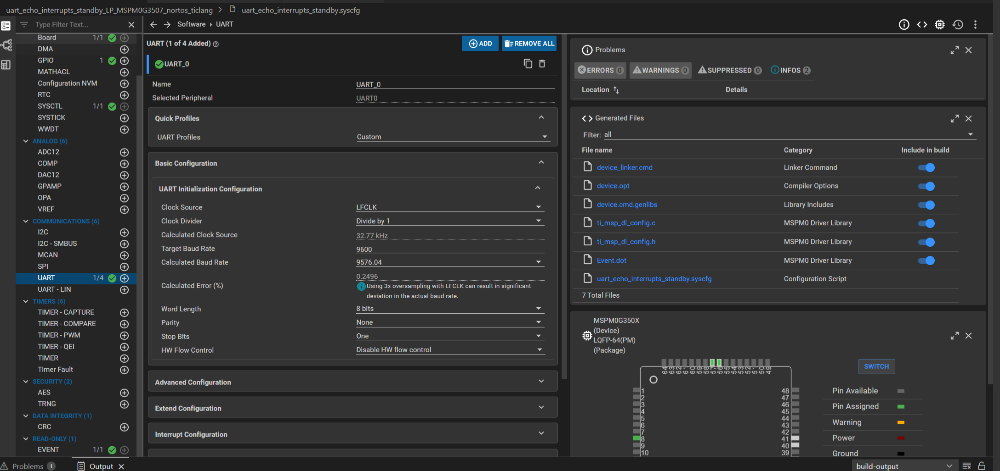
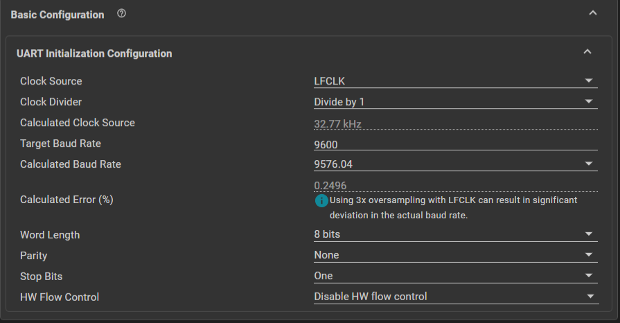
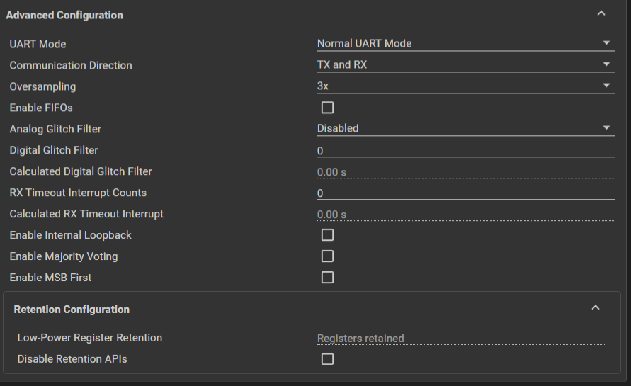
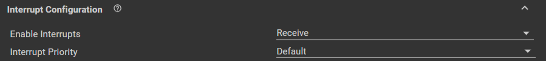
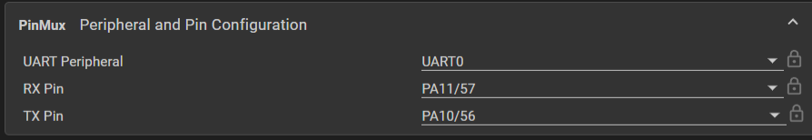

# UART 串口

## 一、例程

实现功能：当串口接收到字符后，将字符发送回来，且每一次接收数据后LED翻转

### 1.1 sys配置



---

#### Basic Configuration



Clock Source: 使用低频时钟 `LFCLK`

下面几个部分跟TImer类似

Target Baud Rate： 波特率

Word Length： 字长

Parity：校验

Stop Bits：停止位

HW Flow Control：硬件流控，不需要

---

#### Advanced Configuration



全默认即可

---

#### Interrupt Configuration



使能接收中断即可

---

#### PinMux



配置引脚

### 1.2 程序

```c
#include "ti/driverlib/dl_timer.h"
#include "ti_msp_dl_config.h"

volatile uint8_t gEchoData = 0;
int main(void)
{
    SYSCFG_DL_init();

    NVIC_ClearPendingIRQ(UART_0_INST_INT_IRQN);
    NVIC_EnableIRQ(UART_0_INST_INT_IRQN);


    while (1) {

    }
}

void UART_0_INST_IRQHandler(void)
{
    switch (DL_UART_Main_getPendingInterrupt(UART_0_INST)) {
        case DL_UART_MAIN_IIDX_RX:
            DL_GPIO_togglePins(GPIO_LEDS_PORT,
                GPIO_LEDS_USER_LED_1_PIN | GPIO_LEDS_USER_TEST_PIN);
            gEchoData = DL_UART_Main_receiveData(UART_0_INST);
            DL_UART_Main_transmitData(UART_0_INST, gEchoData);
            break;
        default:
            break;
    }
}

```