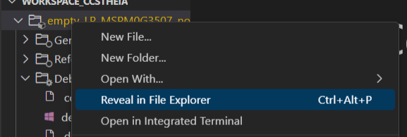
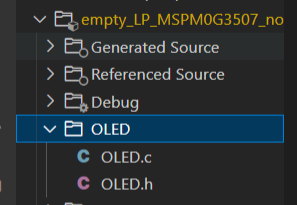
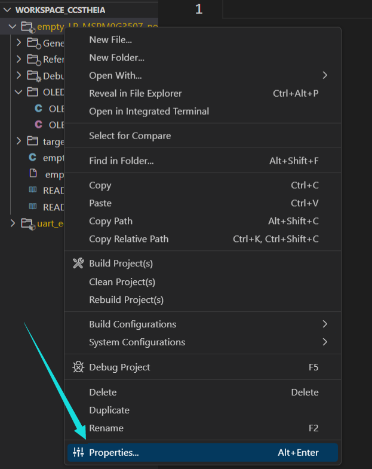
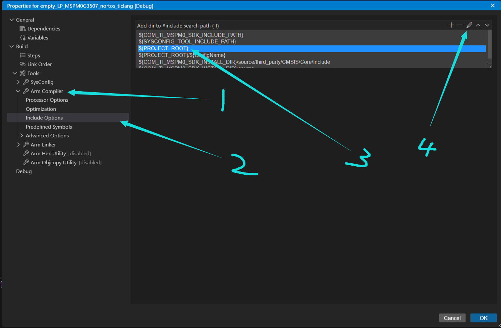
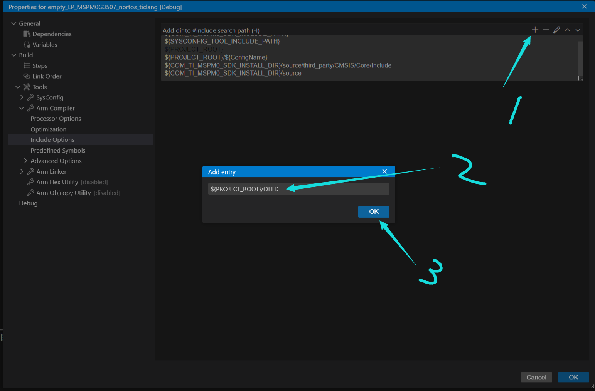
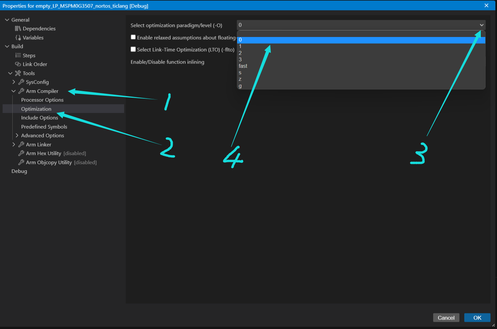
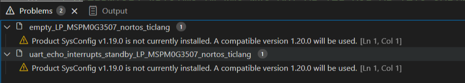
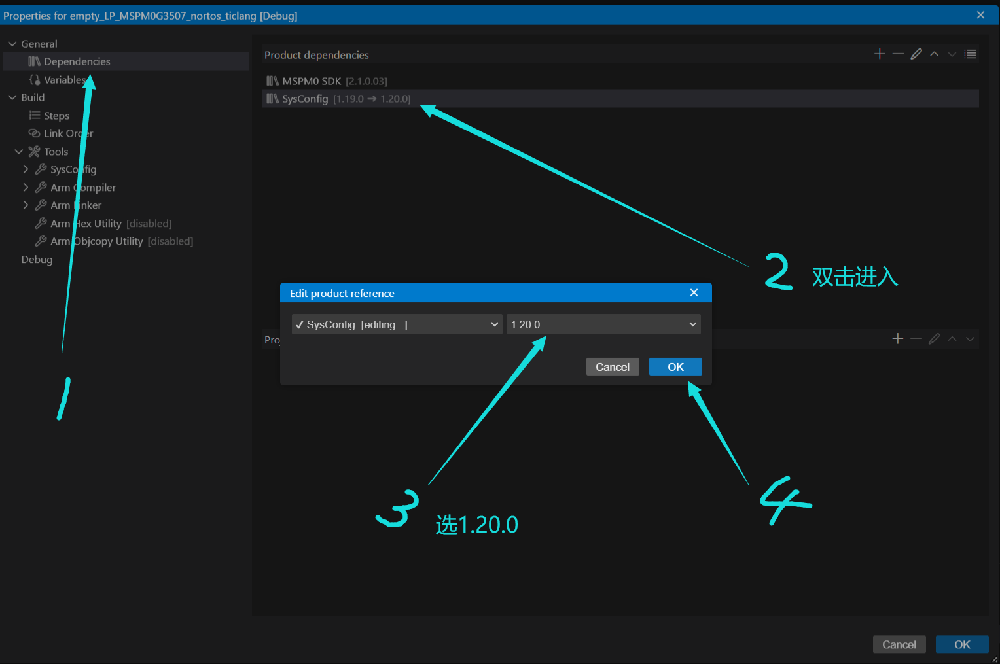

# CCS的使用

## 一、保存路径

在 C:\Users\HMRda\workspace_ccstheia 下

对着工程右键选择在文件夹中打开也可找到

## 二、模块化编程

在添加完工程后，系统是找不到该文件的路径的

需要手动添加路径，右击打开工程设置

按图中顺序点击，复制相对路径内容，即 `${PROJECT_ROOT}`

添加路径，在相对路径后加入新建的文件夹名字

这样就能找到你 **include** 的移植的.h文件啦

## 三、关闭编译优化

编译优化可能会带来变量未知的错误，在与上一点相同的设置中按下图操作关闭（选择`-O` **0**）

## 四、消除版本更新警告

还是在设置中（与上两点位置相同）按照下图操作

编译一下就没有黄色了