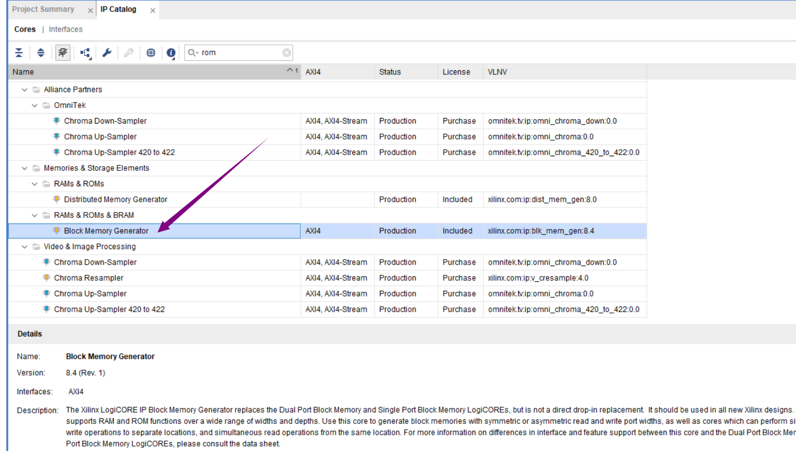
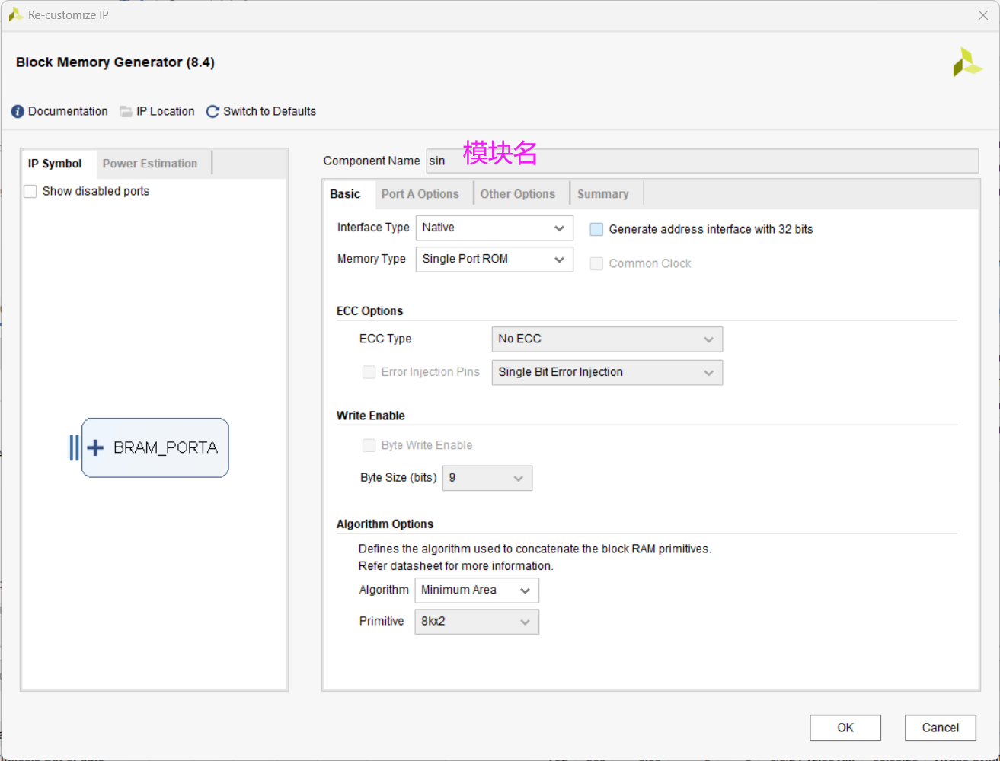
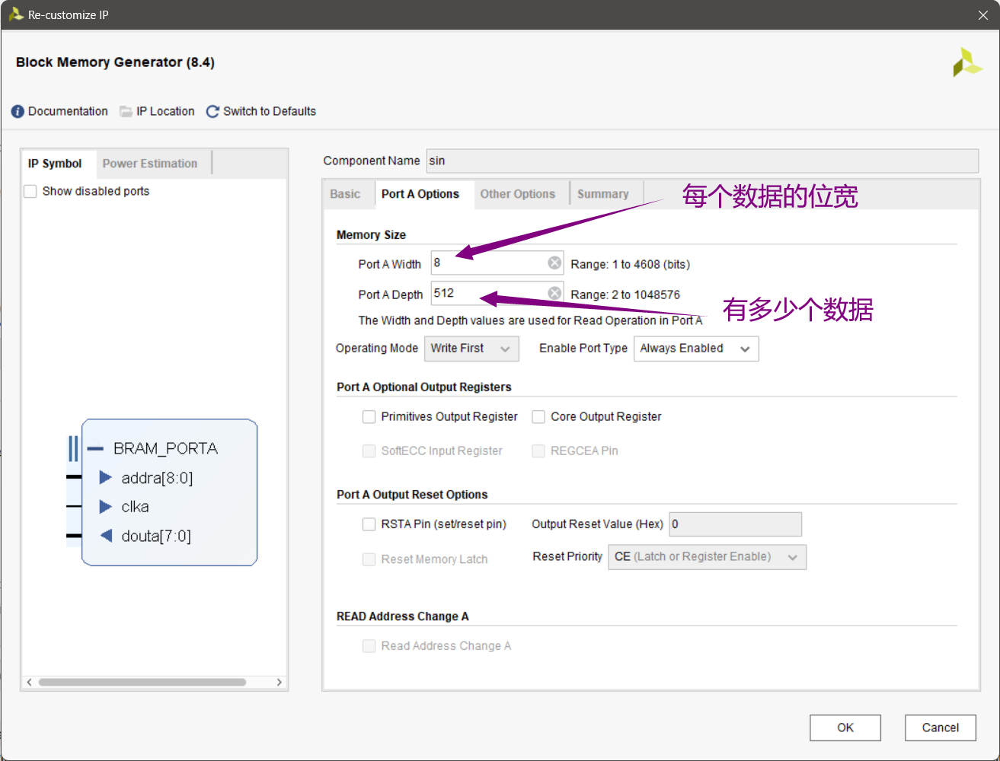
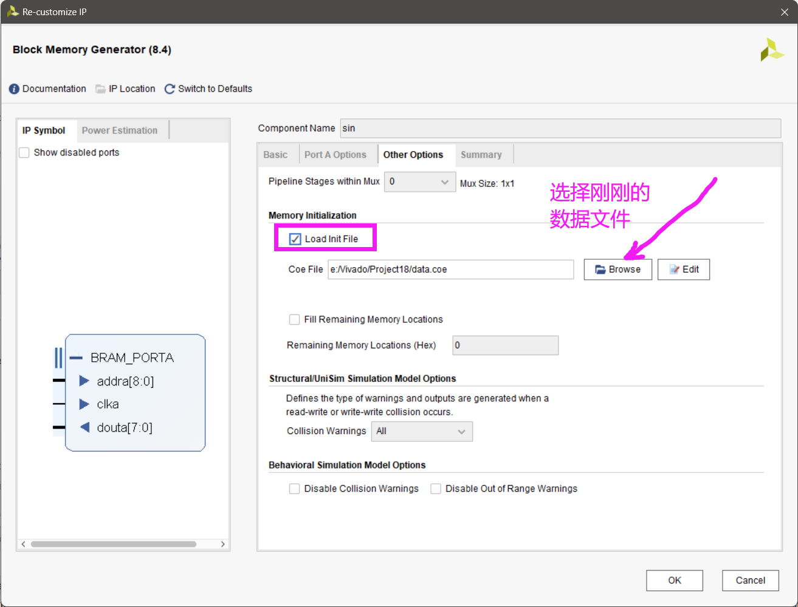
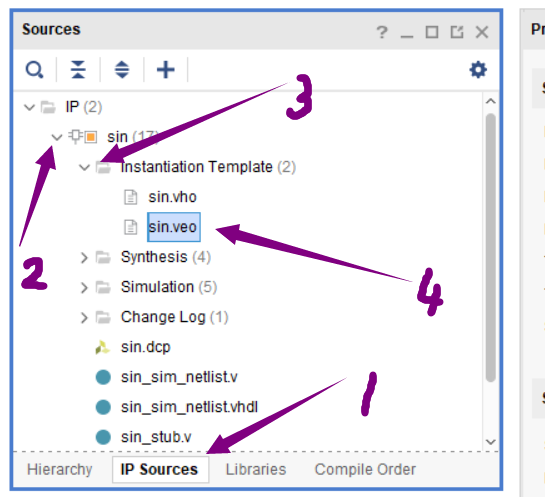
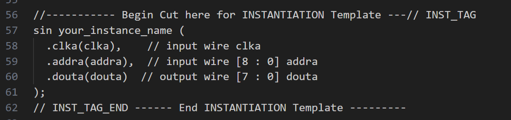

# DAC 模数转换

## 一、DAC0832-S020

开发板上自带一个DAC转换芯片


具体结构如下：


不过实际使用不需要关注那么多，直接进行一个调用即可

>部分参数


## 二、数模转换实例

由于这里我们只用到了片上这一个外设，故采用最简单的工作模式：

**所有控制端都使能，或者只有一个控制端高低切换；而其余控制端都使能，数据刷新间隔>1us。**


### 2.1 产生三角波

```verilog
module D2A(
 input clk,rst,
 output reg [7:0] DAC_D,
 output DAC_ILE, DAC_CS, DAC_XFER, DAC_WR2,
 output reg DAC_WR1
 );

reg flag;
reg [7:0] state;
reg [8:0] addra;
wire [7:0] douta;
assign DAC_WR2 = 0;
assign DAC_XFER = 0;
assign DAC_ILE = 1;
assign DAC_CS = 0;

sin sin_u0(.clka(clk),.addra(addra),.douta(douta));

always @(posedge clk or negedge rst) begin
    if(!rst)begin
        addra<=0;
    end
    else
    case(state)
    0:begin //先把数据准备好，WR1不使能
         if(flag)begin
             DAC_D = DAC_D+1;
         end
         else begin
             DAC_D = DAC_D-1;
        end
        DAC_WR1 <= 1;
        state <= state + 1;
    end
    10:begin//100ns以后WR1使能
        DAC_WR1 <= 0;
        state <= state + 1;
    end  
    150:begin//WR1有效时间持续超过1us
        DAC_WR1 <= 1;
        state <= state + 1;
    end
    180:begin
        state <= 0;//数据再保持一段时间
        if(DAC_D==255)
         flag<=0;
        else if (DAC_D==0)
         flag<=1;
    end
    default:state <= state + 1;
 endcase
end

endmodule
```

其实是一个非常简单的模块，准备好时钟即可输出

### 2.2 产生正弦波

由于正弦波不是简单地+1能够实现，所以我们需要一个**正弦波取值表**来告诉硬件现在应该输出什么电压

板上的DAC取值范围是0~255，所以将正弦波的函数值映射到这个范围内。

使用matlab生成的文本内容如下：

```c
memory_initialization_radix=10;
memory_initialization_vector=
127,
129,
132,
134,
137,
139,
142,
144,
147,
149,
152,
154,
157,
159,
162,
164,
166,
169,
171,
174,
176,
178,
181,
183,
185,
187,
190,
192,
194,
196,
198,
200,
202,
204,
206,
208,
210,
212,
214,
216,
218,
219,
221,
223,
224,
226,
228,
229,
231,
232,
233,
235,
236,
237,
239,
240,
241,
242,
243,
244,
245,
246,
247,
247,
248,
249,
250,
250,
251,
251,
252,
252,
252,
253,
253,
253,
253,
253,
253,
253,
253,
253,
253,
253,
253,
252,
252,
252,
251,
251,
250,
250,
249,
248,
247,
247,
246,
245,
244,
243,
242,
241,
240,
239,
237,
236,
235,
233,
232,
231,
229,
228,
226,
225,
223,
221,
219,
218,
216,
214,
212,
210,
208,
207,
205,
203,
200,
198,
196,
194,
192,
190,
188,
185,
183,
181,
178,
176,
174,
171,
169,
167,
164,
162,
159,
157,
154,
152,
149,
147,
144,
142,
139,
137,
134,
132,
129,
127,
124,
122,
119,
117,
114,
111,
109,
106,
104,
101,
99,
97,
94,
92,
89,
87,
84,
82,
80,
77,
75,
73,
70,
68,
66,
64,
61,
59,
57,
55,
53,
51,
49,
47,
45,
43,
41,
39,
37,
36,
34,
32,
30,
29,
27,
26,
24,
23,
21,
20,
18,
17,
16,
15,
13,
12,
11,
10,
9,
8,
7,
6,
6,
5,
4,
4,
3,
2,
2,
1,
1,
1,
0,
0,
0,
0,
0,
0,
0,
0,
0,
0,
0,
0,
1,
1,
1,
2,
2,
3,
3,
4,
5,
5,
6,
7,
8,
9,
10,
11,
12,
13,
14,
16,
17,
18,
19,
21,
22,
24,
25,
27,
28,
30,
32,
33,
35,
37,
39,
41,
42,
44,
46,
48,
50,
52,
54,
57,
59,
61,
63,
65,
67,
70,
72,
74,
77,
79,
81,
84,
86,
89,
91,
93,
96,
98,
101,
103,
106,
108,
111,
113,
116,
118,
121,
124,
126;
```

由于数值太多，我们可以提前将其写入到ROM内，需要进行以下操作：

1. 首先来看文本内容，`memory_initialization_radix=` 表示**数据格式**，比如这里是十进制；`memory_initialization_vector=` 后面接的则是数据内容，每个一行，数字后需要打上逗号

2. 整理好数据后保存文件，后缀修改为**coe**，接下来就可以录入到ROM中


3. 在vivado中找到这个ip核，双击进入进行配置

4. 第一页基本按照默认配置即可

5. `width` 处为数据的位宽，这里由于是0~255，选择8位即可；`depth` 处为数据深度，有多少个数据就填多少，当然多一点也无所谓

6. 将刚刚生成的数据文件导入，设置完毕后点击**OK**生成ip核即可


7. 在 `Source` 中找到ip核的调用示例文件，双击打开


8. 里面其实已经给出了例化ip核的方法，直接拿过来用即可


9. 在源程序中调用这个ip核，通过给一个地址，返回一个数据的形式，即可完成正弦波的生成
```verilog
//DAC ip
sin sin_u0 (
  .clka(clk),            // input wire clka          
  .addra(add),          // input wire [8 : 0] addra
  .douta(douta)         // output wire [7 : 0] douta
);

always @(posedge clk or negedge rst) begin
    if(!rst)begin
        state<=0;
        add<=0;
    end
    else begin
        case(state)
        0:begin //先把数据准备好，WR1不使能
            // if(flag)begin
            //     DAC_D = DAC_D+1;
            // end
            // else begin
            //     DAC_D = DAC_D-1;
            // end
            if(add==314)
            add<=0;
            else
            add <= add + 1;
            DAC_D <= (douta/4);
            DAC_WR1 <= 1;
            state <= state + 1;
        end
        10:begin//100ns以后WR1使能
            DAC_WR1 <= 0;
            state <= state + 1;
        end  
        120:begin//WR1有效时间持续超过1us
            DAC_WR1 <= 1;
            state <= state + 1;
        end
        140:begin
            state <= 0;//数据再保持一段时间
            if(DAC_D==255)
            flag<=0;
            else if (DAC_D==0)
            flag<=1;
        end
        default:state <= state + 1;
        endcase
    end
end
```

数据声明就不展示了，应该也比较好写，注意**数据位数**即可

