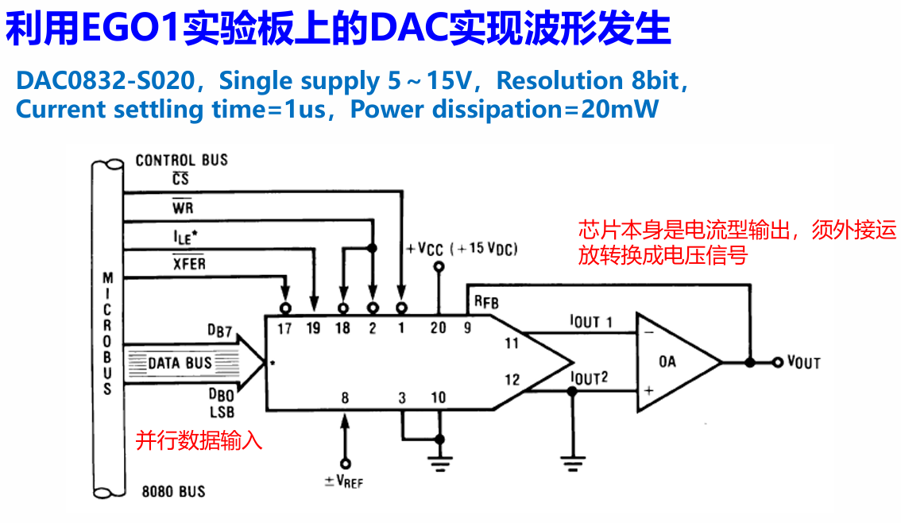
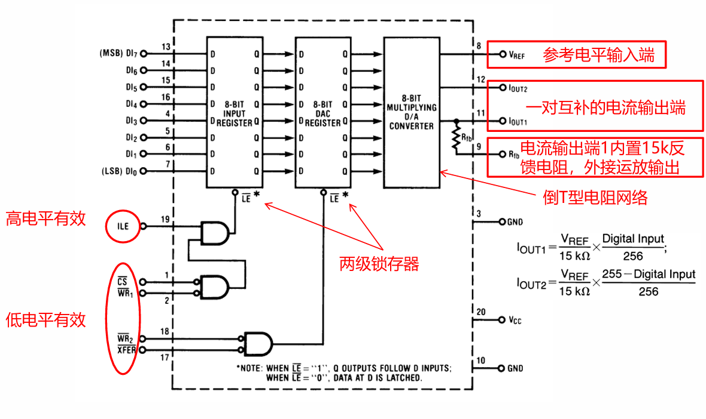
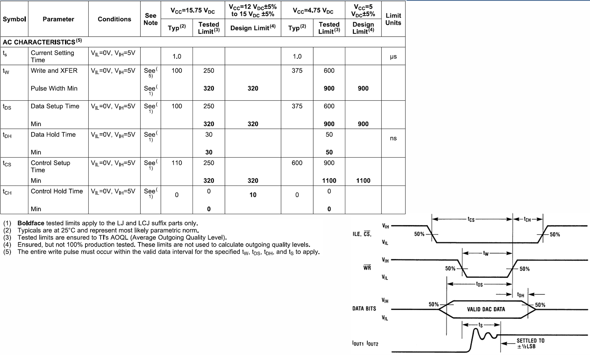
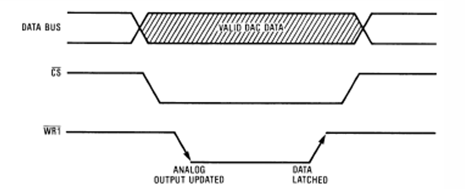

# DAC 模数转换

## 一、DAC0832-S020

开发板上自带一个DAC转换芯片



具体结构如下：



不过实际使用不需要关注那么多，直接进行一个调用即可

>部分参数


## 二、数模转换实例

由于这里我们只用到了片上这一个外设，故采用最简单的工作模式：

**所有控制端都使能，或者只有一个控制端高低切换；而其余控制端都使能，数据刷新间隔>1us。**



### 2.1 产生三角波

```verilog
module D2A(
 input clk,rst,
 output reg [7:0] DAC_D,
 output DAC_ILE, DAC_CS, DAC_XFER, DAC_WR2,
 output reg DAC_WR1
 );

reg flag;
reg [7:0] state;
reg [8:0] addra;
wire [7:0] douta;
assign DAC_WR2 = 0;
assign DAC_XFER = 0;
assign DAC_ILE = 1;
assign DAC_CS = 0;

sin sin_u0(.clka(clk),.addra(addra),.douta(douta));

always @(posedge clk or negedge rst) begin
    if(!rst)begin
        addra<=0;
    end
    else
    case(state)
    0:begin //先把数据准备好，WR1不使能
         if(flag)begin
             DAC_D = DAC_D+1;
         end
         else begin
             DAC_D = DAC_D-1;
        end
        DAC_WR1 <= 1;
        state <= state + 1;
    end
    10:begin//100ns以后WR1使能
        DAC_WR1 <= 0;
        state <= state + 1;
    end  
    150:begin//WR1有效时间持续超过1us
        DAC_WR1 <= 1;
        state <= state + 1;
    end
    180:begin
        state <= 0;//数据再保持一段时间
        if(DAC_D==255)
         flag<=0;
        else if (DAC_D==0)
         flag<=1;
    end
    default:state <= state + 1;
 endcase
end

endmodule
```

其实是一个非常简单的模块，准备好时钟即可输出

### 2.2 产生正弦波

