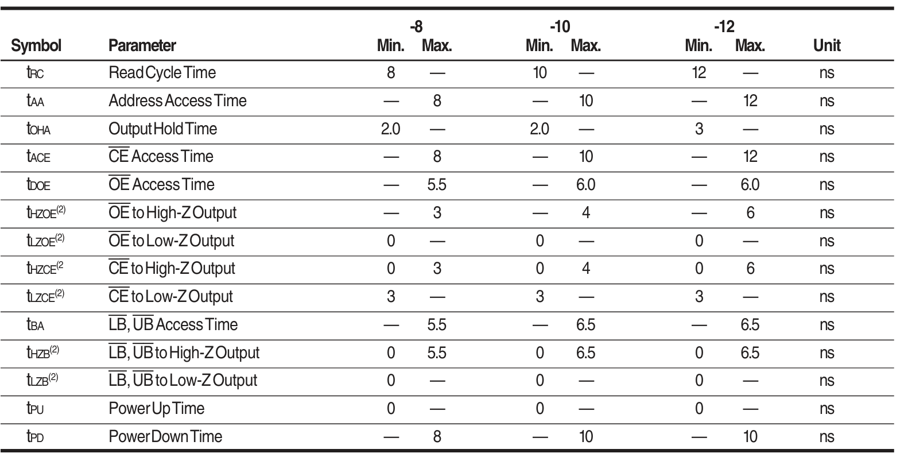

# SRAM 存储器

## 一、EGO1-SRAM 特性

### 1.1 功能框图


其中控制位如下：

表示|功能
:--:|:--:
$\overline{\text{CE}}$|片选，当其为高时进入待机模式，为低时选中
$\overline{\text{OE}}$|输出使能，为低时输出有效
$\overline{\text{WR}}$|写入使能，低为写，高为读
$\overline{\text{UB}}$|数据高八位
$\overline{\text{LB}}$|数据低八位

### 1.2 真值表


### 1.3 数据读取（READ）


1. $\overline{\text{WR}}$ 在数据读取期间一直为高电平
2. 先使能片选信号 $\overline{\text{CR}}$ （为低），然后使能输出 $\overline{\text{OE}}$ ，依次通过使能 $\overline{\text{UB}}$ $\overline{\text{LB}}$ 从高位到低位读取数据，读到后再失能上述端口即可
3. **地址**最先有效，最后失效

>如果要实现快速读取，需要注意各部分的时间



### 1.4 数据写入（WRITE）

采用 $\overline{\text{CE}}$ 控制的方式：


1. 使用 $\overline{\text{CE}}$ 控制，$\overline{\text{OE}}$可以为高也可以为低，不影响
2. 当 $\overline{\text{CE}}$ 与$\overline{\text{WE}}$ 同时为低时且 $\overline{\text{LB}}$ $\overline{\text{HB}}$ 中任意一个为低时，可以对地址进行写入
3. **地址**最先有效，最后失效

>如果要实现快速写入，需要注意各部分的时间


## 二、实战应用——Verilog实现SRAM储存器访问


首先应用一些基本模块：

### 2.1 译码模块

将要显示的二进制数转化为十进制数传递给数码管

使用左移加三法

```verilog
module Bin2Dec( //范围：0~99999999
    input clk_sys,
    input rst_n,
    input [26:0] Data_bin,
    output reg done,
    output reg [31:0] Data_dec
    );

    reg [26:0] Data_bin_buf;
    reg [31:0] Data_dec_buf;
    reg [5:0] cnt;
    reg [1:0] state_current, state_next;
    parameter state_initial = 0, state_load = 1, state_shift = 2, state_finish = 3;
    wire [3:0] unit_tmp, tens_tmp, hund_tmp, thou_temp, unit_tmp1, tens_tmp1, hund_tmp1, thou_temp1;
    
    always@(posedge clk_sys or negedge rst_n)
    begin
      if(!rst_n)
        state_current <= state_initial;
      else
        state_current <= state_next;
    end
    
    always@(*)
    begin
      case(state_current)
      state_initial:state_next = state_load;
      state_load:state_next = state_shift;
      state_shift:begin
                   if(cnt==27)
                     state_next = state_finish;
                   else
                     state_next = state_shift;
                 end
      state_finish:state_next = state_load;
      default:state_next = state_initial;
      endcase
    end
    
    always@(posedge clk_sys or negedge rst_n)
    begin
      if(!rst_n)
        begin
          Data_dec <= 0;
          Data_dec_buf <= 0;
          Data_bin_buf <= 0;
          done <= 0;
          cnt <= 0;
        end
      else
      begin
        case(state_next)
        state_load:begin
                     Data_bin_buf <= Data_bin;
                     Data_dec_buf <= 0;
                     done <= 0;  
                     cnt <= 0;       
                   end
        state_shift:begin
                      cnt <= cnt + 1;
                      Data_bin_buf <= Data_bin_buf << 1;
                      Data_dec_buf[3:0] <= {unit_tmp[2:0],Data_bin_buf[26]};
                      Data_dec_buf[7:4] <= {tens_tmp[2:0], unit_tmp[3]};
                      Data_dec_buf[11:8] <= {hund_tmp[2:0], tens_tmp[3]};
                      Data_dec_buf[15:12] <= {thou_temp[2:0], hund_tmp[3]};
                      Data_dec_buf[19:16] <= {unit_tmp1[2:0], thou_temp[3]};
                      Data_dec_buf[23:20] <= {tens_tmp1[2:0], unit_tmp1[3]};
                      Data_dec_buf[27:24] <= {hund_tmp1[2:0], tens_tmp1[3]};
                      Data_dec_buf[31:28] <= {thou_temp1[2:0], hund_tmp1[3]};
                    end
        state_finish:begin
                       Data_dec <= Data_dec_buf;
                       done <= 1;
                     end
        default:begin
                  Data_dec_buf <= Data_dec_buf;
                  Data_bin_buf <= Data_bin_buf;
                  Data_dec <= Data_dec;
                  done <= done;
                  cnt <= cnt;
                end
        endcase
      end
    end
    
    assign unit_tmp = (Data_dec_buf[3:0]>4)? (Data_dec_buf[3:0]+3):Data_dec_buf[3:0];
    assign tens_tmp = (Data_dec_buf[7:4]>4)? (Data_dec_buf[7:4]+3):Data_dec_buf[7:4];
    assign hund_tmp = (Data_dec_buf[11:8]>4)? (Data_dec_buf[11:8]+3):Data_dec_buf[11:8];
    assign thou_temp = (Data_dec_buf[15:12]>4)? (Data_dec_buf[15:12]+3):Data_dec_buf[15:12];
    assign unit_tmp1 = (Data_dec_buf[19:16]>4)? (Data_dec_buf[19:16]+3):Data_dec_buf[19:16];
    assign tens_tmp1 = (Data_dec_buf[23:20]>4)? (Data_dec_buf[23:20]+3):Data_dec_buf[23:20];
    assign hund_tmp1 = (Data_dec_buf[27:24]>4)? (Data_dec_buf[27:24]+3):Data_dec_buf[27:24];
    assign thou_temp1 = Data_dec_buf[31:28];

endmodule
```

### 2.2 数码管显示模块

直接控制八个（2×4）数码管的显示，添加了高位消隐

```verilog
module seg(
    input clk,
    input [31:0] data_in,  //要显示的数
    output reg[3:0] pos1,pos2,
    output reg [7:0]data1, data2,
    input rst
    );
    wire pclk;
    reg[4:0] num1, num2;
    reg [32:0]ff;
    reg [1:0]current_stage, next_stage;
    reg [2:0]state;

    My_div #(100000) div_u0(.clk_in(clk),.rst_in(rst),.clk_out(pclk));    //1000Hz

    always @(posedge pclk) begin
        current_stage=next_stage;
    end

    always @(*) begin
        next_stage=current_stage+1;
    end

    

    always @(posedge pclk) begin //数码管从右往左扫描
        case(next_stage)
        0:
        begin
            num2<=data_in[3:0];
            if(data_in[31:16]==0) begin
                num1<=21;
            end
            else begin
                num1<=data_in[19:16];
            end
            pos1<=4'b1000;
            pos2<=4'b1000;
        end
        1:
        begin
            if(data_in[31:20]==0) begin
                num1<=21;
            end
            else begin
                num1<=data_in[23:20];
            end
            if(data_in[31:4]==0) begin
                num2<=21;
            end
            else begin
                num2<=data_in[7:4];
            end
            pos1<=4'b0100;
            pos2<=4'b0100;
        end
        2:
        begin
            if(data_in[31:24]==0) begin
                num1<=30;
            end
            else begin
                num1<=data_in[27:24];
            end
            if(data_in[31:8]==0) begin
                num2<=21;
            end
            else begin
                num2<=data_in[11:8];
            end
            pos1<=4'b0010;
            pos2<=4'b0010;
        end
        3:
        begin
            if(data_in[31:28]==0) begin
                num1<=21;
            end
            else begin
                num1<=data_in[31:28];
            end
            if(data_in[31:12]==0) begin
                num2<=21;
            end
            else begin
                num2<=data_in[15:12];
            end
            pos1<=4'b0001;
            pos2<=4'b0001;
        end
        endcase
    end

     always@(*)begin
            case(num1)
                //不带小数点
                5'd0:data1=8'b00111111;
                5'd1:data1=8'b00000110;
                5'd2:data1=8'b01011011;
                5'd3:data1=8'b01001111;
                5'd4:data1=8'b01100110;
                5'd5:data1=8'b01101101;
                5'd6:data1=8'b01111101;
                5'd7:data1=8'b00000111;
                5'd8:data1=8'b01111111;
                5'd9:data1=8'b01101111;
                //带小数点
                5'd10:data1=8'b10111111;
                5'd11:data1=8'b10000110;
                5'd12:data1=8'b11011011;
                5'd13:data1=8'b11001111;
                5'd14:data1=8'b11100110;
                5'd15:data1=8'b11101101;
                5'd16:data1=8'b11111101;
                5'd17:data1=8'b10000111;
                5'd18:data1=8'b11111111;
                5'd19:data1=8'b11101111;
                5'd20:data1=8'b01110110;
                //不显示
                default:data1=8'b0000000;
            endcase

            case(num2)
                //不带小数点
                5'd0:data2=8'b00111111;
                5'd1:data2=8'b00000110;
                5'd2:data2=8'b01011011;
                5'd3:data2=8'b01001111;
                5'd4:data2=8'b01100110;
                5'd5:data2=8'b01101101;
                5'd6:data2=8'b01111101;
                5'd7:data2=8'b00000111;
                5'd8:data2=8'b01111111;
                5'd9:data2=8'b01101111;
                //带小数点
                5'd10:data2=8'b10111111;
                5'd11:data2=8'b10000110;
                5'd12:data2=8'b11011011;
                5'd13:data2=8'b11001111;
                5'd14:data2=8'b11100110;
                5'd15:data2=8'b11101101;
                5'd16:data2=8'b11111101;
                5'd17:data2=8'b10000111;
                5'd18:data2=8'b11111111;
                5'd19:data2=8'b11101111;
                5'd20:data2=8'b01110110;
                //不显示
                default:data2=8'b0000000;
            endcase
    end

endmodule
```

### 2.3 按键消抖模块

与数字频率计的外部信号消抖类似，详细可以参考

```verilog
module Check(
    input clk,      
    input I,        //输入状态
    output reg O, pos, neg
    );

    reg [32:0]cnt;      //延时计数
    reg now;            //当前状态
    reg current_stage;
    reg next_stage;
    parameter [32:0]delay = 5;    //延时目标时间（时钟周期）

    always @(posedge clk) begin
       current_stage<=next_stage;
    end

    always @(*) begin
        case (current_stage)
            0:
            begin
                if(I==now)
                next_stage<=current_stage;
                else
                next_stage<=1;
            end 
            1:
            begin
                if(I==now)
                next_stage<=0;
                else if(cnt==delay)
                next_stage<=0;
                else
                next_stage<=current_stage;
            end
        endcase
    end

    always @(posedge clk) begin
        case (next_stage)
            0:
            begin
                if(cnt==delay)
                begin
                    now<=I;
                    cnt<=0;
                    O<=I;
                    if(I==1)
                    pos=1;
                    else
                    neg=1;
                end
                else
                begin
                    cnt<=0;
                    O<=now;
                    pos=0;
                    neg=0;
                end
            end
            1: if(current_stage==0)
            begin
                cnt<=0;
                O<=now;
                pos=0;
                neg=0;
            end
            else
            begin
                cnt<=cnt+1;
                O<=now;
                pos=0;
                neg=0;
            end
        endcase
    end
endmodule

```

### 2.4 控制SRAM

按照前面的时序图对SRAM进行控制，感觉本质上与通信类似

#### 2.4.1 读写状态机

使用状态机进行控制，采用统一的延时

```verilog
//状态机的延时（500ns）
My_div #(50) div_500ns(.clk_in(clk),.rst_in(rst),.clk_out(pclk));  //2MHz
```

状态机分为两大状态，**0-3**表示**读**状态，**4-7**表示**写**状态

```verilog
//送分部分
always @(posedge pclk or negedge rst) begin
        if(!rst) begin
            current_stage<=0;
        end
        else begin
            current_stage<=next_stage;
        end
    end

    always @(*) begin
    //is_write触发进入写状态
        if(sig==1)begin
            is_write=1;
        end
        else if (finish==1)begin
            is_write=0;
        end

        case (current_stage)
            0: next_stage<=1; 
            1: next_stage<=2; 
            2: next_stage<=3; 
            3: begin
                if(finish) begin
                    next_stage<=4;  //进入读状态
                end
                else begin
                    next_stage<=0;  //继续写状态
                end
            end
            4: next_stage<=5;  
            5: next_stage<=6; 
            6: next_stage<=7; 
            default: //7
            begin
                if (!is_write) begin
                    next_stage<=4;  //进入读状态
                end
                else begin
                    next_stage<=0;  //进入写状态
                end
            end

        endcase
    end
```

输出控制部分，其实就是按照时序图来进行，比较简单

```verilog
 always @(posedge pclk or negedge rst) begin
        if (!rst) begin
            WE<=1;
            OE<=1;
            UB<=1;
            LB<=1;
        end
        else begin
            case (next_stage)
            //写状态
                0: //更新地址与数据线,初始化
                begin
                    WE<=1;
                    OE<=1;
                    UB<=1;
                    LB<=1;
                    LED<=1;
                    if(!first_write) begin
                        addr<=0;
                        data_out<=sw;
                        first_write<=1;
                    end
                    else if(addr!=16'hffff) begin
                        addr<=addr+1;
                        data_out<=data_out+1;
                    end
                    else
                        finish<=1;
                end
                1: //使能片选和写数据线
                begin
                    WE<=0;
                    UB<=0;
                    LB<=0;
                end 
                2:  //等待写入
                ;
                3:  //写入完成，失能
                begin
                    UB<=1;
                    LB<=1;
                    WE<=1;
                end 
                //读部分
                4:  //配置地址,初始化
                begin
                    WE<=1;
                    OE<=1;
                    UB<=1;
                    LB<=1;
                    addr<=sw;
                    finish<=0;
                    LED<=0;
                    first_write<=0;
                end
                5:  //使能读
                begin
                    WE<=1;
                    OE<=0;
                    UB<=0;
                    LB<=0;
                end
                6:  //读数据
                begin
                    data_read<=data;
                end
                default: //失能
                begin
                    WE<=1;
                    OE<=1;
                    UB<=1;
                    LB<=1;
                end
            endcase
        end
    end
endmodule
```

不过由于是单器件控制，所以可以简单地将片选（CE）一直使能

```verilog
assign CE=0;
```

#### 2.4.2 片上连线

需要用到的输入输出引脚以及中间变量有

```verilog
module Read_Write(
    input clk,
    output reg LED,
    input rst,
    input sig, //是否为写状态
    input [15:0]sw,
    output reg OE,WE,UB,LB,
    output CE,
    output reg [16:0] addr,
    output reg [15:0] data_read,
    inout [15:0]data
    );
    wire pclk;
    reg [2:0]current_stage,next_stage;
    reg first_write, finish;
    reg [15:0]data_out;
    reg is_write;
```

值得注意的是，由于数据线 `data` 既要做输入，还要做输出，故其类型为**inout**

而inout型的控制必须使用三态门来完成，即

```verilog
assign data= (is_write)?data_out:16'bzzzz_zzzz_zzzz_zzzz;
```

在输出时将其值赋为高阻态，输入时放入需要写的数值即可

>另一个需要注意的点是这里的三态门由 `is_write` 控制，故在设置按键输入时，不能直接把按键的信号作为  `is_write` 来控制，这样会导致输入完毕后（一般输入时间都很短）按键还处于被按下的状态，使得 `data` 仍处于高阻态，得不到任何输出