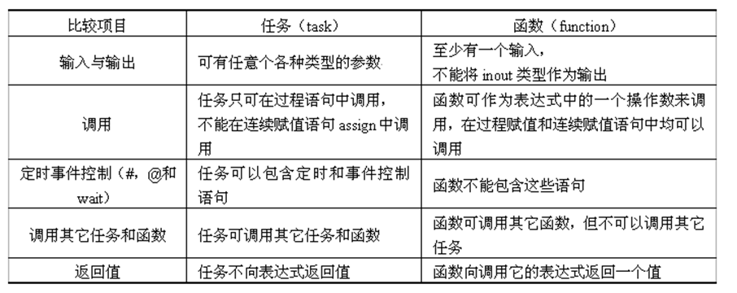

# 硬件描述语言Verilog HDL

<!-- @import "[TOC]" {cmd="toc" depthFrom=2 depthTo=4 orderedList=false} -->

<!-- code_chunk_output -->

- [硬件描述语言Verilog HDL](#硬件描述语言verilog-hdl)
  - [一、Verilog 模块模板](#一verilog-模块模板)
  - [二、基本语法规则](#二基本语法规则)
    - [2.1 一些符号](#21-一些符号)
    - [2.2 Verilog逻辑值](#22-verilog逻辑值)
  - [三、数据类型](#三数据类型)
    - [3.1 常量](#31-常量)
    - [3.2 变量](#32-变量)
      - [3.2.1 net(线网)类型](#321-net线网类型)
      - [3.2.2 variable(变量)类型](#322-variable变量类型)
  - [四、运算符](#四运算符)
    - [4.1 位拼接运算符](#41-位拼接运算符)
  - [五、语句](#五语句)
    - [5.1 过程语句（initial、always）](#51-过程语句initialalways)
    - [5.2 块语句（begin-end）](#52-块语句begin-end)
    - [5.3 赋值语句 (assign、=、\<=)](#53-赋值语句-assign)
      - [5.3.1 连续赋值语句 assign](#531-连续赋值语句-assign)
      - [5.3.2 过程赋值语句 (=、\<=)](#532-过程赋值语句-)
    - [5.4 条件语句（if-else、case、casez、casex）](#54-条件语句if-elsecasecasezcasex)
    - [5.5 循环语句（for、forever、repeat、while）](#55-循环语句forforeverrepeatwhile)
  - [六、任务、函数与预处理](#六任务函数与预处理)
    - [6.1 任务（task）](#61-任务task)
    - [6.2 函数（function）](#62-函数function)
    - [6.3 函数与任务的比较](#63-函数与任务的比较)
    - [6.4 编译预处理语句](#64-编译预处理语句)
      - [6.4.1 \`define](#641-define)
      - [6.4.2 \`include](#642-include)

<!-- /code_chunk_output -->


## 一、Verilog 模块模板 
``` verilog
module  <模块名> (<输入输出端口列表>);
    output  输出端口列表;        //输出端口声明
    input   输入端口列表;         //输入端口声明
    /*定义数据，信号的类型，函数声明*/
    wire 信号名；
    reg  变量名；
    //逻辑功能定义
    assign <结果信号名>=<表达式>；    //使用assign语句定义逻辑功能
    always @ (<敏感信号表达式>) //用always块描述逻辑功能
       begin
            //过程赋值
            //if-else，case语句
            //while，repeat，for循环语句
            //task，function调用
        end 
   //调用其他模块
    <被调用模块名module_name > <例化模块名> (<端口列表port_list >);
   //门元件例化
     门元件关键字 <例化门元件名> (<端口列表port_list>);
endmodule
```

## 二、基本语法规则

### 2.1 一些符号

* 间隔符：空格、tab、换行和换页
* 注释符：单行注释 `//` 与 多行注释`/* */`
* 标识符:给对象（如模块名、电路的输入与输出端口、变量等）取名。可以是任意一组字母、数字以及符号 `$` 和 `_`（下划线）的组合，但标识符的第一个字符必须是字母或者下划线，标识符区分大小写

### 2.2 Verilog逻辑值

值|含义
--|--
0|逻辑0、逻辑假
1|逻辑1、逻辑真
x或X|不确定的状态
z或Z|高阻态

## 三、数据类型

### 3.1 常量
* 整数型
  * 带基数形式的表示方法：
    ``` verilog
    <＋/－><位宽>’<基数符号><数值>
    3’b101、5’o37、8’he3，8’b1001_0011，4‘B1x_01 ，5'Hx 
    ```  
    其中表示进制基数的字符：

    二进制：b或B
  
    十进制：d或D或缺省

    八进制：o或O

    十六进制：h或H

  * 十进制数形式的表示方法:
    
    ``` verilog
    30、-2
    ```

    它们是有符号的

* 实数型：
    
    ``` verilog
    十进制记数法：0.1 2.0 5.67 （不可以写作 2. ）
    科学记数法：23_5.1e2 5E－4 23510.0 0.0005
    ```

* 字符串：双引号内的字符序列，其中1个字符占8位
  
    >字符串不能分成多行书写。
  字符串的作用主要是用于仿真时，显示一些相关的信息，或者指定显示的格式。

* 符号常量：
  
  用`parameter`来定义一个标志符代表一个常量

  ``` verilog
  parameter  SEL=8, CODE=8'ha3；
  /*分别定义参数SEL代表常数8（10进制）, 
  参数CODE代表常量a3（16进制）*/
  ```

### 3.2 变量

#### 3.2.1 net(线网)类型

net型变量相当于硬件电路中的各种物理连接, 其特点是**输出的值紧跟输入值的变化而变化**。

``` verilog
wire [n-1:0]变量名1，变量名2，……；
```

举例：

``` verilog
output wire L;  		      //将电路的输出信号L声明为网络型变量
wire [7:0] databus;   //声明一个8-bit宽的网络型总线变量
```

对连线型有两种驱动方式：

（1）在结构描述中将其连接到一个门元件或模块的输出端；

（2）用持续赋值语句 `assign` 对其进行赋值。

#### 3.2.2 variable(变量)类型

>书上也写作寄存器型

variable类型变量必须放在**过程语句**（如initial、always）中, 通过过程赋值语句赋值；在always、initial等过程块内被赋值的信号也必须定义成variable型

四种variable类型的变量：

类型|功能说明
--|--
reg|常用的寄存器型变量(可定义位宽)
integer|32位带符号的整数型变量
real|64位带符号的实数型变量
time|64位无符号的时间变量

注意：variable类型变量是抽象描述,**不对应具体硬件**，在综合器进行综合时根据具体情况来确定是映射成连线还是映射为触发器或寄存器

## 四、运算符

基本与C语言类似

### 4.1 位拼接运算符

作用是将两个或多个信号的某些位拼接起来成为一个新的操作数，进行运算操作

``` verilog
设A=1’b1，B=2’b10，C=2’b00；

则{B,C}＝4’b1000；
{A,B[1],C[0]}＝3’b110；
{A,B,C,3’b101}=8’b11000101；
```

其他不怎么用到不做赘述

## 五、语句

### 5.1 过程语句（initial、always）

在一个模块（module）中, 使用initial和always语句的次数是不受限制的

`initial` 语句常用于仿真中的**初始化**, initial过程块中的语句**仅执行一次**；

---

`always` 块内的语句则是**不断重复**执行的。

格式如下：

``` verilog
always @(<敏感信号表达式event-expression>)
begin
  //过程赋值
  //if-else, case, casex, casez选择语句
  //while, repeat, for循环
  //task, function调用
end
```

几个要注意的点：

1. always过程块内被赋值的信号也必须定义成variable型！
2. 只有满足 `@( )` 触发条件后才会执行后面语句
3. 敏感信号表达式中变量的值改变时, 就会引发块内语句的执行。因此敏感信号表达式中应列出影响块内取值的**所有信号**。多个信号用 `or` 连接

举例：
``` verilog
@(a)    		    //当信号a的值发生改变
@(a or b)   		//当信号a或信号b的值发生改变
@(posedge clock)    //当clock 的上升沿到来时
@(negedge clock)    //当clock 的下降沿到来时
@(posedge clk or negedge reset) //当clk的上升沿或reset信号的下降沿到来
```

### 5.2 块语句（begin-end）

类比相当于C中的 `{ }` ，同时begin-end串行块中的语句按**串行方式**顺序执行

### 5.3 赋值语句 (assign、=、<=)

#### 5.3.1 连续赋值语句 assign

主要用于对wire型变量的赋值

``` verilog
wire a,b,c;
assign  c = a&b;
```

在上面的赋值中, a、b、c三个变量皆为wire型变量, a和b信号的任何变化, 都将**随时**反映到c上来

#### 5.3.2 过程赋值语句 (=、<=)

过程赋值语句多用于对reg型变量进行赋值

* 非阻塞赋值方式 `<=`
  ``` verilog
  b<=a;
  ```
  这种方式在整个过程块结束时才完成赋值操作, 即b的值并不是立刻就改变的

  <br/>

* 阻塞赋值方式 `=`
  ``` verilog
  b=a;
  ```
  这种方式在该语句结束时就立即完成赋值操作, 即b的值在该条语句结束后立刻改变

### 5.4 条件语句（if-else、case、casez、casex）

`if-else语句` `case语句` 同C语言

`casez` 中将表达式中出现 `z` 的位当作不用关心的位来处理

`casex` 则是将表达式中出现 `z` `x` 的位当作不用关心的位来处理

### 5.5 循环语句（for、forever、repeat、while）

类型|作用
--|--
forever|连续地执行语句；多用在“initial”块中, 以生成时钟等周期性波形
repeat|连续执行一条语句n次
while|执行一条语句直到某个条件不满足
for|有条件的循环语句

## 六、任务、函数与预处理

### 6.1 任务（task）

声明格式：

``` verilog
task <任务名>；           	//注意无端口列表            	
  端口及数据类型声明语句；            	
  其它语句；           
endtask
```

调用格式：

``` verilog
<任务名>（端口1, 端口2, ……）;
```

注意：

1. 任务的定义与调用须在一个module模块内
2. 任务调用时和定义时的端口变量应是一一对应的；定义任务时, 没有端口名列表, 但需要紧接着进行输入输出端口和数据类型的说明
3. 任务调用与模块调用一样通过任务名调用实现, 调用时, 需列出端口名列表, 端口名的**排序**和**类型**必须与任务定义中的相一致
4. 一个任务可调用别的任务和函数, 可调用的任务和函数个数不限。 

### 6.2 函数（function）

函数的目的是返回一个值, 以用于表达式计算

定义格式：

``` verilog
function  <返回值位宽或类型说明> 函数名；
  端口声明；
  局部变量定义；
  其它语句；
endfunction
```

注意：

1. 函数的定义与调用须在一个module模块内
2. <返回值位宽或类型说明>是一个可选项, 如果缺省, 则返回值为1位寄存器类型的数据
3. 函数只允许有输入变量且必须**至少有一个输入变量**, 输出变量由函数名本身担任, 在定义函数时, 需对函数名说明其类型和位宽
4. 定义函数时, 没有端口名列表, 但调用函数时, 需列出端口名列表, 端口名的**排序**和**类型**必须与定义时的相一致（与任务task相同）
5. 函数可以出现在持续赋值assign的右端表达式中
6. 函数不能调用任务, 而任务可以调用别的任务和函数, 且调用任务/函数个数不受限制

### 6.3 函数与任务的比较



### 6.4 编译预处理语句

#### 6.4.1 `define

`define 语句用于将一个简单的名字或标志符（或称为宏名）来代替一个复杂的名字或字符串

``` verilog
`define   宏名（标志符） 字符串

`define  sum  ina+inb+inc+ind   //举例
```

#### 6.4.2 `include

`include是文件包含语句, 它可将一个文件全部包含到另一个文件中

``` verilog
`include   “文件名”
```

注意：
1. 一个`include语句只能指定一个被包含的文件。
2. `include语句可以出现在源程序的任何地方。被包含的文件若与包含文件不在同一个子目录下, 必须指明其路径名。
3. 文件包含允许多重包含, 比如文件1包含文件2, 文件2又包含文件3等