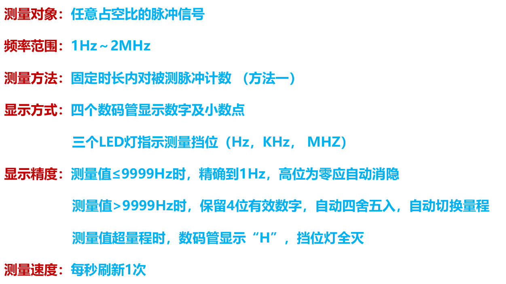
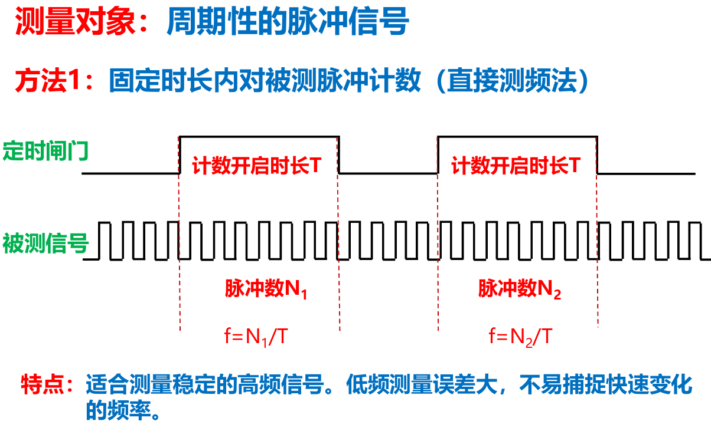
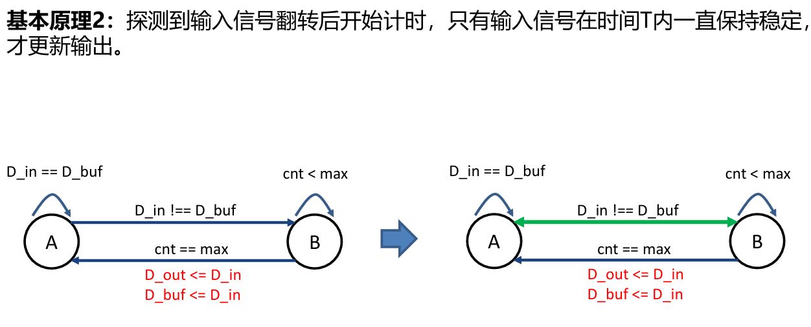

# 实验 数字频率计



<!-- @import "[TOC]" {cmd="toc" depthFrom=2 depthTo=4 orderedList=false} -->

<!-- code_chunk_output -->

- [一、频率测量](#一-频率测量)
  - [1.1 采样](#11-采样)
  - [1.2 消抖](#12-消抖)
- [二、计数](#二-计数)
  - [2.1 使用逢10进1法](#21-使用逢10进1法)
  - [2.2 移位加3法](#22-移位加3法)
- [三、数码管显示](#三-数码管显示)
  - [3.1 显示数字算法](#31-显示数字算法)
  - [3.2 数码管显示代码](#32-数码管显示代码)

<!-- /code_chunk_output -->


## 一、频率测量

### 1.1 采样

采用直接测频法，在固定1s时间内对脉冲计数



可以通过组合逻辑的方式在上升沿与下降沿到来时输出一个脉冲


`D_in` 为输入信号，`D_buf` 为缓存信号，当时钟上升沿到来时将 `D_in` 的状态存入 `D_buf` 中，然后通过以下逻辑

**pos = D_in & (D_in ^ D_buf)**
**neg =（~D_in） & (D_in ^ D_buf)**

由于 `D_buf` 的变化会存在一定延时，故 `pos` / `neg` 在clk上升沿时还存在一小段高电平，这是在计数器里面检测 `pos==1` 或者 `neg==1` 即可

### 1.2 消抖

同时，为了避免抖动，需要对采样信号的跳变进行一定的延时（几个系统时钟周期），排除干扰导致多次计数

通过比较采样信号上一个时刻的状态与下一个时刻的状态实现边沿检测

**O**为消抖后的采样信号，**pos**为上升沿脉冲，当信号有上升沿后产生一个机器周期的脉冲（可用来计数），**neg**为下降沿脉冲

消抖的实现可以按照以下状态转移图：



参考代码：

```verilog
module posedge_check(
    input clk,      
    input I,        //输入状态
    output reg O, pos, neg
    );

    reg [32:0]cnt;      //延时计数
    reg now;            //当前状态
    reg current_stage;
    reg next_stage;
    parameter [32:0]delay = 5;    //延时目标时间（时钟周期）

    always @(posedge clk) begin
    current_stage<=next_stage;
    end

    always @(*) begin
        case (current_stage)
            0:
            begin
                if(I==now)
                next_stage<=current_stage;
                else
                next_stage<=1;
            end 
            1:
            begin
                if(I==now)
                next_stage<=0;
                else if(cnt==delay)
                next_stage<=0;
                else
                next_stage<=current_stage;
            end
        endcase
    end

    always @(posedge clk) begin
        case (next_stage)
            0:
            begin
                if(cnt==delay)
                begin
                    now<=I;
                    cnt<=0;
                    O<=I;
                    if(I==1)
                    pos=1;
                    else
                    neg=1;
                end
                else
                begin
                    cnt<=0;
                    O<=now;
                    pos=0;
                    neg=0;
                end
            end
            1: if(current_stage==0)
            begin
                cnt<=0;
                O<=now;
                pos=0;
                neg=0;
            end
            else
            begin
                cnt<=cnt+1;
                O<=now;
                pos=0;
                neg=0;
            end
        endcase
    end
endmodule
```

## 二、计数

### 2.1 使用逢10进1法

采用每位数字用一个4位二进制来储存，这样可以方便取出每位的数字，避免使用 `/` 和 `%` 

**清零**：每过1s需要清除计数器中储存的值，通过比较参考电平来实现（当检测上升沿到来后，若当前的tim电平与每秒翻转的sec电平不同，则翻转tim
并清零数据）

故有以下代码

```verilog
always @(posedge sig) begin
    //计数
    if (bit0==9) begin bit0<=0;
        if (bit1==9) begin bit1<=0;
            if (bit2==9) begin bit2<=0;
                if (bit3==9) begin bit3<=0;
                    if (bit4==9) begin bit4<=0;
                        if (bit5==9) begin bit5<=0;
                            if (bit6==9) begin
                                bit6=0;
                            end
                            else
                            bit6<=bit6+1;
                        end
                        else
                        bit5<=bit5+1;
                    end
                    else
                    bit4<=bit4+1;
                end
                else
                bit3<=bit3+1;
            end
            else
            bit2<=bit2+1;
        end
        else
        bit1<=bit1+1;
    end
    else
    bit0<=bit0+1;
    //清零
    if (tim!=sec) begin
        tim<=sec;
        bit0<=1;
        bit1<=0;
        bit2<=0;
        bit3<=0;
        bit4<=0;
        bit5<=0;
        bit6<=0;
    end
end
```

**注意：由于这里都是非阻塞赋值，清零一定要写在最后，否则可能会出现被计数里的自增覆盖的问题**

可以发现这样的代码if-else嵌套的非常冗长

### 2.2 移位加3法

将一个二进制数转换为十进制数

本质上就是我们将二进制数转换为十进制数的逻辑：

```c
10100101 对应 2^7+2^5+2^2+2^0
所以最高位左移了 8 次，最低位左移了 1 次（第一次左移是移入2^0位置）
而+3再左移则是为了满足十进制的进位方式，因为个、十、百、千等等位是由4位即16进制组成，
故(5+3)*2对于16进制的尾数与10进制相同均为0
```


参考代码：

```verilog
module Bin2Dec( //范围：0~9999
    input clk_sys,
    input rst_n,
    input [13:0] Data_bin,
    output reg done,
    output reg [15:0] Data_dec
    );

    reg [13:0] Data_bin_buf;
    reg [15:0] Data_dec_buf;
    reg [4:0] cnt;
    reg [1:0] state_current, state_next;
    parameter state_initial = 0, state_load = 1, state_shift = 2, state_finish = 3;
    wire [3:0] unit_tmp, tens_tmp, hund_tmp, thou_temp;
    
    always@(posedge clk_sys or negedge rst_n)
    begin
      if(!rst_n)
        state_current <= state_initial;
      else
        state_current <= state_next;
    end
    
    always@(*)
    begin
      case(state_current)
      state_initial:state_next = state_load;
      state_load:state_next = state_shift;
      state_shift:begin
                   if(cnt==14)
                     state_next = state_finish;
                   else
                     state_next = state_shift;
                 end
      state_finish:state_next = state_load;
      default:state_next = state_initial;
      endcase
    end
    
    always@(posedge clk_sys or negedge rst_n)
    begin
      if(!rst_n)
        begin
          Data_dec <= 0;
          Data_dec_buf <= 0;
          Data_bin_buf <= 0;
          done <= 0;
          cnt <= 0;
        end
      else
      begin
        case(state_next)
        state_load:begin
                     Data_bin_buf <= Data_bin;
                     Data_dec_buf <= 0;
                     done <= 0;  
                     cnt <= 0;       
                   end
        state_shift:begin
                      cnt <= cnt + 1;
                      Data_bin_buf <= Data_bin_buf << 1;
                      Data_dec_buf[3:0] <= {unit_tmp[2:0],Data_bin_buf[13]};
                      Data_dec_buf[7:4] <= {tens_tmp[2:0], unit_tmp[3]};
                      Data_dec_buf[11:8] <= {hund_tmp[2:0], tens_tmp[3]};
                      Data_dec_buf[15:12] <= {thou_temp[2:0], hund_tmp[3]};
                    end
        state_finish:begin
                       Data_dec <= Data_dec_buf;
                       done <= 1;
                     end
        default:begin
                  Data_dec_buf <= Data_dec_buf;
                  Data_bin_buf <= Data_bin_buf;
                  Data_dec <= Data_dec;
                  done <= done;
                  cnt <= cnt;
                end
        endcase
      end
    end
    
    assign unit_tmp = (Data_dec_buf[3:0]>4)? (Data_dec_buf[3:0]+3):Data_dec_buf[3:0];
    assign tens_tmp = (Data_dec_buf[7:4]>4)? (Data_dec_buf[7:4]+3):Data_dec_buf[7:4];
    assign hund_tmp = (Data_dec_buf[11:8]>4)? (Data_dec_buf[11:8]+3):Data_dec_buf[11:8];
    assign thou_temp = Data_dec_buf[15:12];
    
endmodule
```

## 三、数码管显示

### 3.1 显示数字算法

每过1s（采用“时钟”章节中的手动分频器），就翻转一次参考电平sec（给计数用），同时更新一次数码管的显示值

按照开头处的要求有如下代码：

```verilog
always @(posedge asec) begin
    //判断是否没有信号输入
    begin
    if (tim==tim_past) begin
        zero<=1;
    end
    else begin
        zero<=0;
    end
    tim_past<=tim;
    //按要求更新数码管显示值
    if (zero==1) begin
        d1=30;d2=30;d3=30;d4=0;LED1=0;LED2=0;LED3=0;
    end
    else
        if (bit6>2 || (bit6==2 && (bit5|bit4|bit3|bit2|bit1|bit0)!=0)) begin
        d1<=20;d2<=20;d3<=20;d4<=20;LED1=0;LED2=0;LED3=0;
        end
        else if (bit6>0) begin
            d1<=bit6+10;d2<=bit5;d3<=bit4;d4<=bit3;LED1=1;LED2=0;LED3=0;
        end
        else if (bit5>0) begin
            d1<=bit5;d2<=bit4;d3<=bit3+10;d4<=bit2;LED1=0;LED2=1;LED3=0;
        end
        else if (bit4>0) begin
            d1<=bit4;d2<=bit3+10;d3<=bit2;d4<=bit1;LED1=0;LED2=1;LED3=0;
        end
        else if (bit3>0) begin
            d1<=bit3;d2<=bit2;d3<=bit1;d4<=bit0;LED1=0;LED2=0;LED3=1;
        end
        else if (bit2>0) begin
            d1<=30;d2<=bit2;d3<=bit1;d4<=bit0;LED1=0;LED2=0;LED3=1;
        end
        else if (bit1>0) begin
            d1<=30;d2<=30;d3<=bit1;d4<=bit0;LED1=0;LED2=0;LED3=1;
        end
        else begin
            d1<=30;d2<=30;d3<=30;d4<=bit0;LED1=0;LED2=0;LED3=1;
        end
    end
    //翻转参考电平
    sec<=~sec;
end
```

### 3.2 数码管显示代码

四个data表示四个管对应要显示的数据，**从左往右**扫描显示，返回pos位选和data段选数据，译码功能和扫描功能已在内部完成

```verilog
module seg(
    input clk,
    input [4:0]data1,data2,data3,data4,  //要显示的四个数字
    output reg[3:0] pos,    //位选
    output reg[4:0] num,
    output reg [8:0]data,   //段选
    input rst
    );
    wire pclk;
    reg [32:0]ff;
    reg [1:0]current_stage, next_stage;
    reg [2:0]state;

    My_div #(100000) div_u0(.clk_in(clk),.rst_in(rst),.clk_out(pclk));    //1000Hz

    always @(posedge pclk) begin
        current_stage=next_stage;
    end

    always @(*) begin
        next_stage=current_stage+1;
    end

    

    always @(posedge pclk) begin //数码管从左往右扫描
        case(next_stage)
        0:
        begin
            num=data1;
            pos=4'b0001;
        end
        1:
        begin
            num=data2;
            pos=4'b0010;
        end
        2:
        begin
            num=data3;
            pos=4'b0100;
        end
        3:
        begin
            num=data4;
            pos=4'b1000;
        end
        endcase
    end

     always@(*)begin
            case(num)
                5'd0:data=8'b00111111;
                5'd1:data=8'b00000110;
                5'd2:data=8'b01011011;
                5'd3:data=8'b01001111;
                5'd4:data=8'b01100110;
                5'd5:data=8'b01101101;
                5'd6:data=8'b01111101;
                5'd7:data=8'b00000111;
                5'd8:data=8'b01111111;
                5'd9:data=8'b01101111;
                5'd10:data=8'b10111111;
                5'd11:data=8'b10000110;
                5'd12:data=8'b11011011;
                5'd13:data=8'b11001111;
                5'd14:data=8'b11100110;
                5'd15:data=8'b11101101;
                5'd16:data=8'b11111101;
                5'd17:data=8'b10000111;
                5'd18:data=8'b11111111;
                5'd19:data=8'b11101111;
                5'd20:data=8'b01110110;
                default:data=8'b0000000;
            endcase
    end
endmodule
```

num取`0~9`为正常数字，`10~19`会在右下角显示小数点，20显示H，大于20则不显示