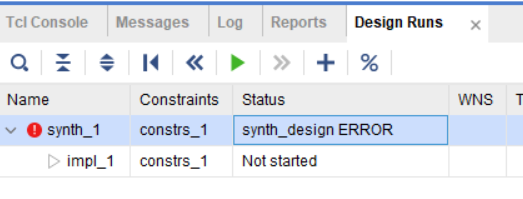
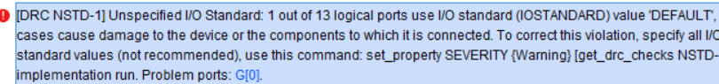
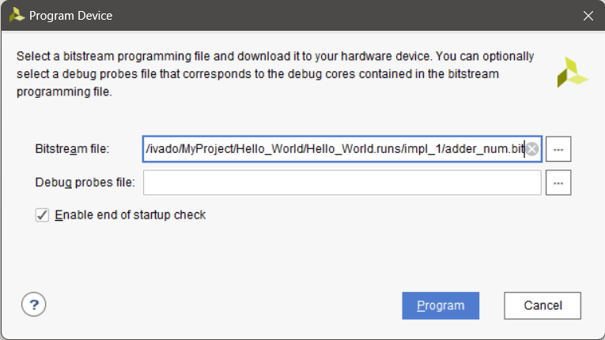

# 报错集合

<!-- @import "[TOC]" {cmd="toc" depthFrom=2 depthTo=4 orderedList=false} -->

<!-- code_chunk_output -->

- [报错集合](#报错集合)
  - [1. Synthesis failed.](#1-synthesis-failed)
    - [1.1 synth\_design ERROR](#11-synth_design-error)
    - [1.2 ambiguous clock in event control](#12-ambiguous-clock-in-event-control)
  - [2. Bitstream Generation failed.](#2-bitstream-generation-failed)
    - [2.1 Unspecified l/0 Standard: 1 out of 13 logical ports use 10 standard (IOSTANDARD) vaue 'DEFAULT'](#21-unspecified-l0-standard-1-out-of-13-logical-ports-use-10-standard-iostandard-vaue-default)
  - [3. 找不到.bit文件](#3-找不到bit文件)

<!-- /code_chunk_output -->


## 1. Synthesis failed.

### 1.1 synth_design ERROR

开始第一步就报错



**原因：放入了中文路径**

软件要求放在全英文路径中

### 1.2 ambiguous clock in event control 

事件控制 Vivado 中的模棱两可时钟

说人话就是：使用always的时候进行了双时钟采样，而vivado里面没有这种器件


比如做分频的时候使用

```verilog
always @ (posedge clk or posedge clk_reverse or negedge rst_n) 
```

里面的 `clk` 与 `clk_reverse` 为两个输入时钟，在vivado里不被支持

同样，像这样的代码

```verilog
always @ (posedge clk or negedge rst_n) begin
a <= 1'b0;
end
```

因为没有用上 `rst_n` ，Verilog会认为你的 `rst_n` 也是一个时钟，从而也是非法的

## 2. Bitstream Generation failed.

### 2.1 Unspecified l/0 Standard: 1 out of 13 logical ports use 10 standard (IOSTANDARD) vaue 'DEFAULT'



**原因：输入输出有错误**

包括但不限于：

1. 重复定义引脚

``` verilog
set_property -dict {PACKAGE_PIN P5 IOSTANDARD LVCMOS33} [get_ports {G[1]}]
set_property -dict {PACKAGE_PIN P4 IOSTANDARD LVCMOS33} [get_ports {G[1]}]

或者

set_property -dict {PACKAGE_PIN P4 IOSTANDARD LVCMOS33} [get_ports {G[0]}]
set_property -dict {PACKAGE_PIN P4 IOSTANDARD LVCMOS33} [get_ports {G[1]}]
```

2. 声明的output并未被完全定义

``` verilog
output [2:0]A,B,C
上面表示A,B,C均为三位总线，所以应对应9个约束端口，否则应写为
output [2:0]A，
output B,C
```
## 3. 找不到.bit文件

在generate bitstream文件后在下图位置寻找

<div style="text-align: center;">


</div>