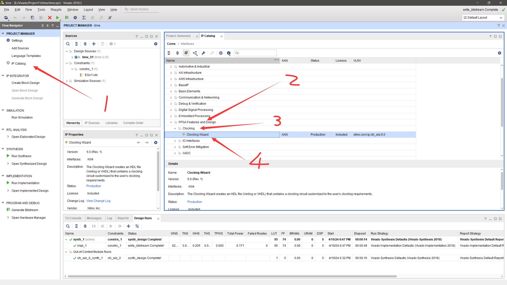
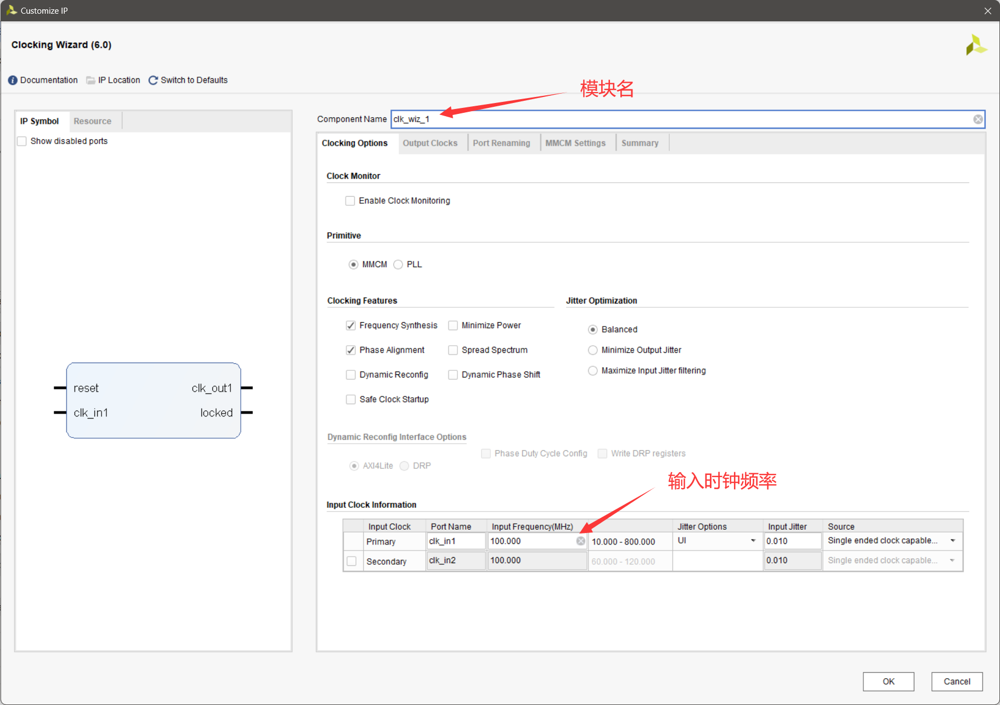
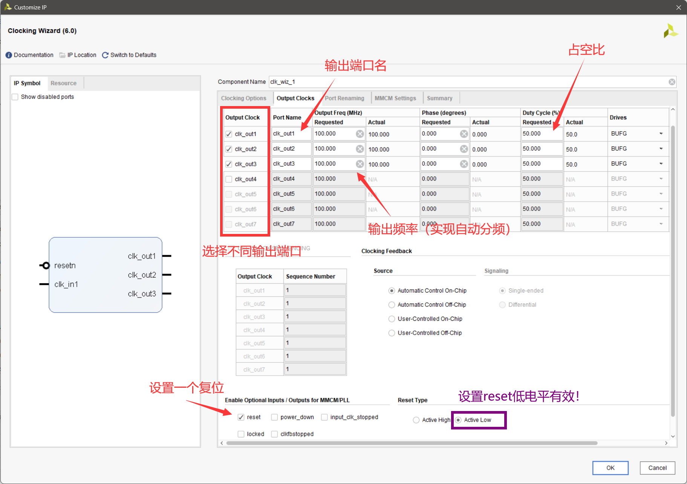
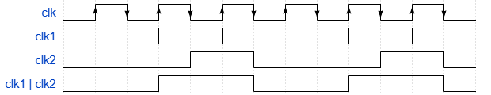
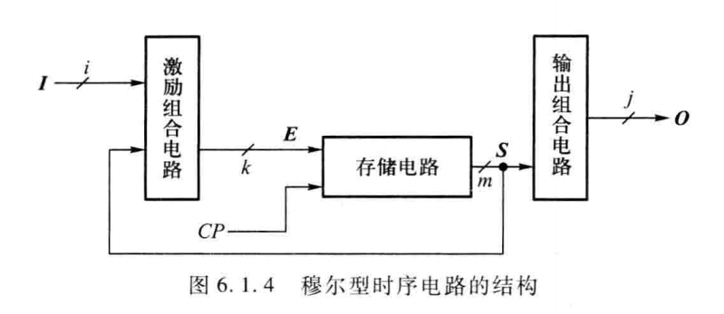

# 时序

## 一、矩形脉冲信号的产生

FPGA/CPLD通常采用外部有源晶振作为主时钟源，通过配置片内PLL或编写HDL程序实现分频、倍频

### 1.1 利用IP核实现分频模块

使用IP核中的Clocking Wiazred 



里面的选项基本默认即可





特别说明：

1. locked功能可以不用勾选，用的不多
2. 由于EGO1板上的**复位键是默认高电平**，故reset功能需要设置为低电平（下降沿）触发，否则就可能一直在"复位"

### 1.2 用语言写一个带参数分频模块

这种模块可以在例化模型时修改参数的取值，实现不同的分频效果

```verilog
module MyFerq_div(
    input clk_in,
    input rst_in,
    output reg clk_out
    );
    reg [31:0] cnt;
    wire [30:0] cnt_max;
    parameter fq_div = 32'd100;
    assign cnt_max = fq_div[31:1]-1;    

    always@(posedge clk_in or negedge rst_in ) begin
        if(!rst_in)
        begin
            cnt<=0;
            clk_out<=0;
        end
        else
        if(cnt<cnt_max)
        cnt<=cnt+1;
        else
        begin
            cnt<=0;
            clk_out<=~clk_out;
        end
    end

endmodule
```

由 `fq_div` 决定默认是100分频，在实例化模块时可以通过 `#(x)` 来将这种parameter类型的值更改为x

```verilog
MyFerq_div #(10000000) div2_u0(C10,rst_in,A);    //  10M分频
MyFerq_div #(5000000) div2_u1(C15,rst_in,F30);    //  5M分频
MyFerq_div #(5000000) div2_u2(C5,rst_in,C);     //  5M分频
```

写好后可以将该模块与IP核分频模块结合在一起实现多级分频，具体见 “verilog语言基础” 第7章节

### 1.3 实现占空比为50%的三分频

上述分频程序通过对上升沿进行计数可以实现偶数倍的分频，而奇数倍的分频需要上升沿下降沿都要计数

实现三分频的原理为：



* 在数了两个上升沿后clk1置1，并在下一个上升沿后清0，重新再数两个上升沿；
* 在数了两个下降沿后clk2置1，并在下一个下降沿后清0，重新再数两个下降沿；

这样clk2比clk1超前半拍，最后将两个信号取或，就可以得到三分频的信号如上图所示

---

但是在编程时需要注意以下问题：

1. 不能在 `always@()` 内同时检测同一个信号的上升沿和下降沿
2. 不能在多个 `always` 模块内对同一变量进行赋值
3. 不能给一个 `always@()` 输入两个或多个时钟信号（在always内部没有被调用/使用的变量即被认为是时钟信号）
4. 在 `always` 模块内的赋值全部要使用非阻塞赋值方式 `<=`

由此我们需要对**两个always**取**或**，代码如下：

```verilog
module div3(
    input clk_in,
    input rst_in,
    output wire clk_out
    );

    reg [1:0]cnt1;
    reg [1:0]cnt2;

    always@(posedge clk_in or negedge rst_in) begin
        if(!rst_in)
        begin
            cnt1<=0;
        end
        else
        if(cnt1==2)
        cnt1<=0;
        else
        begin
            cnt1<=cnt1+1;
        end
    end

    always@(negedge clk_in or negedge rst_in) begin
        if(!rst_in)
        begin
            cnt2<=0;
        end
        else
        if(cnt2==2)
        cnt2<=0;
        else
        begin
            cnt2<=cnt2+1;
        end
    end

    assign clk_out= (cnt1==2) | (cnt2==2);
endmodule
```

即可完成三分频（占空比50%）模块的书写

---

那么如果是任意整数倍分频呢？

>实现奇数倍分频若不考虑占空比可以用非常简单的方式：
使分频数=cnt，每次上升沿cnt+1，最后通过读取cnt的二进制最高位（0或1）来进行翻转即可
>
>eg.11分频：那么0000~0111(cnt数0~7)均为低，1000~1011（cnt数~10）均为高（11即为0），即可实现1/11的频率，当然占空比就不是50%了

## 二、使用三段式状态机



这里的 **E** 对应 `next_stage` ，**S** 对应 `current_stage`

### 2.1 D触发器状态转换方程（S）

用一个时序always块描述次态寄存器迁移到现态寄存器（E进入储存电路到S的过程）

```verilog
always@(posedge clk or negedge rst_n)
if (!rst_n)
current_state <= IDLE;
else
current_state <= next_state;
```
### 2.2 D触发器输入/激励方程（E）

一个组合always块，描述状态转移条件（S进入组合电路到E的过程）

由于本质上是一个组合逻辑电路，不涉及时序部分，所以触发方式可以为 `*`

```verilog
always@(*)
case(current_state)
S1: if(…) next_state = S2;
S2: if(…) next_state = S3;
......
default: next_state = … ;
endcase
```

### 2.3 穆尔型输出方程（O）

一个时序always块描述输出赋值（S通过输出组合电路输出到O的过程）

```verilog
always@(posedge clk or negedge rst_n)
begin
if (!rst_n)
out <= … ;
else
case(next_state)
S1: out <= … ;
S2: out <= … ;
......
default: out <= … ;
endcase
end
```

