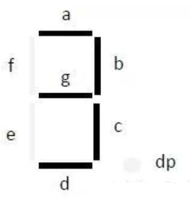

# 几种经典组合逻辑电路

## 7448——显示译码器

EG01数码管管脚分布如下：

<div style="text-align: center;">


</div>

管脚约束：

<div style="text-align: center;">


</div>

定义`output reg [0:7]data` 为位选信号，`data[0]` 对应A，`data[6]` 对应G， `data[7]` 对应DP，相应约束文件有：

``` verilog
//使用右边四个数码管
set_property -dict {PACKAGE_PIN D4 IOSTANDARD LVCMOS33} [get_ports {data[0]}]
set_property -dict {PACKAGE_PIN E3 IOSTANDARD LVCMOS33} [get_ports {data[1]}]
set_property -dict {PACKAGE_PIN D3 IOSTANDARD LVCMOS33} [get_ports {data[2]}]
set_property -dict {PACKAGE_PIN F4 IOSTANDARD LVCMOS33} [get_ports {data[3]}]
set_property -dict {PACKAGE_PIN F3 IOSTANDARD LVCMOS33} [get_ports {data[4]}]
set_property -dict {PACKAGE_PIN E2 IOSTANDARD LVCMOS33} [get_ports {data[5]}]
set_property -dict {PACKAGE_PIN D2 IOSTANDARD LVCMOS33} [get_ports {data[6]}]
set_property -dict {PACKAGE_PIN H2 IOSTANDARD LVCMOS33} [get_ports {data[7]}]
```

相应的数字对应编码：

``` verilog
4'd0:data=8'b00111111;
4'd1:data=8'b00000110;
4'd2:data=8'b01011011;
4'd3:data=8'b01001111;
4'd4:data=8'b01100110;
4'd5:data=8'b01101101;
4'd6:data=8'b01111101;
4'd7:data=8'b00000111;
4'd8:data=8'b01111111;
4'd9:data=8'b01101111;
default:data=8'b0000000;
```

同时还有测试信号 `test` ，按下后所有数码管都亮起

以及最高位指示器 `BL` ，若当前为是最高位且显示数字0，则让它不显示并将最高位传递给后面的数码管（此处只让一个数码管亮灯故没有这个作用）

---

采用按键**P5**作为测试接口，按键**P4**作为最高位指示器

数码管为**G1，F1，E1，G6**，片选线是板子上数码管下方的八组代号

代码如下：

``` verilog
module shumaguan(
    input [3:0] num,
    input test,
    input note,
    output reg [7:0] data,
    output reg [3:0] pos
    );
    
    
    always@(*)
    begin
    pos=4'b0010;
        if(test==1)
        data=8'b11111111;
        else if(note==1 && num==4'b0000)
            begin
            data=8'b00000000;
            end
        else
            case(num)
                4'd0:data=8'b00111111;
                4'd1:data=8'b00000110;
                4'd2:data=8'b01011011;
                4'd3:data=8'b01001111;
                4'd4:data=8'b01100110;
                4'd5:data=8'b01101101;
                4'd6:data=8'b01111101;
                4'd7:data=8'b00000111;
                4'd8:data=8'b01111111;
                4'd9:data=8'b01101111;
                default:data=8'b0000000;
            endcase
    end
endmodule
```

约束文件改动：

``` verilog
//按键
set_property -dict {PACKAGE_PIN P5 IOSTANDARD LVCMOS33} [get_ports {test}]
set_property -dict {PACKAGE_PIN P4 IOSTANDARD LVCMOS33} [get_ports {note}]
set_property -dict {PACKAGE_PIN R2 IOSTANDARD LVCMOS33} [get_ports {num[3]}]
set_property -dict {PACKAGE_PIN M4 IOSTANDARD LVCMOS33} [get_ports {num[2]}]
set_property -dict {PACKAGE_PIN N4 IOSTANDARD LVCMOS33} [get_ports {num[1]}]
set_property -dict {PACKAGE_PIN R1 IOSTANDARD LVCMOS33} [get_ports {num[0]}]
//片选线
set_property -dict {PACKAGE_PIN G1 IOSTANDARD LVCMOS33} [get_ports {pos[3]}]
set_property -dict {PACKAGE_PIN F1 IOSTANDARD LVCMOS33} [get_ports {pos[2]}]
set_property -dict {PACKAGE_PIN E1 IOSTANDARD LVCMOS33} [get_ports {pos[1]}]
set_property -dict {PACKAGE_PIN G6 IOSTANDARD LVCMOS33} [get_ports {pos[0]}]
//数码管
set_property -dict {PACKAGE_PIN D4 IOSTANDARD LVCMOS33} [get_ports {data[0]}]
set_property -dict {PACKAGE_PIN E3 IOSTANDARD LVCMOS33} [get_ports {data[1]}]
set_property -dict {PACKAGE_PIN D3 IOSTANDARD LVCMOS33} [get_ports {data[2]}]
set_property -dict {PACKAGE_PIN F4 IOSTANDARD LVCMOS33} [get_ports {data[3]}]
set_property -dict {PACKAGE_PIN F3 IOSTANDARD LVCMOS33} [get_ports {data[4]}]
set_property -dict {PACKAGE_PIN E2 IOSTANDARD LVCMOS33} [get_ports {data[5]}]
set_property -dict {PACKAGE_PIN D2 IOSTANDARD LVCMOS33} [get_ports {data[6]}]
set_property -dict {PACKAGE_PIN H2 IOSTANDARD LVCMOS33} [get_ports {data[7]}]
```
