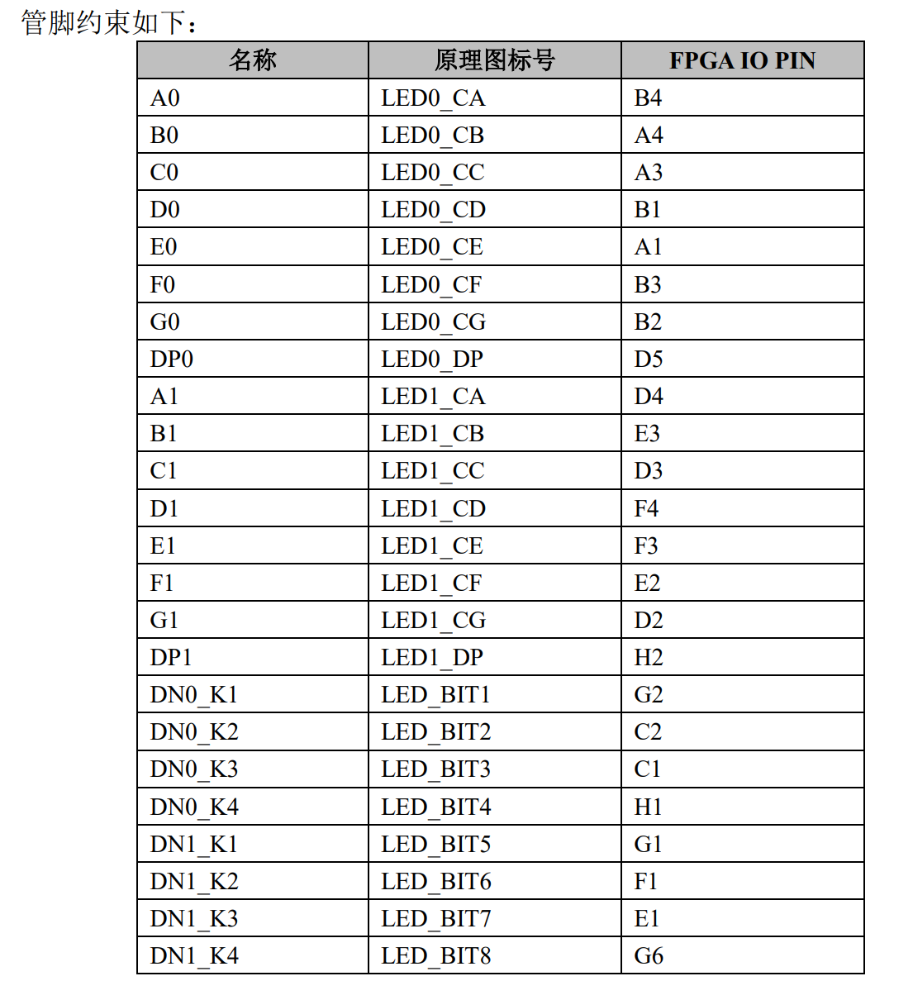

# 几种经典组合逻辑电路

## 7448——显示译码器

EG01数码管管脚分布如下：

<div style="text-align: center;">


</div>

管脚约束：

<div style="text-align: center;">


</div>

定义`output reg [0:7]data` 为位选信号，`data[0]` 对应A，`data[6]` 对应G， `data[7]` 对应DP，相应约束文件有：

``` verilog
//使用右边四个数码管
set_property -dict {PACKAGE_PIN D4 IOSTANDARD LVCMOS33} [get_ports {data[0]}]
set_property -dict {PACKAGE_PIN E3 IOSTANDARD LVCMOS33} [get_ports {data[1]}]
set_property -dict {PACKAGE_PIN D3 IOSTANDARD LVCMOS33} [get_ports {data[2]}]
set_property -dict {PACKAGE_PIN F4 IOSTANDARD LVCMOS33} [get_ports {data[3]}]
set_property -dict {PACKAGE_PIN F3 IOSTANDARD LVCMOS33} [get_ports {data[4]}]
set_property -dict {PACKAGE_PIN E2 IOSTANDARD LVCMOS33} [get_ports {data[5]}]
set_property -dict {PACKAGE_PIN D2 IOSTANDARD LVCMOS33} [get_ports {data[6]}]
set_property -dict {PACKAGE_PIN H2 IOSTANDARD LVCMOS33} [get_ports {data[7]}]
```

相应的数字对应编码：

``` verilog
4'd0:data=8'b00111111;
4'd1:data=8'b00000110;
4'd2:data=8'b01011011;
4'd3:data=8'b01001111;
4'd4:data=8'b01100110;
4'd5:data=8'b01101101;
4'd6:data=8'b01111101;
4'd7:data=8'b00000111;
4'd8:data=8'b01111111;
4'd9:data=8'b01101111;
default:data=8'b0000000;
```

同时还有测试信号 `test` ，按下后所有数码管都亮起

以及最高位指示器 `BL` ，若当前为是最高位且显示数字0，则让它不显示并将最高位传递给后面的数码管（此处只让一个数码管亮灯故没有这个作用）

---

采用按键**P5**作为测试接口，按键**P4**作为最高位指示器

数码管为**G1，F1，E1，G6**，片选线是板子上数码管下方的八组代号

代码如下：

``` verilog
module shumaguan(
    input [3:0] num,
    input test,
    input note,
    output reg [7:0] data,
    output reg [3:0] pos
    );
    
    
    always@(*)
    begin
    pos=4'b0010;
        if(test==1)
        data=8'b11111111;
        else if(note==1 && num==4'b0000)
            begin
            data=8'b00000000;
            end
        else
            case(num)
                4'd0:data=8'b00111111;
                4'd1:data=8'b00000110;
                4'd2:data=8'b01011011;
                4'd3:data=8'b01001111;
                4'd4:data=8'b01100110;
                4'd5:data=8'b01101101;
                4'd6:data=8'b01111101;
                4'd7:data=8'b00000111;
                4'd8:data=8'b01111111;
                4'd9:data=8'b01101111;
                default:data=8'b0000000;
            endcase
    end
endmodule
```

约束文件改动：

``` verilog
//按键
set_property -dict {PACKAGE_PIN P5 IOSTANDARD LVCMOS33} [get_ports {test}]
set_property -dict {PACKAGE_PIN P4 IOSTANDARD LVCMOS33} [get_ports {note}]
set_property -dict {PACKAGE_PIN R2 IOSTANDARD LVCMOS33} [get_ports {num[3]}]
set_property -dict {PACKAGE_PIN M4 IOSTANDARD LVCMOS33} [get_ports {num[2]}]
set_property -dict {PACKAGE_PIN N4 IOSTANDARD LVCMOS33} [get_ports {num[1]}]
set_property -dict {PACKAGE_PIN R1 IOSTANDARD LVCMOS33} [get_ports {num[0]}]
//片选线
set_property -dict {PACKAGE_PIN G1 IOSTANDARD LVCMOS33} [get_ports {pos[3]}]
set_property -dict {PACKAGE_PIN F1 IOSTANDARD LVCMOS33} [get_ports {pos[2]}]
set_property -dict {PACKAGE_PIN E1 IOSTANDARD LVCMOS33} [get_ports {pos[1]}]
set_property -dict {PACKAGE_PIN G6 IOSTANDARD LVCMOS33} [get_ports {pos[0]}]
//数码管
set_property -dict {PACKAGE_PIN D4 IOSTANDARD LVCMOS33} [get_ports {data[0]}]
set_property -dict {PACKAGE_PIN E3 IOSTANDARD LVCMOS33} [get_ports {data[1]}]
set_property -dict {PACKAGE_PIN D3 IOSTANDARD LVCMOS33} [get_ports {data[2]}]
set_property -dict {PACKAGE_PIN F4 IOSTANDARD LVCMOS33} [get_ports {data[3]}]
set_property -dict {PACKAGE_PIN F3 IOSTANDARD LVCMOS33} [get_ports {data[4]}]
set_property -dict {PACKAGE_PIN E2 IOSTANDARD LVCMOS33} [get_ports {data[5]}]
set_property -dict {PACKAGE_PIN D2 IOSTANDARD LVCMOS33} [get_ports {data[6]}]
set_property -dict {PACKAGE_PIN H2 IOSTANDARD LVCMOS33} [get_ports {data[7]}]
```

## 74138——38译码器

管脚分布：
<div style="text-align: center;">


</div>

真值表：
<div style="text-align: center;">


</div>

>其中**G**为使能端，**G1**低，**G2**高才工作；默认引脚高电平，有信号时对应引脚为低

代码如下：

``` verilog
module encoder38(
input [1:0]G,
input A,B,C,
output reg [7:0]Y

    );
    
    always@(*)
    if(G==2'b10)
    begin
    //Y=~(1<<(A+B*2+C*4));
    case({A,B,C})
            3'b000:Y = 8'b11111110;
            3'b001:Y = 8'b11111101;
            3'b010:Y = 8'b11111011;
            3'b011:Y = 8'b11110111;
            3'b100:Y = 8'b11101111;
            3'b101:Y = 8'b11011111;
            3'b110:Y = 8'b10111111;
            3'b111:Y = 8'b01111111;
            endcase
    end
    else
    Y=8'b11111111;
endmodule
```

## 74148——83编码器

管脚分布：

<div style="text-align: center;">


</div>

真值表：

<div style="text-align: center;">


</div>

>其中**EI**为输入使能端，电平为低时才能工作；
**EO**则为输出使能端，当0~7均无有效电平输入时，EO=1，允许下一片编码器编码（应用于编码器的级联）
**GS**为输出指示器，当编码器开始工作时输出为低，指示当前芯片正在工作，这个时候**A**的输出才是有效的

代码如下：

``` verilog
module Encoder(
    input EI,
    input [7:0] I,
    output reg [2:0] A,
    output reg GS,
    output reg EO
    );

    always @(*) begin
        if(EI==0)
    begin
        if(I[7]==0)
        begin
            A=3'b000;
            GS=0;
            EO=1;
        end
        else if(I[6]==0)
        begin
            A=3'b001;
            GS=0;
            EO=1;
        end
        else if(I[5]==0)
        begin
            A=3'b010;
            GS=0;
            EO=1;
        end
        else if(I[4]==0)
        begin
            A=3'b011;
            GS=0;
            EO=1;
        end
        else if(I[3]==0)
        begin
            A=3'b100;
            GS=0;
            EO=1;
        end
        else if(I[2]==0)
        begin
            A=3'b101;
            GS=0;
            EO=1;
        end
        else if(I[1]==0)
        begin
            A=3'b110;
            GS=0;
            EO=1;
        end
        else if(I[0]==0)
        begin
            A=3'b111;
            GS=0;
            EO=1;
        end
        else
        begin
            A=3'b111;
            GS=1;
            EO=0;
        end
    end
    else
        begin
            A=3'b111;
            GS=1;
            EO=1;
        end
    end
    
endmodule
```

约束文件略（根据input output自己写）

## 7442——二进制译码器（BCD）

引脚分布：

<div style="text-align: center;">


</div>

真值表：

<div style="text-align: center;">


</div>

>根据输入的数（0-9）将之转化为对应线的序号，超出9的输入不输出

代码如下：

```verilog
module BCD(
    input [3:0] I,
    output reg [9:0] O
    );

    always @(*) begin
        case(I)
        4'b0000:O=10'b0000000001;
        4'b0001:O=10'b0000000010;
        4'b0010:O=10'b0000000100;
        4'b0011:O=10'b0000001000;
        4'b0100:O=10'b0000010000;
        4'b0101:O=10'b0000100000;
        4'b0110:O=10'b0001000000;
        4'b0111:O=10'b0010000000;
        4'b1000:O=10'b0100000000;
        4'b1001:O=10'b1000000000;
        default:O=10'b1111111111;
        endcase
    end
endmodule
```

## 7485——数值比较器

引脚图：

<div style="text-align: center;">


</div>

>**I**用于接收上一级联的比较器传来的结果，若本比较器的A与B值相同，则采用I传来的结果作为结果输出

真值表：

<div style="text-align: center;">


</div>

代码如下：

``` verilog
module magnitude_comparator(
    input [3:0] A,
    input [3:0] B,
    input [2:0] I,
    output reg [2:0] O
    );

    always @(*) begin
        if(A[3]>B[3])
        O=3'b100;
        else if(A[3]<B[3])
        O=3'b001;
        else if(A[2]>B[2])
        O=3'b100;
        else if(A[2]<B[2])
        O=3'b001;
        else if(A[1]>B[1])
        O=3'b100;
        else if(A[1]<B[1])
        O=3'b001;
        else if(A[0]>B[0])
        O=3'b100;
        else if(A[0]<B[0])
        O=3'b001;
        else if(I==3'b101)
        O=3'b000;
        else if(I==3'b000)
        O=3'b101;
        else
        O=I;
    end
endmodule
```

## 74283——4位全加器

引脚图：

<div style="text-align: center;">


</div>

>**C**为进位指示器，**C0**表示下一级向前（$\Sigma_1$）进1，
**C1**指示（A4+B4）应向更高一级进1

真值表(单个全加器)：

<div style="text-align: center;">


</div>

但是这个是超前进位加法器，满足以下公式：

<div style="text-align: center;">


</div>

代码如下：

```verilog
module full_adder(
    input [3:0] A,
    input [3:0] B,
    input C0,
    output reg C4,
    output reg [3:0] O
    );

    always @(*) begin
        C4=(C0+A+B)/16;
        O=(C0+A+B)-C4*16;
    end
endmodule
```

## 74151——8位数据选择器

引脚图：

<div style="text-align: center;">


</div>

>**E**为使能端，低电平使能
**S**为选择数据的位置，其值对应输入线的编号
输出有两个，**Y**为选出的输入值，另一个则是其取反

真值表：

<div style="text-align: center;">


</div>

代码如下：

```verilog
module multiplexer(
    input E,
    input [2:0] S,
    input [7:0] I,
    output reg [1:0] Y
    );
    always @(*) begin
        if(E==1)
        Y=2'b10;
        else
        begin
            case(S)
            3'b000:Y={I[0],~I[0]};
            3'b001:Y={I[1],~I[1]};
            3'b010:Y={I[2],~I[2]};
            3'b011:Y={I[3],~I[3]};
            3'b100:Y={I[4],~I[4]};
            3'b101:Y={I[5],~I[5]};
            3'b110:Y={I[6],~I[6]};
            3'b111:Y={I[7],~I[7]};
            endcase
        end
    end
endmodule
```