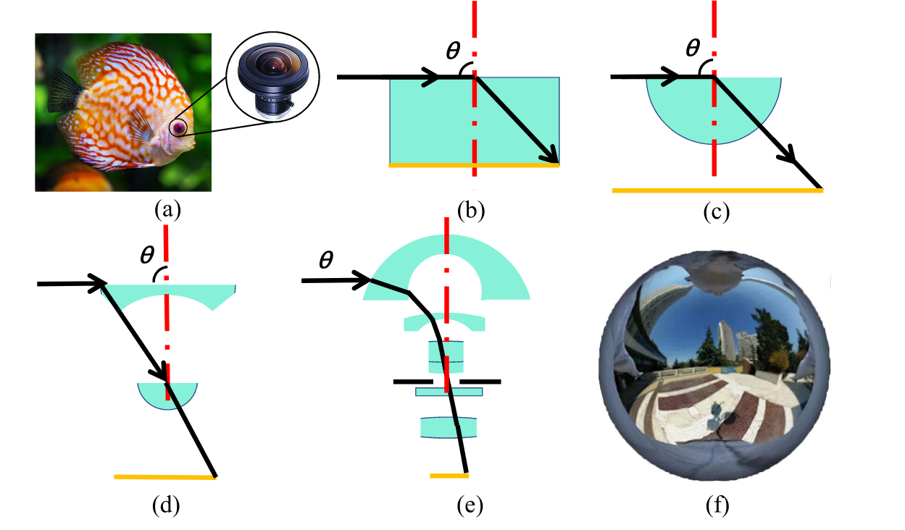
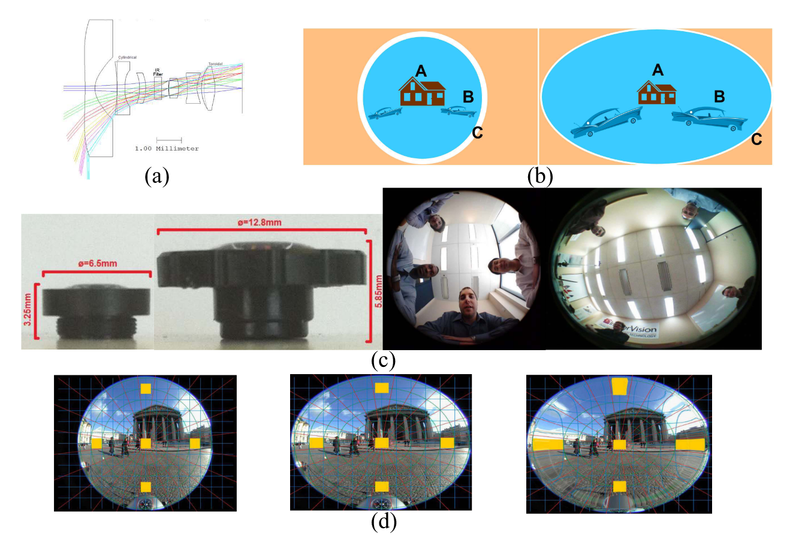
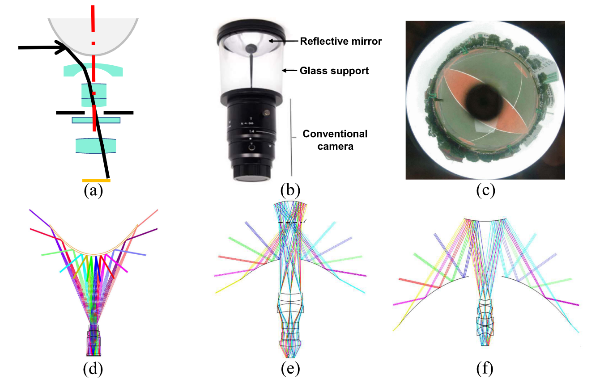
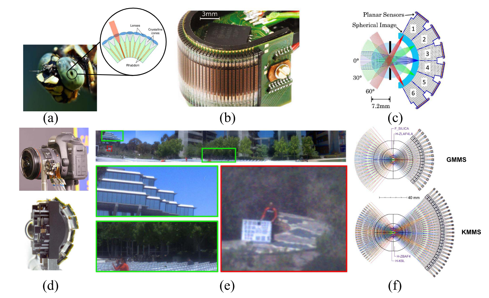
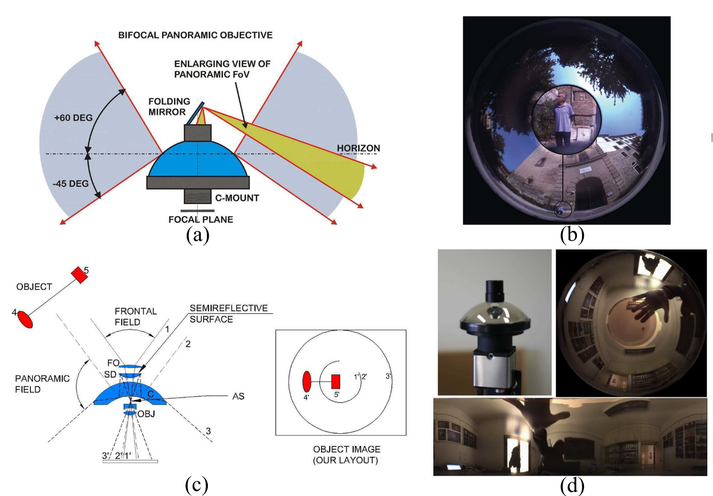
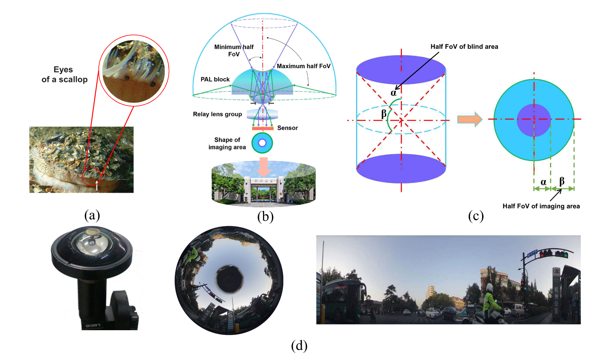
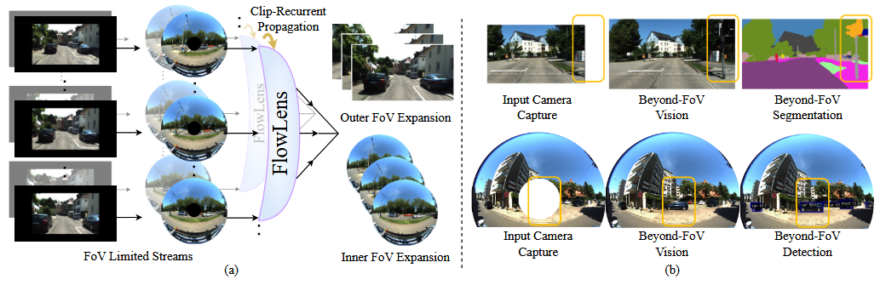
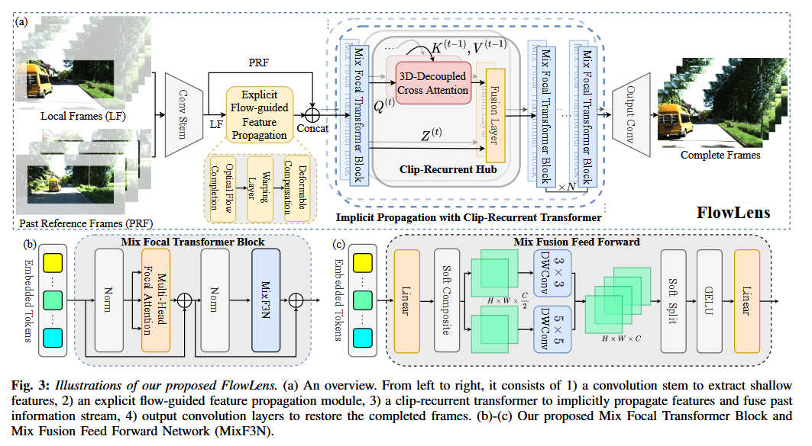
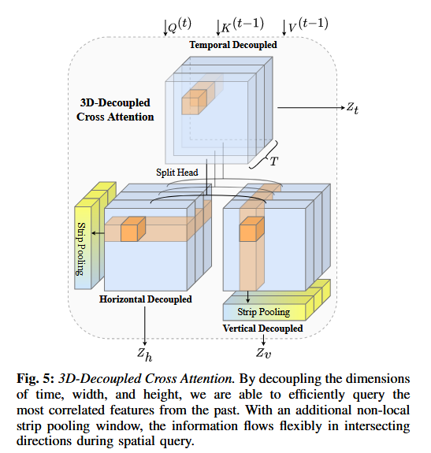

# 全景成像与SLAM

## **Review on Panoramic Imaging and Its Applications in Scene Understanding（综述）**

> 全景成像及其在场景理解中的应用综述

## 1.全景成像关键参数

- **FOV（视场）**：以光学仪器的摄像机为顶点，被测目标物体通过摄像机的最大范围的两条边所形成的角度。

  > 鱼眼光学系统的FoV通常可以达到180 GHz或更高，这种独特的成像特征使得能够一次记录有关周围环境的更多信息。

- **波长**：可见光波长是设计全景成像光学系统最常见的范围，而紫外线和红外全景成像系统的出现可以实现人类可见光谱波长之外的更广泛的环境感知。
- **F数**：光学系统的焦距与其入光瞳直径的比率。F数越小，景深小，更适合用高速快门清晰地拍摄物体，且相机的应用范围更，成像质量更好，但设计更困难

  > 全景系统的F数通常设计得足够小，以实现大的光通量和出色的成像质量

- **焦距**：等距投影模型广泛应用于大型FoV光学系统的设计中，满足$f =y \cdot  \theta$。当全景光学系统的FoV保持相同值时，焦距越大，像高越大。同时，设计的系统体积也会更大。其匹配的传感器往往具有更高的分辨率。

  > 鱼眼光学系统包含两种成像模式：内切圆与外切圆。采用内切圆成像模式设计的全景系统不会丢失FoV，但会浪费传感器边缘的像素。外接圆成像模式的全景系统在边缘处丢失FoV。

- **分辨率**：在全景系统设计中，分辨率通常是指传感器水平和垂直像素阵列的总数。波长越短、口径越大，光学系统的分辨率越高
- **成像质量**：对其影响最大的是像差。通常采用点列图和调制传递函数（MTF）来评价全景成像系统的像质

  > 像差包含：球差、彗差、像散、场曲、畸变、色差、波像差

- **体积**：全景系统的紧凑比可以定义为全景系统的最大直径与传感器上图像的直径尺寸的比

  $$
  R_{compact} =D_{panoramic}/D_{sensor} 
  $$

## 2.全景成像系统的结构和性质

#### (1) 单摄像机扫描和多摄像机融合

1. 光学系统围绕中心旋转扫描一周

- 只适用于静态场景（需要时间扫描）

2. 使用多个相机来拼接镜头

   - 各个摄像头的参数设置和安装角度不一致，影响图像的拼接（需要高精度算法）

#### (2) 鱼眼系统

- 使用单个摄像头具有系统结构简单、无需拼接算法、成本低、安装稳定
- 但光路需要通过前面的多个镜头进行折叠，因此光学系统的**失真较大**
- 前、后镜头组直径差异大造成的鱼眼光学系统的**紧凑性较差**

#### (3) Panomorph系统

- 通过非对称投影优化感兴趣区域分辨率（边缘变形使得弥补像素数z增加，从而弥补分辨率较低问题）
- 适用于车辆定位和跟踪、军事近距离定位和城市安全监视任务

#### (4) 折反射系统

- 使用反射元件将360°的光线反射到中继透镜组中，节省体积减少镜头
- 但是将自身成像于视野中央，即视野盲区

#### (5) 单中心系统

- 仿生复眼结构，紧凑且无彗差

#### (6) 超半球透镜

- 一种双焦点超半球晶状体，FoV角度为360 x 260
- 系统中心有一个盲点，但可用前镜组和镜子进行成像，避免传感器在中心盲点处成像区域的浪费

#### (7) 全景环形透镜

- 整个系统主要由三部分组成：全景环形透镜块、中继透镜组和传感器。与传统鱼眼镜头通过多个镜头折射环境光形成全景图像不同），全景环形镜头配备了一个折反射全景环形透镜块，以取代鱼眼镜头前面的透镜组
- 结构更紧凑，且体积小轻量化

#### 新引擎

- **自由曲面**：非对称设计提供更多自由度，优化像差并减小体积（如Alvarez曲面实现变焦）。
- **薄板光学**：结合菲涅尔透镜和计算成像，实现轻量化与高分辨率。
- **超表面**：纳米结构调控光波相位，实现超薄、宽视场（如180°金属透镜），但需解决色差和制造精度问题。

## 3.全景成像系统的应用

#### (1) 鱼眼/全景相机的语义分割

- 挑战：数据标注困难（数据集稀缺）、失真矫正困难
- 解决方案：将全景分割明确地形式化为无监督的域适应问题或域概括问题、直接对有畸变的等矩形全景图像进行分割（提出畸变感知的模型设计）

#### (2) 通过深度估计理解几何场景

- 监督学习方法较为成熟，无监督方法逐步受到关注（深度图像的渲染结合球形注意力、OLANet自监督、PADENet融合监督与自监督）

#### (3) 视觉定位与SLAM

- 全景环形透镜（PAL-SLAM）在动态环境中表现鲁棒，但需优化特征匹配和闭环检测效率

#### (4) 目标检测

- Faster R-CNN：在不改变网络架构的情况下，通过使用图像变换矩阵和球坐标投影恢复3D位置
- 边界FoV注释：用于对象检测的等矩形全景数据集通过重新投影将YOLO调整为全景内容进行目标检测

## 4.结论与展望

1. 新的光学表面技术将有助于全景成像系统的小型化、轻型化和高性能
2. 全景光学系统的多FoV、多功能（例如变焦和极化）、高时间分辨率和高光谱多维感知将促进场景理解的更多新应用
3. 基于新型智能传感器与计算成像的融合，推动场景理解全景光学仪器的开发
4. 将全景光学系统与超宽FoV和具有超动态范围的事件传感器或具有相同投影行为的主动传感LiDART相结合，以实现多模式稳健的周围感知
5. 考虑到整个全景图上的注释很难获得且昂贵，探索具有无监督或弱监督学习的算法

# 基于历史时空信息的FOV扩展

> Beyond the Field-of-View:  Enhancing Scene Visibility and Perception with Clip-Recurrent Transformer

## 摘要

引入FlowLens架构：1）具有3D去耦合交叉注意力（DDCA），可以逐步处理随着时间的推移积累的全球信息；2）它集成了多分支混合融合前向网络（MixF 3 N），以增强局部要素的精确空间流动。

能够从过去的视频流获得超出相机的物理视场（FOV）信息，实现更广范围场景重建和感知。

## 为什么采用FlowLens？

FlowLens仅使用过去的流媒体和当前剪辑提供立即在线输出，其输出速率更快，实时性更强，故在车辆驾驶上更合适。

## 网络构建

### 整体框架

**输入**：FoV受限的视频序列 $Xt={Xt∈RH×W×3∣t=1...T}$ 和对应的二值掩码 $M∈RH×W×1$ ，其中掩码标记缺失区域

**目标**：生成FoV扩展后的完整视频序列 $Y^t$，保证时空一致性

**整体流程：**

1. **卷积编码**：通过卷积层提取浅层特征（Local Frames, LF 和 Past Reference Frames, PRF）。
2. **显式光流传播**：利用光流补全网络和可变形卷积对齐多帧特征。
3. **Clip-Recurrent Transformer**：通过历史片段缓存和3D解耦注意力机制融合时空信息。
4. **解码输出**：卷积层上采样特征，生成最终扩展视频。

### **显式光流传播（Explicit Propagation with Optical Flow）**

> 利用光流作为运动先验，显式对齐相邻帧特征，解决大位移和对齐问题

#### 1. 光流补全（optical flow completion）

- 引入6层共享特征金字塔的flow completion network，从粗到细生成光流场
- 相邻帧经过4倍下采样

#### 2. 特征变形（Warping Layer）

- 利用运动先验来对特征空间中的输入局部帧进行变形

#### 3. 变形补偿（deformable compensation）

- 引入可变形卷积（DCN）补偿光流估计误差（对齐帧）
- 最后将前向和后向传播特征通过1×1卷积融合

### **Clip-Recurrent Transformer**

> 通过历史片段缓存（Clip-Recurrent Hub）和3D解耦注意力（DDCA），实现跨时间特征传播。

#### 1. 特征嵌入

- 局部帧（LF）和参考帧（PRF）特征拼接后，通过Soft Split操作分割为重叠的Patch
- 然后采用多头焦点注意力（QKV），聚焦局部与全局信息

#### 2. Clip-Recurrent Hub

- 缓存历史片段的Key和Value（$Kˉit,Vˉit$​），通过停止梯度（Stop Gradient）避免反向传播干扰。
- **更新机制：**每个时间步更新缓存，初始化为当前片段特征。

#### 3. 3D解耦交叉注意力（3D-Decoupled Cross Attention）

- **时间维度注意力**：沿时间轴计算全局注意力
- - **空间维度解耦**：
  
    - **水平条带池化**：将特征分割为水平条带，通过池化与展开操作生成全局上下文。
    - **垂直条带池化**：类似水平处理，增强正交方向的信息交互。
  
  - **特征融合**：时间与空间注意力结果通过线性投影融合
  - 

#### 4. 混合融合前馈网络（MixF3N）

1. **软分割（Soft Split）**：将输入特征分割为重叠的子Token。
2. **多尺度卷积分支**：

   - 分支1：3×3深度可分离卷积。
   - 分支2：5×5深度可分离卷积。

3. **特征融合**：拼接分支结果后通过MLP生成输出：

- **优势**：结合局部细节与全局上下文，增强细粒度特征恢复

### 训练指标

#### 损失函数：

**重构损失（Reconstruction Loss）、对抗损失（Adversarial Loss）、光流损失（L1 Loss）**

#### 关键设计验证：

1. **显式光流传播的必要性**：

   - 消融实验显示，移除光流引导或DCN补偿会导致PSNR下降（表XI）。
   - 高分辨率光流（$R=1/4$​）在精度与计算开销间达到平衡（表XII）。

2. **Clip-Recurrent Hub的有效性**：

   - 缓存历史键值对可使mIoU提升2.3%（表XVII）。
   - 早期融合（Early Fusion）优于后期融合，避免特征混淆。

3. **MixF3N的优势**：

   - 对比传统FFN和F3N，MixF3N的PSNR提升0.34 dB（表XIII）。
   - 多尺度卷积分支增强局部细节恢复能力。

## 创新点：

1. **在线实时处理**：仅依赖过去帧，无需未来信息，适用于自动驾驶等实时场景。
2. **Clip-Recurrent机制**：通过历史特征缓存和跨时间注意力，增强时空一致性。
3. **三维解耦注意力（DDCA）**：结合条带池化，有效融合局部与全局信息。
4. **多模态损失函数**：结合重构损失、对抗损失和光流损失，优化生成质量。

## 局限性：

- 针孔相机向外扩展的结果不如球形相机向内扩展的结果令人满意
- 单向约束、$f-\theta$相机（理想像高与扫描角成线性关系，使得以等角速度偏转的入射光束在焦平面上的扫描速度保持恒定）模型带来的更大的实际填充面积以及与向内扩展情况相比更大的位移运动场
- **未来方向**：

  - **多模态融合**：结合LiDAR、事件相机等多传感器数据，提升鲁棒性。
  - **三维视觉扩展**：探索FoV扩展在三维场景理解中的应用。
  - **算法优化**：进一步提升外扩场景的生成质量和实时性。

